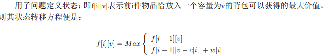

## 算法总结

1. 有效回文串(valid-palindrome),leetcode 125,two pointers

   给定一个字符串,判断是否是回文字符串,字符串只考虑字母和数字,忽略字母大小写

   ```java
   class Solution {
       public boolean isPalindrome(String s) {
           if (s == null || s.length() == 0) {
               return true;
           }
           //left,right两根指针遍历整个字符串,每次移到字符串或者数字上,每次比较都相同则说明是回文串
           int left = 0;
           int right = s.length() - 1;
           while (left < right) {
               //left指针移动到第一个合法字符串
               while (left < s.length() && !isValid(s.charAt(left))) {
                   left++;
               }
               //如果整个字符串都为空字符串,也为回文串
               if (left == s.length()) {
                   return true;
               }
               //right指针移动到第一个合法字符串
               while (rigth > 0 && !isValid(s.charAt(right))) {
                   right--;
               }
               //将字符串统一化为小写比较
               if (Character.toLowerCase(s.charAt(left)) != Character.toLowerCase(s.charAt(right))) {
                   break;
               } else {
                   left++;
                   right--;
               }
           }
           //left指针移动到right指针右边或者两指针重合表明为回文串
           return left >= right;
       }
       //判断为字母和数字
       private boolean isValid(Char c){
           return Char.isLetter(c) || Char.isDigit(c);
       }
   }
   //时间复杂度为O(n), 空间复杂度为O(1)
   ```

2. 两数之和(two sum),leetcode 1, HashMap

   给定数组和目标数,求数组中两数之和为目标数的下标

   ```Java
   class Solution {
       public int[] twoSum(int[] nums, int target) {
           //用一个HashMap做辅助
           Map<Integer, Integer> map = new HashMap<Integer, Integer>();
           //将target-nums[i]作为key, i作为value,意为第i个数的互补的数作为key,i作为value,不存在则放入HashMap,等到互补的数出现,则将HashMap中的下标和当前下标输出即可
           for (int i = 0; i< nums.length; i++) {
               if (map.get(nums[i]) != null) {
                   int[] result = {map.get(nums[i]), i};
                   return result;
               }
               map.put(target - nums[i], i);
           }
           
           int[] result = {};
           return result;
       }
   }
   //时间复杂度为O(n), 空间复杂度为O(n)----HashMap辅助的
   ```

3. 有序数组两数之和(two sum II),leetcode 167, two pointers

   给定有序数组和目标数,求数组中两数之和为目标数的下标

   ```Java
   class Solution {
       public int[] twoSum(int[] numbers, int target) {
           int left = 0;
           int right = numbers.length - 1;

           while (left < right) {
               if (numbers[left] + numbers[right] > target) {
                   right--;
               } else if (numbers[left] + numbers[right] < target) {
                   left++;
               } else {
                   return new int[]{left + 1, right + 1};
               }
           }

           return new int[]{-1, -1};
       }
   }
   ```

4. 对称树判断(Symmetric Tree),leetcode101

   给定一棵二叉树,判断是否沿中轴线对称

   ```Java
   //递归版本
   class Solution {
       public boolean isSymmetric(TredNode root) {
           //判断左右子树是否对称
           return root == null || isSymmetricHelp(root.left, root.right);
       }
       
       public boolean isSymmetricHelp(TreeNode left, TreeNode right) {
           //左右子树有为空的一般为false
           if (left == null || right == null) {
               return left == right;
           }
           //左右子树根节点值不同,返回false
           if (left.val != right.val) {
               return false;
           }
           //判断左子树.左子树和右子树.右子树 && 左子树.右子树和右子树.左子树对称
           return isSymmetricHelp(left.left, right.right) && isSymmetricHelp(left.right, right.left);
       }
   }
   ```

   ```java
   //非递归版本
   class Solution {
       public boolean isSymmetric(TreeNode root) {
           if (root == null) {
               return true;
           }
           //申请辅助栈,将左右子树push到栈中
           Stack<TreeNode> stack = new Stack<TreeNode>();
           stack.push(root.left);
           stack.push(root.right);

           while (!stack.isEmpty()) {
               //pop出左右子树
               TreeNode right = stack.pop(), left = stack.pop();
               //左右子树均为null则continue
               if (left == null && right == null) {
                   continue;
               }
               if (left == null || right == null) {
                   return false;
               }
               if (left.val != right.val) {
                   return false;
               }
               stack.push(left.left);
               stack.push(right.right);
               stack.push(left.right);
               stack.push(right.left);
           }
           return true;
       }
   }
   ```

5. 不用+/-求两数之和(Sum of Two Integers),leetcode 371,异或,与

   ```Java
   //递归版本 a & b 是进位情况,a ^ b是不进位情况的相加
   Class Solution {
       public int getSum(int a, int b) {
           return b == 0 ? a : getSum(a^b, (a&b)<<1)
       }
   }
   ```

   ```Java
   //尾递归优化
   Class Solution {
       public int getSum(int a, int b) {
           while (b != 0) {
               int sum = a ^ b;
               int carry = (a & b) << 1;
               a = sum;
               b = carry;
           }
           return a;
       }
   }
   ```

6. 单身数(Single number),leetcode 136,异或/hashset

   ```Java
   Class Solution {
       public int singleNumber(int[] nums) {
           Set<Integer> set = new HashSet<>();
           int sum = 0, uniqueSum = 0;
           for (int num : nums) {
               if (!set.contains(num)) {
                   uniqueSum += num;
                   set.add(num);
               }
               sum += num;
           }
           return uniqueSum * 2 - sum;
       }
   }
   ```

7. 数据流中的中位数

思路: 用两个容器来分别存数据流序列中位数左右两边的数,只要保证左边容器的数都大于右边容器的数,且能在O(1)的时间分别取到左边容器的最小值和右边容器的最大值,因此分别借助小顶堆和大顶堆来存储数据,同时还需要保证左右容器相差不大于1,可以约定规则:偶数下标进入大顶堆.

```java
import java.util.Comparator;
import java.util.PriorityQueue;
import java.util.Queue;

public class FindMedianNum {
    private int count = 0;
    private Queue<Integer> minHeap = new PriorityQueue<Integer>();
    private Queue<Integer> maxHeap = new PriorityQueue<Integer>(15, new Comparator<Integer>() {
        public int compare(Integer o1, Integer o2) {
            return o2 - o1;
        }
    });

    public void insert(Integer num) {
        if (count % 2 == 0) {
            // 当数据总数为偶数时,新加入的元素,应当加入小顶堆;但并不是直接进入小顶堆,而是经大顶堆筛选后取大顶堆最大元素进入小顶堆.
            // 1. 新加入的元素进入小顶堆,由大顶堆筛选出堆中最大元素
            maxHeap.offer(num);
            int maxNum = maxHeap.poll();
            // 2. 筛选后,即大顶堆中最大元素进入小顶堆
            minHeap.offer(maxNum);
        } else {
            // 当数据总数为奇数时,新加入的元素应该进入大顶堆;但并不是直接进入大顶堆,而是经小顶堆筛选后取小顶堆最小元素进入大顶堆.
            // 1. 新加入的元素进入小顶堆,由小顶堆筛选出堆中最小元素
            minHeap.offer(num);
            int minNum = minHeap.poll();
            // 2. 筛选后,即小顶堆中最小元素进入大顶堆
            maxHeap.offer(minNum);
        }
        count++;
    }

    public Double getMedian() {
        //分情况获取中位数
        if (count % 2 == 0) {
            return new Double((minHeap.peek() + maxHeap.peek()) * 1.0 / 2);
        } else {
            return new Double(minHeap.peek());
        }
    }
}
```

8. 一个链表奇数位上升序，偶数位上降序，不用额外空间让这个链表整体升序

比如: 1->8->3->6->5->4->7->2->9, 解题思路:1. 根据奇数位和偶数位拆分成两个链表;2. 将偶数位链表反转;3.将两个有序链表进行合并;

```java
public class SortedLinkedList {
    //1. 根据奇数位和偶数位拆分成两个链表
    private static Node[] divideList(Node head) {
        Node head1 = new Node(0);
        Node head2 = new Node(0);
        Node cur1 = head1;
        Node cur2 = head2;
        int cnt = 1;
        while (head != null) {
            if (cnt % 2 != 0) {
                cur1.next = head;
                cur1 = cur1.next;
            } else {
                cur2.next = head;
                cur2 = cur2.next;
            }
            head = head.next;
            cnt++;
        }
        cur1.next = null;
        cur2.next = null;
        return new Node[] {head1.next, head2.next};
    }

    //2. 将偶数位链表反转
    private static Node reverse(Node head) {
        if (head == null || head.next == null) {
            return head;
        }

        Node prev = null;
        while (head != null) {
            Node temp = head.next;
            head.next = prev;
            prev = head;
            head = temp;
        }

        return prev;
    }

    //3. 将两个有序链表进行合并
    private static Node combine(Node head1, Node head2) {
        if (head1 == null || head2 == null) {
            return head1 != null ? head1 : head2;
        }

        Node head = new Node(0);
        Node curt = head;
        while (head1 != null && head2 != null) {
            if (head1.value >= head2.value) {
                curt.next = head2;
                head2 = head2.next;
            } else {
                curt.next = head1;
                head1 = head1.next;
            }
            curt = curt.next;
        }

        if (head1 != null) {
            curt.next = head1;
        }

        if (head2 != null) {
            curt.next = head2;
        }
        return head.next;
    }

    public static void main(String[] args) {
        Node node1 = new Node(1);
        Node node2 = new Node(8);
        Node node3 = new Node(3);
        Node node4 = new Node(6);
        Node node5 = new Node(5);
        Node node6 = new Node(4);
        Node node7 = new Node(7);
        Node node8 = new Node(2);
        Node node9 = new Node(9);

        node1.next = node2;
        node2.next = node3;
        node3.next = node4;
        node4.next = node5;
        node5.next = node6;
        node6.next = node7;
        node7.next = node8;
        node8.next = node9;
        Node head = node1;

        Node[] lists = divideList(head);
        Node head1 = lists[0];
        Node head2 = lists[1];
        head2 = reverse(head2);
        head = combine(head1, head2);
        while (head != null) {
            System.out.println(head.value);
            head = head.next;
        }
    }
}

class Node {
    public int value;
    public Node next;

    Node(int value) {
        this.value = value;
    }
}
```

9. 丑数 leetcode 264, lintcode 4

```java
class Solution {
    public int nthUglyNumber(int n) {
        List<Integer> uglys = new ArrayList<Integer>();
        uglys.add(1);
        int p2 = 0, p3 = 0, p5 = 0;
        for (int i = 1; i < n; i++) {
            int lastNum = uglys.get(i - 1);
            while (uglys.get(p2) * 2 <= lastNum) p2++;
            while (uglys.get(p3) * 3 <= lastNum) p3++;
            while (uglys.get(p5) * 5 <= lastNum) p5++;

            uglys.add(Math.min(Math.min(uglys.get(p2) * 2, uglys.get(p3) * 3), uglys.get(p5) * 5));
        }
        
        return uglys.get(n - 1);
    }
}
```

10. Quick Select思路解决求第K大的数,时间复杂度为O(n) + O(n/2) + O(n/4) + O(n/8) + ....O(1) = O(2n) = O(n),同理lintcode80 求中位数也可以转换为这个方法解决,即求第(n+1)/2大数

```java
class Solution {
    public int kthLargestElement(int k, int[] nums) {
        if (nums == null || nums.length == 0) {
            return -1;
        }
        return quickSelect(nums, 0, nums.length - 1; k);
    }
    
    private int quickSelect(int[] nums, int start, int end, int k) {
        if (start == end) {
            return nums[start];
        }
        
        int left = start;
        int right = end;
        int pivot = nums[(left + right) / 2];
        while (left <= right) {
            while (left <= right && nums[left] > pivot) {
                left++;
            }
            while (left <= right && nums[right] < pivot) {
                right--;
            }
            if (left <= right) {
                int temp = nums[left];
                nums[left] = nums[right];
                nums[right] = temp;
                left++;
                right--;
            }
        }
        if (start + k - 1 <= right) {
            return quickSelect(nums, start, right, k);
        }
        if (start + k - 1 >= left) {
            return quickSelect(nums, left, end, k - (left - start));
        }
        
        return nums[right + 1];
    }
}
```

11.最大蓄水问题,left和right分别往中间移动,找到最大的短板乘上慢慢变短的宽,面积为宽*高,找到可能出现的最大值

```java
class Solution {
    public int maxArea(int[] height) {
        if (height == null || height.length <= 1) {
            return 0;
        }
        int left = 0;
        int right = height.length - 1;
        int max = Integer.MIN_VALUE;
        while (left < right) {
            max = Math.max(max, Math.min(height[left], height[right]) * (right - left));
            if (height[left] < height[right]) {
                left++;
            } else {
                right--;
            }
        }
        
        return max;
    }
}
```

12. 给出一个数组代表围柱的高度，求能围住的最大的水量

思路:求出每个柱子能够存多少水,然后每根主子的存水量相加便得到总的存水量,因此求出每根柱子的左边最高柱和右边最高柱子,然后两者最小值(**短板**)减去当前柱子的高度

**这里需要注意的是作为边界的柱子是无法存有水的**

```java
class Solution {
    public int maxArea(int[] height) {
        if (height == null || height.length < 2) {
            return 0;
        }
        int result = 0;
        int leftMax = 0;
        int rightMax = 0;
        int left = 0;
        int right = height.length - 1;
        while (left < right) {
            //分别得到左右最高柱子
            leftMax = Math.max(height[left], leftMax);
            rightMax = Math.max(height[right], rightMax);
            if (leftMax > rightMax) {
                result += (rightMax - height[right]);
                right--;
            } else {
                result += (leftMax - height[left]);
                left++;
            }
        }
        return result;
    }
}
```

13. 给一个整数n,计算出1~n这n个数字可以构成多少棵不同的二叉搜索树

```java
class solution {
    public int numTrees(int n) {
        //n小于0,直接返回0
        if (n < 0) {
            return 0;
        }
        //开辟count数组,长度为n+2,至少包含前两个数count[0], count[1]
        int[] count = new int[n + 2];
        count[0] = 1;
        count[1] = 1;
        for (int i = 2; i <= n; i++) {
            for (int j = 0; j < i; j++) {
                //root分别第0,1,2,..i-1个数时,左子树有0,1,2,..i-1个递增数,右子树有i-j-1个,分别求得左右二叉搜素树数目相乘最后求和
                count[i] += count[j] * count[i - j - 1];
            }
        }
        return count[n];
    }
}
```

14. 直方图最大矩形面积:给出的n个非负整数表示每个直方图的高度，每个直方图的宽均为1，在直方图中找到最大的矩形面积

```java
class Solution {
    /**
     * @param height: A list of integer
     * @return: The area of largest rectangle in the histogram
     */
    public int largestRectangleArea(int[] height) {
        // write your code here
        if (height == null || height.length == 0) {
            return 0;
        }
        int len = height.length;
        int max = 0;
        //分别找到左右边界,左边第一个比height[i]小,右边第一个比height[i]小,但是会超时T:O(n*n), S:O(1)
        // for (int i = 0; i < len; i++) {
        //     int left = i;
        //     int right = i;
        //     while (left >= 0 && height[left] >= height[i]) {
        //         left--;
        //     }
        //     while (right < len && height[right] >= height[i]) {
        //         right++;
        //     }
        //     max = Math.max(max, (right - left - 1) * height[i]);
        // }
        //借助辅助栈,维护一个单调递增栈,T:O(n), S:O(n)
        Stack<Integer> stack = new Stack<Integer>();
        for (int right = 0; right <= len; right++) {
            //只需要找右边界,因为左边界就是idx左起第一个
            int h = right == len ? 0 : height[right];//约定如果右边界已经是数组长度,那么规定其值为0
            while (!stack.empty() && h < height[stack.peek()]) {
                int idx = stack.pop();//idx为该考虑的值,为其找到左右边界
                int left = stack.empty() ? -1 : stack.peek();//左边界,如果栈已经空了,左边界为-1
                //计算面积
                max = Math.max(max, height[idx] * (right - left - 1));
            }
            //如果是递增就继续往栈里push
            stack.push(right);
        }
        return max;
    }
}
```

15. 给你一个二维矩阵，权值为`False`和`True`，找到一个最大的矩形，使得里面的值全部为`True`，输出它的面积

```java
class Solution {
    //思路:将该矩形转变为直方图,然后转变为求直方图最大矩形面积
    /**
     * @param matrix: a boolean 2D matrix
     * @return: an integer
     */
    public int maximalRectangle(boolean[][] matrix) {
        // write your code here
        if (matrix == null || matrix.length == 0
            || matrix[0] == null || matrix[0].length == 0) {
            return 0;
        }
        int row = matrix.length;
        int col = matrix[0].length;
        int[] heights = new int[col];
        int max = 0;
        for (int i = 0; i < row; i++) {
            for (int j = 0; j < col; j++) {
                //只要有false,直方图高度就为0,否则高度加1
                heights[j] = matrix[i][j] ? heights[j] + 1 : 0;
            }
            max = Math.max(max, largestRectangleArea(heights));
        }
        return max;
    }
}
```

16. 在一个二维01矩阵中找到全为1的最大正方形, 返回它的面积.

```java
class Solution {
    /**
     * @param matrix: a matrix of 0 and 1
     * @return: an integer
     */
    public int maxSquare(int[][] matrix) {
        // write your code here
        if (matrix == null || matrix.length == 0
            || matrix[0] == null || matrix[0].length == 0) {
            return 0;
        }
        int row = matrix.length;
        int col = matrix[0].length;
        int[] heights = new int[col];
        int max = 0;
        for (int i = 0; i < row; i++) {
            for (int j = 0; j < col; j++) {
                //只要有1,直方图高度就加1,否则赋值为0
                heights[j] = matrix[i][j] == 1 ? heights[j] + 1 : 0;
            }
            max = Math.max(max, largestSquareArea(heights));
        }
        return max;
    }
    
    private int largestSquareArea(int[] height) {
        // write your code here
        if (height == null || height.length == 0) {
            return 0;
        }
        int len = height.length;
        int max = 0;
        //分别找到左右边界,但是会超时T:O(n*n), S:O(1)
        // for (int i = 0; i < len; i++) {
        //     int left = i;
        //     int right = i;
        //     while (left >= 0 && height[left] >= height[i]) {
        //         left--;
        //     }
        //     while (right < len && height[right] >= height[i]) {
        //         right++;
        //     }
        //     max = Math.max(max, (right - left - 1) * height[i]);
        // }
        //借助辅助栈T:O(n), S:O(n)
        Stack<Integer> stack = new Stack<Integer>();
        for (int right = 0; right <= len; right++) {
            int h = right == len ? 0 : height[right];
            while (!stack.empty() && h < height[stack.peek()]) {
                int idx = stack.pop();
                int left = stack.empty() ? -1 : stack.peek();
                int axis = Math.min(height[idx], (right - left -1));
                max = Math.max(max, axis * axis);
            }
            stack.push(right);
        }
        return max;
    }
    
    //动态规划方法:
    //状态转移方程:
    /*
    if matrix[i][j] == 0
        dp[i][j] = 0
    else                 // 此时为dp[i-1][j-1], dp[i-1][j], dp[i][j-1] 确定的区域的最大全1矩阵
        dp[i][j] = min{dp[i-1][j-1], dp[i-1][j], dp[i][j-1]} + 1	// 得到此方程需要一定推导, 纸笔画一下
    */
    public int maxSquare(int[][] matrix) {
        // write your code here
        int ans = 0;
        int n = matrix.length;
        int m;
        if (n > 0)
            m = matrix[0].length;
        else 
            return ans;
        int [][]res = new int [n][m];
        for (int i = 0; i < n; i++) {
            res[i][0] = matrix[i][0];
            ans = Math.max(res[i][0] , ans);
            for (int j = 1; j < m; j++) {
                if (i > 0) {
                    if (matrix[i][j] > 0) {
                        res[i][j] = Math.min(res[i-1][j], Math.min(res[i][j-1], res[i-1][j-1])) + 1;
                    } else {
                        res[i][j] = 0;
                    }
                    
                } else {
                    res[i][j] = matrix[i][j];
                }
                ans = Math.max(res[i][j], ans);
            }
        }
        return ans * ans;
    }
}
```

17. 给你一个大小为n的整型数组和一个大小为k的滑动窗口，将滑动窗口从头移到尾，输出从开始到结束每一个时刻滑动窗口内的数的和(window sum)

    ```java
    class Solution {
        public int[] winSum(int[] nums, int k) {
            if (nums == null || nums.length < k || k <= 0) {
                return new int[0];
            }
            
            int[] sum = new int[nums.length - k + 1];
            for (int i = 0; i < k; i++) {
                sum[0] += nums[i];
            }
            
            for (int i = 1; i + k <= nums.length ; i++) {
                sum[i] = sum[i - 1] - nums[i - 1] + nums[i - 1 + k];
            }
            
            return sum;
        }
    }
    ```

18. 给定一个整数数组，找到和为零的子数组。你的代码应该返回满足要求的子数组的起始位置和结束位置

```java
class Solution {
    /**
     * @param nums: A list of integers
     * @return: A list of integers includes the index of the first number and the index of the last number
     */
    public List<Integer> subarraySum(int[] nums) {
        // write your code here
        List<Integer> result = new ArrayList<Integer>();
        if (nums == null || nums.length == 0) {
            return result;
        }
        
        Map<Integer, Integer> map = new HashMap<Integer, Integer>();
        map.put(0, -1);
        int sum = 0;
        for (int i = 0; i < nums.length; i++) {
            sum += nums[i];
            if (map.containsKey(sum)) {
                result.add(map.get(sum) + 1);
                result.add(i);
            }
            map.put(sum, i);
        }
        
        return result;
    }
}
```

19. 给定一个由 `n` 个正整数组成的数组和一个正整数 `s` ，请找出该数组中满足其和 ≥ s 的最小长度子数组。如果无解，则返回 -1

```java
class Solution {
    /**
     * @param nums: an array of integers
     * @param s: An integer
     * @return: an integer representing the minimum size of subarray
     */
    // 两根同向指针对数组进行一次遍历,如果当前和小于s,右指针右移,扩大区间,反之做指针右移,缩小区间
    //这个过程中维持区间和不小于s,然后更新答案即可
    public int minimumSize(int[] nums, int s) {
        // write your code here
        if (nums == null || nums.length == 0) {
            return -1;
        }
        
        int left = 0;
        int right = 0;
        int len = nums.length;
        int sum = 0;
        int subLen = Integer.MAX_VALUE;
        while (left < len && right < len) {
            sum += nums[right];
            
            while (sum >= s) {
                subLen = Math.min(subLen, right - left + 1);
                sum -= nums[left];
                left++;
            }
            
            right++;
        }
        
        if (subLen == Integer.MAX_VALUE) {
            return -1;
        }
        
        return subLen;
    }
}
```

20. n*n的正方形网格中有多少个长方形?
    - 横竖各n+1条直线,任意各取两条都可以组成一个长方形,个数为C(n+1, 2) * C(n+1, 2) = (n+1)^2 * n^2 / 4
    - 正方形个数为n^2 + ...+2^2+1^2 = n(n+1)(2n+1)/6
    - 如果单单要求正方形,则是上述之差

21. 翻转链表中第m个节点到第n个节点的部分

```java
class Solution {
    public ListNode reverseBetween(ListNode head, int m, int n) {
        //哨兵节点
        ListNode dummy = new ListNode(0);
        dummy.next = head;
        //两个指针,一前一后,分别指向两个节点位置
        ListNode prev = dummy;
        ListNode curt = head;
        //curt指针运动到m位置,prev节点随之一起运动到m前一个位置
        for (int i = 1; i < m; i++) {
            curt = curt.next;
            prev = prev.next;
        }
        //记下m节点位置,和m前一个节点位置
        ListNode mNode = curt;
        ListNode mPrev = prev;
        
        //前后两节点翻转,同时往前运动直到prev节点到n节点位置,curt节点到了n节点下一个位置
        for(int i = m; i <= n; i++) {
            ListNode temp = curt.next;
            curt.next = prev;
            prev = curt;
            curt = temp;
        }
        //翻转结束,m节点前的next指针指向n节点;m节点的next指针指向n节点的next位置
        mPrev.next = prev;
        mNode.next = curt;
        //返回dummy节点的next指针
        return dummy.next;
    }
}
```

22. 给你一个链表以及一个*k*,将这个链表从头指针开始每*k*个翻转一下。
    链表元素个数不是*k*的倍数，最后剩余的不用翻转

思路:每次翻转k个节点,传入head节点的prev节点,输出下一轮翻转k节点head节点的prev节点

```java
class Solution {
    public ListNode reverseKGroup(ListNode head, int k) {
        // write your code here
        if (head == null || k <= 1) {
            return head;
        }
        
        ListNode dummy = new ListNode(1);
        dummy.next = head;
        
        ListNode prev = dummy;
        while (prev != null) {
            prev = reverseNextKNodes(prev, k);
        }
        
        
        return dummy.next;
    }
    
    private ListNode reverseNextKNodes(ListNode head, int k) {
        ListNode curt = head;
        ListNode n1 = head.next;
        //判断是否有k个节点,没有则返回null
        for (int i = 0; i < k; i++) {
            curt = curt.next;
            if (curt == null) {
                return null;
            }
        }
        //记下k node和k+1 node节点
        ListNode nk = curt;
        ListNode nkplus = curt.next;
        //翻转这k个节点
        ListNode prev = head;
        curt = head.next;
        while (curt != nkplus) {
            ListNode temp = curt.next;
            curt.next = prev;
            prev = curt;
            curt = temp;
        }
        //翻转后需要连接起来
        head.next = nk;
        n1.next = nkplus;
        
        return n1;
    }
}
```

23. 链表相加

```java
class Solution {
    /**
     * @param l1: the first list
     * @param l2: the second list
     * @return: the sum list of l1 and l2 
     */
    public ListNode addLists(ListNode l1, ListNode l2) {
        // write your code here
        if (l1 == null && l2 == null) {
            return null;
        }
        
        ListNode dummy = new ListNode(0);
        ListNode head = dummy;
        int carry = 0;
        while (l1 != null && l2 != null) {
            int sum = carry + l1.val + l2.val;
            head.next = new ListNode(sum % 10);
            carry = sum / 10;
            l1 = l1.next;
            l2 = l2.next;
            head = head.next;
        }
        
        while (l1 != null) {
            int sum = carry + l1.val;
            head.next = new ListNode(sum % 10);
            carry = sum / 10;
            l1 = l1.next;
            head = head.next;
        }
        
        while (l2 != null) {
            int sum = carry + l2.val;
            head.next = new ListNode(sum % 10);
            carry = sum / 10;
            l2 = l2.next;
            head = head.next;
        }
        
        if (carry != 0) {
            head.next = new ListNode(carry);
        }
        
        return dummy.next;
    }
}
```

24. 链表相加2(和23不一样的地方在于顺序不一致,因此先reverse 链表就可以完全和上面一样了,然后再reverse)

```java
class Solution {
    /**
     * @param l1: The first list.
     * @param l2: The second list.
     * @return: the sum list of l1 and l2.
     */
    public ListNode addLists2(ListNode l1, ListNode l2) {
        // write your code here
        ListNode reverseL1 = reverse(l1);
        ListNode reverseL2 = reverse(l2);
        return reverse(addLists(reverseL1, reverseL2));
        
    }
    
    private ListNode reverse(ListNode head) {
        if (head == null) {
            return null;
        }
        
        ListNode prev = null;
        while (head != null) {
            ListNode temp = head.next;
            head.next = prev;
            prev = head;
            head = temp;
        }
        
        return prev;
    }
    
    private ListNode addLists(ListNode l1, ListNode l2) {
        // write your code here
        if (l1 == null && l2 == null) {
            return null;
        }
        
        ListNode dummy = new ListNode(0);
        ListNode head = dummy;
        int carry = 0;
        while (l1 != null && l2 != null) {
            int sum = carry + l1.val + l2.val;
            head.next = new ListNode(sum % 10);
            carry = sum / 10;
            l1 = l1.next;
            l2 = l2.next;
            head = head.next;
        }
        
        while (l1 != null) {
            int sum = carry + l1.val;
            head.next = new ListNode(sum % 10);
            carry = sum / 10;
            l1 = l1.next;
            head = head.next;
        }
        
        while (l2 != null) {
            int sum = carry + l2.val;
            head.next = new ListNode(sum % 10);
            carry = sum / 10;
            l2 = l2.next;
            head = head.next;
        }
        
        if (carry != 0) {
            head.next = new ListNode(carry);
        }
        
        return dummy.next;
    }
}
```

25. 最大连续子数组

```java
class Solution {
    /**
     * @param nums: A list of integers
     * @return: A integer indicate the sum of max subarray
     */
    public int maxSubArray(int[] nums) {
        // write your code here
        if (nums == null || nums.length == 0) {
            return 0;
        }
        
        int max = Integer.MIN_VALUE;
        int sum = 0;
        int minSum = 0;
        int len = nums.length;	
        for (int i= 0; i < len; i++) {
            sum += nums[i];
            max = Math.max(max, sum - minSum);
            
            if (sum < minSum) {
                minSum = sum;
            }
        }
        
        return max;
    }
}
```

26. 翻转二叉树

思路:分治法,首先递归调用翻转左右子树,然后分别翻转root的左右子树;

```java
class Solution {
    public TreeNode invertTree(TreeNode root) {
        if(root == null){
            return null;
        }
        invertTree(root.left);
        invertTree(root.right);
        TreeNode temp = root.left;
        root.left = root.right;
        root.right = temp;
        return root;
    }
}
```

27. LRU Cache

```java
public class LRUCache {
    private int capacity;
    private HashMap<Integer, ListNode> hashMap = new HashMap<Integer, ListNode>();
    private ListNode head = new ListNode(-1, -1);
    private ListNode tail = new ListNode(-1, -1);

    public LRUCache(int capacity) {
        this.capacity = capacity;
        tail.prev = head;
        head.next = tail;
    }

    public int get(int key) {
        if (!hashMap.containsKey(key)) {
            return -1;
        }

        ListNode curt = hashMap.get(key);
        curt.prev.next = curt.next;
        curt.next.prev = curt.prev;

        moveToTail(curt);

        return hashMap.get(key).value;
    }

    public void set(int key, int value) {
        if (get(key) != -1) {
            hashMap.get(key).value = value;
            return;
        }

        if (hashMap.size() == capacity) {
            hashMap.remove(head.next.key);
            head.next = head.next.next;
            head.next.prev = head;
        }

        ListNode insert = new ListNode(key, value);
        hashMap.put(key, insert);
        moveToTail(insert);
    }

    private void moveToTail(ListNode node) {
        node.next = tail;
        node.prev = tail.prev;
        tail.prev.next = node;
        tail.prev = node;
    }
}

class ListNode {
    ListNode next;
    ListNode prev;
    int key;
    int value;

    public ListNode(int key, int value) {
        next = null;
        prev = null;
        this.key = key;
        this.value = value;
    }
}
```

28. 括号匹配问题

```java
class Solution {
    /**
     * @param s: A string
     * @return: whether the string is a valid parentheses
     */
    public boolean isValidParentheses(String s) {
        // write your code here
        if (s == null || s.length() == 0) {
            return true;
        }
        
        if (s.length() % 2 == 1) {
            return false;
        }
        
        Stack<Character> stack = new Stack<Character>();
        for (int i = 0; i < s.length(); i++) {
            if (s.charAt(i) == ')' || s.charAt(i) == '}' || s.charAt(i) == ']') {
                if (stack.isEmpty()) {
                    return false;
                }
                char c = stack.pop();
                if ((c == '(' && s.charAt(i) != ')')  || (c == '[' && s.charAt(i) != ']') || (c == '{' && s.charAt(i) != '}')) {
                    return false;
                }
            } else {
                stack.push(s.charAt(i));
            }
        }
        
        return stack.isEmpty();
    }
}
```

29. 生成括号

```java
class Solution {
    /**
     * @param n: n pairs
     * @return: All combinations of well-formed parentheses
     */
    public List<String> generateParenthesis(int n) {
        // write your code here
        List<String> result = new ArrayList<String>();
        if (n <= 0) {
            return result;
        }
        
        helper(result, "", n, n);
        
        return result;
        
        
        
    }
    //递归定义:观察当前括号,左右括号分别可以如何加到当前字符串中
    private void helper(List<String> result, String curt, int left, int right) {
        //递归的出口,左右括号都不剩了,将当前括号加入到结果中,退出.
        if (left == 0 && right == 0) {
            result.add(curt);
            return;
        }
        //仍剩下左边括号可加入
        if (left > 0) {
            helper(result, curt + '(', left - 1, right);
        } 
        //仍剩右边括号可加入,且左边括号剩得比右边少
        if (right > 0 && left < right) {
            helper(result, curt + ')', left, right - 1);
        }
    }
}
```

30. 寻找旋转排序数组中的最小值

```Java
class Solution {
    /**
     * @param nums: a rotated sorted array
     * @return: the minimum number in the array
     */
    public int findMin(int[] nums) {
        // write your code here
        if (nums == null || nums.length == 0) {
            return -1;
        }
        //二分法，找到第一个比最后一个数小的数， target = nums[end]
        int start = 0;
        int end = nums.length - 1;
        int target = nums[end];
        
        while(start + 1 < end) {
            int mid = start + (end - start) / 2;
            if (nums[mid] <= target) {
                end = mid;
            } else {
                start = mid;
            }
        }
        
        if (nums[start] <= target) {
            return nums[start];
        } else {
            return nums[end];
        }
    }
}
```

31. 山脉序列中的最大值

```Java
class Solution {
    /**
     * @param nums a mountain sequence which increase firstly and then decrease
     * @return then mountain top
     */
    public int mountainSequence(int[] nums) {
        // Write your code here
        if (nums == null || nums.length == 0) {
            return 0;
        }
        int start = 0;
        int end = nums.length - 1;
        while (start + 1 < end) {
            int mid = start + (end - start) / 2;
          //找到峰值
            if (nums[mid] > nums[mid + 1]) {
                end = mid;
            } else {
                start = mid;
            }
        }
        return Math.max(nums[start], nums[end]);
    }
}
```

32. 搜素旋转排序数组

```Java
class Solution {
    /** 
     *@param A : an integer rotated sorted array
     *@param target :  an integer to be searched
     *return : an integer
     */
    public int search(int[] A, int target) {
        // write your code here
        if (A == null || A.length == 0){
            return -1;
        }
        int start = 0;
        int end = A.length - 1;
        while (start + 1 < end){
            int mid = start + (end - start) / 2;
            if (A[mid] == target){
                return mid;
            }
            if (A[mid] > A[start]){
                if (A[start] <= target && target <= A[mid]){
                    end = mid;
                } else {
                    start = mid;
                }
            } else {
                if (A[mid] <= target && target <= A[end]){
                    start = mid;
                } else {
                    end = mid;
                }
            }
        }
        if (A[start] == target){
            return start;
        }
        if (A[end] == target){
            return end;
        }
        return -1;
    }
}
```

33. 根据中序遍历和后序遍历树构造二叉树

```java
class Solution {
    private int findPosition(int[] arr, int start, int end, int key) {
        int i;
        for (i = start; i <= end; i++) {
            if (arr[i] == key) {
                return i;
            }
        }
        return -1;
    }

    private TreeNode myBuildTree(int[] inorder, int instart, int inend,
            int[] postorder, int poststart, int postend) {
        if (instart > inend) {
            return null;
        }

        TreeNode root = new TreeNode(postorder[postend]);
        int position = findPosition(inorder, instart, inend, postorder[postend]);

        root.left = myBuildTree(inorder, instart, position - 1,
                postorder, poststart, poststart + position - instart - 1);
        root.right = myBuildTree(inorder, position + 1, inend,
                postorder, poststart + position - instart, postend - 1);
        return root;
    }

    public TreeNode buildTree(int[] inorder, int[] postorder) {
        if (inorder.length != postorder.length) {
            return null;
        }
        return myBuildTree(inorder, 0, inorder.length - 1, postorder, 0, postorder.length - 1);
    }
}
```

34. 打印螺旋矩阵

```java
public class Solution {
    /**
     * @param matrix a matrix of m x n elements
     * @return an integer list
     */
    public List<Integer> spiralOrder(int[][] matrix) {
        // Write your code here
        List<Integer> result = new ArrayList<Integer>();
 
        if (matrix == null || matrix.length == 0) return result;
 
        int m = matrix.length;
        int n = matrix[0].length;
 
        int x=0; 
        int y=0;
 
        while(m>0 && n>0){
 
            //if one row/column left, no circle can be formed
            if(m==1){
                //打印一行
                for(int i=0; i<n; i++){
                    result.add(matrix[x][y++]);
                }
                break;
            }else if(n==1){
                //打印一列
                for(int i=0; i<m; i++){
                    result.add(matrix[x++][y]);
                }
                break;
            }
 
            //below, process a circle
            //一圈一圈打印
 
            //top - move right 往右移动tr
            for(int i=0;i<n-1;i++){
                result.add(matrix[x][y++]);
            }
 
            //right - move down 往下移动rd
            for(int i=0;i<m-1;i++){
                result.add(matrix[x++][y]);
            }
 
            //bottom - move left
            for(int i=0;i<n-1;i++){
                result.add(matrix[x][y--]);
            }
 
            //left - move up
            for(int i=0;i<m-1;i++){
                result.add(matrix[x--][y]);
            }
            //然后再往内一个圈
            x++;
            y++;
            //行数,列数分别减2
            m=m-2;
            n=n-2;
        }
 
        return result;
    }
}
```

35. 海量数据随即抽样问题:要求从N个元素中随即的抽取K个元素,其中N无法确定

场景:数据流情况下,由于数据只能被读取一次,而且数据量很大,并不能全部保存,因此数据量N是无法在抽样开始时确定的,但又要保持随机性

思路:蓄水池抽样,保持一个集合(这个集合中的每个数字出现),作为蓄水池,依次遍历所有数据的时候以一定概率替换这个蓄水池中的数字.

解决办法:程序的开始把前k个元素都放到水库中,然后对之后的第i个元素,以k/i的概率换掉这个水库中的某一个元素

36. 链表排序

    快排思路:两个指针left,right均往next方向一定,移动的过程中保证left之前的key都小于选定的key,left和right之间的key都大于选定的key,当right指针移动到最后,交换left和key的值便完成了一次切分

```java
public class Solution {
    public Node sortList(Node head) {
        quickSort(head, null);
        return head;
    }
    
    public void quickSort(Node head, Node end) {
        if (head == end) {
            return;
        }
        Node left = head, right = head.next;
        while (right != end) {
            if (right.value < head.value) {
                left = left.next;
                int temp = left.value;
                left.value = right.value;
                right.value = temp;
            }
            right = right.next;
        }
        // 如果已经有序了,不交换left和key的值
        if (left != head) {
            int temp = left.value;
            left.value = head.value;
            head.value = temp;
        }
        quickSort(head, left);
        quickSort(left.next, end);
    }
}
```

​	归并排序思路:1. 将待排序链表取中点,一分为二;2. 递归地对左半部分进行归并排序;3. 递归地对右半部分进行归并排序;4. 将两个半部分进行merge合并,得到结果

```		java
public class Solution {
    public Node sortList(Node head) {
        if (head == null || head.next == null) {
            return head;
        }
        Node mid = findMid(head);
        Node right = sortList(mid.next);
        mid.next = null;
        Node left = sortList(head);

        return combine(left, right);
    }
    
    private Node findMid(Node head) {
        Node fast = head.next;
        Node slow = head;
        while (fast != null && fast.next != null) {
            fast = fast.next.next;
            slow = slow.next;
        }
        return slow;
    }
    
    private Node combine(Node head1, Node head2) {
        if (head1 == null || head2 == null) {
            return head1 != null ? head1 : head2;
        }

        Node head = new Node(0);
        Node curt = head;
        while (head1 != null && head2 != null) {
            if (head1.value >= head2.value) {
                curt.next = head2;
                head2 = head2.next;
            } else {
                curt.next = head1;
                head1 = head1.next;
            }
            curt = curt.next;
        }

        if (head1 != null) {
            curt.next = head1;
        }

        if (head2 != null) {
            curt.next = head2;
        }
        return head.next;
    }
}
```

### 九章算法之BFS

- BFS要点:使用队列作为主要数据结构Queue
- 是否需要实现分层?需要分层的算法比不需要分层的算法多一层循环
- size = queue.size()
- 图的BFS与树BFS区别
  - 结点之间树关系:父子关系
  - 图结点之间:邻居关系
  - 因此需要借助HashMap/HashSet完成去重操作

1. 二叉树的层级遍历(图的遍历,树是图的一种特殊形态,树属于图)

```java
public class Solution {
    public List<List<Integer>> levelOrder(TreeNode root) {
        List<List<Integer>> result = new List<ArrayList<Integer>>();
        if (root == null) {
            return result;
        }
        Queue<TreeNode> queue = new LinkedList<TreeNode>();
        queue.add(root);
        while (!queue.isEmpty()) {
            int size = queue.size();
            List<Integer> list = new ArrayList<Integer>();
            for (int i = 0; i < size; i++) {
                TreeNode node = queue.poll();
                list.add(node.val);
                if (node.left != null) {
                    queue.add(node.left);
                }
                
                if (node.right != null) {
                    queue.add(node.right);
                }
            }
            result.add(list);
        }
        return result;
    }
}
```

2. 二叉树层次遍历2,输出的list顺序和二叉树层次遍历1相反,因此可以在1的基础上reverse或者最后result.add(0, list),每次加到index为0的位置;
3. 如果需要实现二叉树之字形层次遍历,可以加奇偶flag,在奇数行翻转ArrayList即可实现;
4. 二叉树垂直层次遍历:在层次遍历的基础之上借助HashMap实现.假设root结点的初始列值为0,每个结点的左子结点-1, 右子结点+1,然后以列值为key,各个结点的值组成list作为value,然后按照列值从小到大输出对应的list
5. 判断一个图是不是树状结构:树:1. N个点N-1条边; 2. 所有点都连通(防止给我们提供多个图)

```java
public class Solution {
    public boolean validTree(int n, int[][] edges) {
        if (n == 0) {
            return false;
        }
        if (edges.length != n - 1) {
            return false;
        }
        
        Map<Integer, Set<Integer>> graph = initializeGraph(n, edges);
        
        Queue<Integer> queue = new LinkedList<Integer>();
        Set<Integer> hash = new HashSet<Integer>();
        queue.offer(0);
        hash.add(0);
        while (!queue.isEmpty()) {
            int node = queue.poll();
            for (Integer neighbor : graph.get(node)) {
                if (hash.contains(neighbor)) {
                    continue;
                }
                hash.add(neighbor);
                queue.offer(neighbor);
            }
        }
        return (hash.size() == n);
    }
    
    private Map<Integer, Set<Integer>> initializeGraph(int n, int[][] edges) {
        Map<Integer, Set<Integer>> graph = new HashMap<Integer, Set<Integer>>();
        for (int i = 0; i < n; i++) {
            graph.put(i, new HashSet<Integer>());
        }
        for (int i = 0; i < edges.length; i++) {
            int u = edges[i][0];
            int v = edges[i][1];
            graph.get(u).add(v);
            graph.get(v).add(u);	
        }
        
        return graph;
    }
}
```

6. 克隆图

```java
public class Solution {
    /*
     * @param node: A undirected graph node
     * @return: A undirected graph node
     */
    public UndirectedGraphNode cloneGraph(UndirectedGraphNode node) {
        // write your code here
        if (node == null) {
            return null;
        }
        List<UndirectedGraphNode> nodes = getNodes(node);
        Map<UndirectedGraphNode, UndirectedGraphNode> nodeMap = new HashMap<UndirectedGraphNode, UndirectedGraphNode>();
        //得到一个新老结点的map
        for (UndirectedGraphNode node : nodes) {
            nodeMap.put(node, new UndirectedGraphNode(node.label));
        }
        //复制老结点的边到新结点
        for (UndirectedGraphNode node : nodes) {
            UndirectedGraphNode newNode = nodeMap.get(node);
            for (UndirectedGraphNode n : node.neighbors) {
                newNode.neighbors.add(nodeMap.get(n));
            }
        }
        //返回新结点
        return nodeMap.get(node);
    }
    //首先根据无向图中某个结点得到图中所有结点
    private List<UndirectedGraphNode> getNodes(UndirectedGraphNode node) {
        Queue<UndirectedGraphNode> queue = new LinkedList<UndirectedGraphNode>();
        Set<UndirectedGraphNode> set = new HashSet<UndirectedGraphNode>();
        
        queue.offer(node);
        set.add(node);
        while (!queue.isEmpty()) {
            UndirectedGraphNode head = queue.poll();
            for (UndirectedGraphNode neighbor : head.neighbors) {
                if (set.contains(neighbor)) {
                    continue;
                }
                queue.offer(neighbor);
                set.add(neighbor);
            }
        }
        return new ArrayList<UndirectedGraphNode>(set);
    }
}
```

7. 拓扑排序

```java
public class Solution {
    /*
     * @param graph: A list of Directed graph node
     * @return: Any topological order for the given graph.
     */
    public ArrayList<DirectedGraphNode> topSort(ArrayList<DirectedGraphNode> graph) {
        // write your code here
        ArrayList<DirectedGraphNode> result = new ArrayList<DirectedGraphNode>();
        if (graph == null) {
            return result;
        }
        //计算入度indegree
        Map<DirectedGraphNode, Integer> indegree = new HashMap<DirectedGraphNode, Integer>();
        for (DirectedGraphNode node : graph) {
            for (DirectedGraphNode neighbor : node.neighbors) {
                if (indegree.containsKey(neighbor)) {
                    indegree.put(neighbor, indegree.get(neighbor) + 1);
                } else {
                    indegree.put(neighbor, 1);
                }
            }
        }
        //将入度为0的结点加入队列中
        Queue<DirectedGraphNode> queue = new LinkedList<DirectedGraphNode>();
        for (DirectedGraphNode node : graph) {
            if (!indegree.containsKey(node)) {
                queue.offer(node);
                result.add(node);
            }
        }
        //BFS
        while (!queue.isEmpty()) {
            DirectedGraphNode node = queue.poll();
            for (DirectedGraphNode n : node.neighbors) {
                indegree.put(n, map.get(n) - 1);
                if (indegree.get(n) == 0) {
                    result.add(n);
                    queue.offer(n);
                }
            }
        }
        return result;
    }
}
```

8. 岛个数

```Java
class Solution {
    //定义坐标类
    class Coordinate {
        int x;
        int y;
        public Coordinate(int x, int y) {
            this.x = x;
            this.y = y;
        }
    }
    /**
     * @param grid a boolean 2D matrix
     * @return an integer
     */
    public int numIslands(boolean[][] grid) {
        // Write your code here
        if (grid == null || grid.length == 0 || grid[0].length == 0) {
            return 0;
        }
        int islandsNum = 0;
        int rowNum = grid.length;
        int colNum = grid[0].length;
        for (int i = 0; i < rowNum; i++) {
            for (int j = 0; j < colNum; j++) {
                //遍历每个结点,如果是岛就开始看其上下左右是否也是岛,是的话得连起来
                if (grid[i][j]) {
                    markByBFS(grid, i, j);
                    //连起来的岛只算成一处岛
                    islandsNum++;
                }
            }
        }
        return islandsNum;
    }
    
    private void markByBFS(boolean[][] grid, int i, int j) {
        //坐标变换数组
        int[] directionX = {0, 0, -1, 1};
        int[] directionY = {1, -1, 0, 0};
        Queue<Coordinate> queue = new LinkedList<Coordinate>();
        queue.offer(new Coordinate(i, j));
        //先将这个结点变为水
        grid[i][j] = false;
        
        while(!queue.isEmpty()) {
            Coordinate coor = queue.poll();
            for (int k = 0; k < 4; k++) {
                Coordinate adj = new Coordinate(
                    coor.x + directionX[k],
                    coor.y + directionY[k]
                    );
                if (!inBound(adj, grid)) {
                    continue;
                }
                if (grid[adj.x][adj.y]) {
                    //是岛,将该结点加入队列中,并且这个岛变成水
                    grid[adj.x][adj.y] = false;
                    queue.offer(adj);
                }
            }
        }
    }
    //判断是否在矩阵的边界外
    private boolean inBound(Coordinate coor, boolean[][] grid) {
        int rowNum = grid.length;
        int colNum = grid[0].length;
        
        return coor.x >= 0 && coor.y >= 0 && coor.x < rowNum && coor.y < colNum;
    }
}
```

9. 僵尸矩阵 · Zombie in Matrix(层级遍历)

```java
class Coordinate {
    int x, y;
    public Coordinate(int x, int y) {
        this.x = x;
        this.y = y;
    }
}

public class Solution {
    public int PEOPLE = 0;
    public int ZOMBIE = 1;
    public int WALL = 2;
    
    public int[] deltaX = {1, 0, 0, -1};
    public int[] deltaY = {0, 1, -1, 0};
     
    /**
     * @param grid a 2D integer grid
     * @return an integer
     */
    public int zombie(int[][] grid) {
        if (grid == null || grid.length == 0 || grid[0].length == 0) {
            return 0;
        }
        
        int n = grid.length;
        int m = grid[0].length;
        
        // initialize the queue & count people
        int people = 0;
        Queue<Coordinate> queue = new LinkedList<>();
        for (int i = 0; i < n; i++) {
            for (int j = 0; j < m; j++) {
                if (grid[i][j] == PEOPLE) {
                    people++;
                } else if (grid[i][j] == ZOMBIE) {
                    //初代僵尸全部加入队列,后续开始第一天咬人
                    queue.offer(new Coordinate(i, j));
                }
            }
        }
        
        // corner case
        if (people == 0) {
            return 0;
        }
        
        // bfs
        int days = 0;
        while (!queue.isEmpty()) {
            days++;
            int size = queue.size();//层级遍历,第一天,所有僵尸都把自己身边的人咬了
            for (int i = 0; i < size; i++) {
                Coordinate zb = queue.poll();
                for (int direction = 0; direction < 4; direction++) {
                    Coordinate adj = new Coordinate(
                        zb.x + deltaX[direction],
                        zb.y + deltaY[direction]
                    );
                    
                    if (!isPeople(adj, grid)) {
                        continue;
                    }
                    //被咬的人都变成僵尸
                    grid[adj.x][adj.y] = ZOMBIE;
                    people--;
                    if (people == 0) {
                        return days;
                    }
                    queue.offer(adj);//新生代僵尸加入队列
                }
            }
        }
        
        return -1;
    }
    
    private boolean isPeople(Coordinate coor, int[][] grid) {
        int n = grid.length;
        int m = grid[0].length;
        
        if (coor.x < 0 || coor.x >= n) {
            return false;
        }
        if (coor.y < 0 || coor.y >= m) {
            return false;
        }
        return (grid[coor.x][coor.y] == PEOPLE);
    }
}
```

10. 骑士最短路径问题

```java
public class Solution {
    int n, m; // size of the chessboard
    //可以往棋盘八个方向走
    int[] deltaX = {1, 1, 2, 2, -1, -1, -2, -2};
    int[] deltaY = {2, -2, 1, -1, 2, -2, 1, -1};
    /**
     * @param grid a chessboard included 0 (false) and 1 (true)
     * @param source, destination a point
     * @return the shortest path 
     */
    public int shortestPath(boolean[][] grid, Point source, Point destination) {
        if (grid == null || grid.length == 0 || grid[0].length == 0) {
            return -1;
        }
        
        n = grid.length;
        m = grid[0].length;
        //将source位置加入队列中
        Queue<Point> queue = new LinkedList<>();
        queue.offer(source);
        
        int steps = 0;
        while (!queue.isEmpty()) {
            //求最短路径,考虑得分层遍历
            int size = queue.size();
            for (int i = 0; i < size; i++) {
                Point point = queue.poll();
                if (point.x == destination.x && point.y == destination.y) {
                    return steps;
                }
                
                for (int direction = 0; direction < 8; direction++) {
                    Point nextPoint = new Point(
                        point.x + deltaX[direction],
                        point.y + deltaY[direction]
                    );
                    //如果超过棋盘边界或者已经走过了就不走
                    if (!inBound(nextPoint, grid)) {
                        continue;
                    }
                    
                    queue.offer(nextPoint);
                    // mark the point not accessible,已经走过的不能再走,肯定更远
                    grid[nextPoint.x][nextPoint.y] = true;
                }
            }
            //一层之后,步数加1
            steps++;
        }
        
        return -1;
    }
    //判断是否超过棋盘边界或是已经走过了
    private boolean inBound(Point point, boolean[][] grid) {
        if (point.x < 0 || point.x >= n) {
            return false;
        }
        if (point.y < 0 || point.y >= m) {
            return false;
        }
        return (grid[point.x][point.y] == false);
    }
}
```

### 九章算法之DFS

- 遇到找所有方案的题,一定是DFS
- 90%DFS的题,要么是排列,要么是组合
- 使用递归来实现DFS
  - 递归三要素:递归定义,递归拆解,递归出口

1. Combination Sum 组合搜索问题Combination
   1. 问题模型:求出所有满足条件的"组合";
   2. 组合中的元素是顺序无关的
   3. 时间复杂度:与2^n相关

```java
public class Solution {
    /**
     * @param candidates: A list of integers
     * @param target: An integer
     * @return: A list of lists of integers
     */
    public List<List<Integer>> combinationSum(int[] candidates, int target) {
        // write your code here
        List<List<Integer>> result = new ArrayList<List<Integer>>();
        if (candidates == null || candidates.length == 0) {
            return result;
        }
        List<Integer> combination = new ArrayList<Integer>();
        int[] newCandidates = sortAndRemoveDuplicates(candidates);
        //把所有以[]开头的和为target的组合放到result里面
        helper(newCandidates, 0, target, combination, result);
        return result;
    }
    //找到所有以combination开头的那些和为target的组合,并丢到result里面,其中剩余需要加入combination里的数的和为remainTarget,并且下一个可以加入combination中的数至少从candidates的startIndex开始
    private void helper(int[] candidates, int startIndex, int remainTarget, List<Integer> combination, List<List<Integer>> result) {
        //当不需要再往里面添加数了
        if (remainTarget == 0) {
            //deep copy
            result.add(new ArrayList<Integer>(combination));
            return;
        }
        //递归的拆解
        for (int i = startIndex; i < candidates.length; i++) {
            if (remainTarget < candidates[i]) {
                break;
            }
            combination.add(candidates[i]);
            helper(candidates, i, remainTarget - candidates[i], combination, result);
            combination.remove(combination.size() - 1);
        }
    }
    
    private int[] sortAndRemoveDuplicates(int[] candidates) {
        //Arrays.sort进行排序
        Arrays.sort(candidates);
        int index = 0;//index表示非重复数下标
        for (int i = 0; i < candidates.length; i++) {
            if (candidates[i] != candidates[index]) {
                index += 1;
                candidates[index] = candidates[i];
            }
        }
        int[] newCandidates = new int[index + 1];
        for (int i = 0; i <= index; i++) {
            newCandidates[i] = candidates[i];
        }
        return newCandidates;
    }
}
```

2. Subset

```java
public class Solution {
    /**
     * @param nums: A set of numbers
     * @return: A list of lists
     */
    public List<List<Integer>> subsets(int[] nums) {
        // write your code here
        List<List<Integer>> result = new ArrayList<List<Integer>>();
        if (nums == null || nums.length == 0) {
            return result;
        }
        Arrays.sort(nums);
        helper(new ArrayList<Integer>(), nums, 0, result);
        return result;
    }
    //递归的定义:在nums中找到所有以subset开头的集合,并放到result中
    private void helper(ArrayList<Integer> subset, int[] nums, int startIndex, List<List<Integer> result) {
        //递归的拆解,deep copy
        result.add(new ArrayList<Integer>(subset));
        for (int i = startIndex; i < nums.length; i++) {
            // [1] -> [1, 2]
            subset.add(nums[i]);
            // 寻找所有以[1, 2]开头的集合,并扔到result中
            helper(subset, nums, i + 1, result);
            // [1, 2] -> [1] 回溯
            subset.remove(subset.size() - 1);
        }
        //递归的出口,结束
    }
}
```

3. 全排列

```Java
class Solution {
    /*
     * @param nums: A list of integers.
     * @return: A list of permutations.
     */
    public List<List<Integer>> permute(int[] nums) {
        // write your code here
        List<List<Integer>> results = new ArrayList<List<Integer>>();
        if (nums == null) {
            return results;
        }
        
        if (nums.length == 0) {
            results.add(new ArrayList<Integer>());
            return results;
        }
        
        List<Integer> permutation = new ArrayList<Integer>();
        Set<Integer> set = new HashSet<Integer>();
        helper(nums, permutation, set, results);
        
        return results;
    }
    
    
    private void helper(int[] nums,
                        List<Integer> permutation,
                        Set<Integer> set,
                        List<List<Integer>> results) {
        
        if (permutation.size() == nums.length) {
            results.add(new ArrayList<Integer>(permutation));
            return;
        }
        
        for (int i = 0; i < nums.length; i++) {
            if (set.contains(nums[i])) {
                continue;
            }
            
            permutation.add(nums[i]);
            set.add(nums[i]);
            helper(nums, permutation, set, results);
            set.remove(nums[i]);
            permutation.remove(permutation.size() - 1);
        }
    }
} 
```

### 背包问题

1. 01背包:

   1. 描述:有N件物品和一个容量为V的背包。第i件物品的费用是c[i]，价值是w[i]。求解将哪些物
      品装入背包可使价值总和最大。

   2. 特点:每种物品仅有一件，可以选择放或不放

      

```java
public class ZeroOnePack {
    public static int[] maxValue(int[] w, int[] v, int cap) {
        int[][] dp = new int[w.length + 1][cap + 1];
        for (int i = 1; i <= w.length; i++) {
            for (int j = 1; j <= cap ; j++) {
                dp[i][j] = dp[i - 1][j];
                if (j >= w[i - 1]) {
                    dp[i][j] = Math.max(dp[i - 1][j], dp[i - 1][j - w[i - 1]] + v[i - 1]);
                }
            }
        }
        int maxValue = dp[w.length][cap];//获取的最大值
        /*
        * 到这一步，可以确定的是可能获得的最大价值，但是我们并不清楚具体选择哪几样物品能获得最大价值。
        * 另起一个 x[] 数组，x[i]=0表示不拿，x[i]=1表示拿。
        * dp[n][c]为最优值，如果dp[n][c]=dp[n-1][c] ,说明有没有第n件物品都一样，则x[n]=0 ; 否则
        * x[n]=1。当x[n]=0时，由dp[n-1][c]继续构造最优解；当x[n]=1时，则由dp[n-1][c-w[i]]继续构造最优解。以此类推，可构造出所有的最优解。
        */
        int[] x = new int[w.length + 1];
        for (int i = w.length; i > 1 ; i--) {
            if (dp[i][cap] == dp[i - 1][cap]) {
                x[i] = 0;
            } else {
                x[i] = 1;
                cap -= w[i - 1];
            }
        }
        x[1] = dp[1][cap] > 0 ? 1 : 0;

        return x;
    }
    
    public static int maxValue2(int[] w, int[] v, int cap) {
        int[] dp = new int[cap + 1];
        for (int i = 0; i < w.length; i++) {
            for (int j = cap; j >= w[i] ; j--) {
                dp[j] = Math.max(dp[j], dp[j - w[i]] + v[i]);
                System.out.println(j);
                System.out.println(Arrays.toString(dp));
            }
        }
        int maxValue = dp[cap];
        System.out.println(Arrays.toString(dp));

        return maxValue;
    }

    public static void main(String[] args) {
        int[] w = {1, 2, 3};
        int[] v = {1, 2, 3};
        int cap = 6;
        int[] result = maxValue(w, v, cap);
        for (int val : result) {
            System.out.println(val);
        }
    }
}
```

2. 完全背包

   ```java
   public static int completeMaxValue(int[] w, int[] v, int cap) {
           int[] dp = new int[cap + 1];
           for (int i = 0; i < w.length; i++) {
               for (int j = w[i]; j <= cap ; j++) {//正序遍历
                   dp[j] = Math.max(dp[j], dp[j - w[i]] + v[i]);
                   System.out.println(j);
                   System.out.println(Arrays.toString(dp));
               }
           }
           int maxValue = dp[cap];//获取最大值
           System.out.println(Arrays.toString(dp));
   
           return maxValue;
       }
   ```