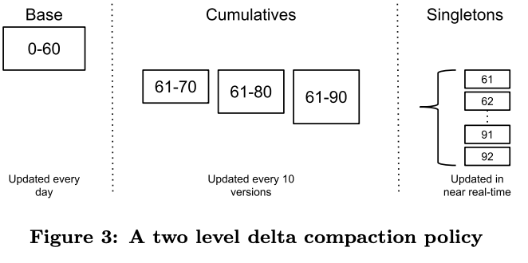
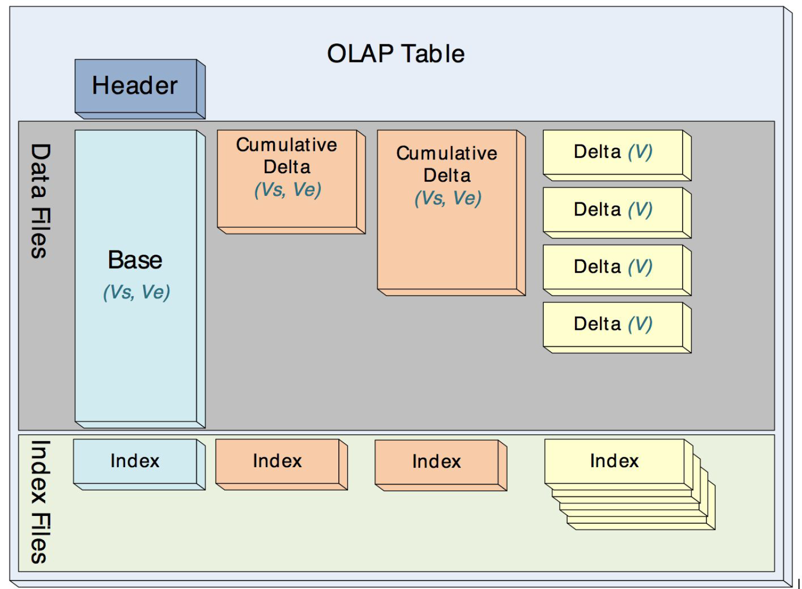
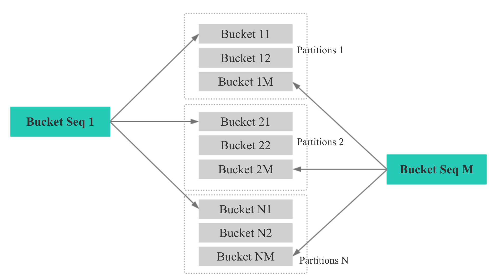
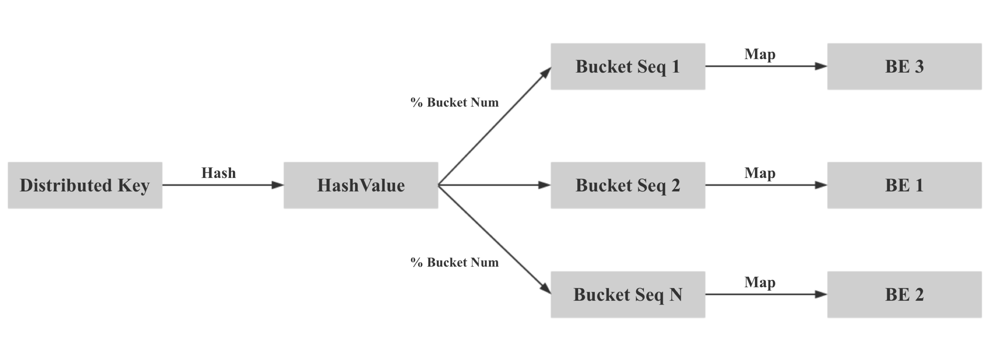

## Doris(Palo)知识总结

- 基于google的mesa数据仓库,经由百度孵化的Doris(原Palo)项目

### Mesa论文解读

Mesa是一个分布式、多副本的、高可用的数据处理、存储和查询系统，针对结构化数据。一般数据从上游服务产生（比如一个批次的spark streaming作业产生），在内部做数据的聚合和存储，最终把数据serve到外面供用户查询。

- WHAT：多数据中心，近实时，高可扩展的分析型数据仓库
- WHY：
  - **Atomic Updates**
    - 要么全生效,要么全不生效,不存在中间状态
  - **Consistency and Correctness**
    - 强一致性必须保证,可重复读
  - **Availability**
    - 高可用,不存在单点故障,不能停服
  - **Near Real-Time Update Throughput**:近实时的高吞吐更新.数据摄入时不仅支持追加新数据,也支持更新已有数据
    - 支持增量实时更新,吞吐达到百万行/秒,增量在分钟级即可被查询到的queryability
  - **Query Performance**:同时支持数百毫秒低延迟的点查询和高吞吐的批量查询
  - **Scalability**:数据摄入和查询性能可以随集群规模线性增长
  - **Online Data and Metadata Transformation**:在线的表Schema变更,表的Schema变更不会影响数据的摄入和查询。业务不断变化，对于schema的变更，包括加表、删表、加列、减列，新建索引，修改无话视图等都必须不能停服在线完成，而且不能影响数据更新和查询。
- HOW
  - 水平分区和多副本,实现storage scalability和availability
  - 底层数据多版本管理,实现数据一致性,数据更新时不影响查询
  - 数据batch更新,采用MVCC,每次更新会分配一个版本号,然后周期性（分钟级）的摄入到Mesa
    - 存储版本问题,需要存储多份数据,聚合数据较小,问题还好
    - 查询时延,多版本查询,需要遍历各个版本,增大查询时延
    - merge策略:base compaction和cumulative compaction
      - 导入数据为多个singleton delta,到一定版本数（比如10个）就会聚合成一个cumulative deltas,最后每天会通过base compaction将一定周期内的deltas都合并为base deltas,查询只需要查询一个base deltas,一个cumulative deltas和少数singleton deltas即可,其中compaction是后台并发和异步执行的,且key是按序存储的,merge是线性时间

        
    - Mesa物理结构和索引结构
      - Mesa中的delta、cumulative和base在物理存储上格式一样，都是immutable的，这样就很方便做mini-batch的增量的更新，而不至于很影响吞吐，因为compaction都是异步的。

      - Mesa的存储格式要尽可能的节约空间，同时支持点查（fast seeking to a specific key），Mesa设计了索引和数据Data文件，物理上Index和Data数据是分开的，每个Index实际就是Short Key的顺序排列外加offset偏移量，每个Data就是Key+Value的顺序存储。每个表就是这样多个Index和多个Data的集合。

      - Data文件中的数据按照Key有序排列，按行切块形成row block，按列存储，这种格式和现在的ORC、Parquet很像，row block的大小一般不大，它是从磁盘load到内存的最小粒度，使用这种格式很容易做压缩，因为每一列的格式都是相同的，可以做一些轻量级的编码比如RLE、字典编码、Bitpacking等，在这个基础之上再做重量级的压缩，比如LZO、Snappy、GZIP等，就可以实现压缩比很高的存储。

      - 每个data files都会有对应的index file,一个索引项是<key, value>,key是row block的第一个key,value是row block在data files中的offset.查找特定key的过程就是:先加载index文件,二分查找index文件获取包含特定key的row blocks的offset,然后从data files中load指定的row block到内存,再做一些Predicate filter的Scan，对于Key相同的按照聚合函数做聚合即可把结果查到。

        
    - Mesa系统架构
      - controller/worker框架,congtroller负责元数据缓存和worker调度器,为各种worker维护不同的调度器
      - 各种类型worker有自己的职责,update,compaction,schema change,checksum workers
      - controller是无状态的,controller在启动的时候会去BigTable拉取元数据,因此系统挂掉不影响查询
      - 查询系统:
        - global locator service用来知道目标table是由哪个query server负责
    - Mesa多数据中心下的一致更新机制
      - 引入committer组件,负责协调在多数据中心实例下,一次只更新一个版本
      - 更新前,每个batch的更新分配一个version,存入version database,然后mesa的controller会监听version database的change,如果监听到change,Mesa会分配worker给update workers,接着controllers会根据work执行结果的状态信息更新version database，最终committer会检查verion提交的一致性条件是否满足（比如，一个table有多个roll up表，那么必须所有roll up表都更新后才可以提交），如果满足的话，就最终更新versions database中的version
      - 优点:数据更新和查询都没有锁,异步更新,元数据基于Paxos协议同步更新
    - Mesa Schema在线变更
      - 在线变更Schema不影响数据的正常导入和查询,无需重刷历史数据
      - Mesa提出linked schema change,对于历史数据不会重刷,新摄入的数据都按照新的schema处理,旧数据中新加列的值直接用对应数据类型的默认值填充
  - 基于Paxos的一致性协议,保证元数据一致性

### 最佳实践

#### 大宽表与star schema

- 业务方建表时，为了和前端业务适配，往往不对维度信息和指标信息加以区分，而将schema定义成大宽表，这种大宽表性能往往不如人意：
  1. schema中字段数比较多，聚合模型中可能key列比较多，导入过程中需要排序的列会增加；
  2. 维度信息更新会反应到整张表中，而更新的频率直接影响查询的效率
- 建议尽量使用star schema区分维度表和指标表。频繁更新的维表可以房子啊mysql中个，而如果只有少量更新，可以直接放在Doris中。在Doris中存储维度表时，可对维度表设置更多的副本，提升join的性能。

#### failover和load balance

- 第一种方法：应用层面解决，如果发现连接挂掉，自动重试其他连接
- 第二种方法：使用jdbc的自动重试机制
- 第三种方法:应用可以连接到和应用部署到同一机器上的mysql proxy，通过配置mysql proxy的failover和load balance功能来达到目的

#### 分区(partition)和分桶(bucket)

- RANGE分区用于将数据划分为不同区间，逻辑上可以理解为将原始表划分成多个子表；业务上，多数用户会选择采用时间进行partition，让时间进行partition好处有：
  - 区分**冷热**数据
  - Doris分级存储(SSD+SATA)的功能
  - 按分区删数据，更加迅速,partition是逻辑上最小的管理单元,数据的导入和删除,仅能针对一个partition进行,每个partition包含多个Tablet,Tablet是数据移动,复制等操作的最小物理存储单元
- HASH分桶:
  - 区分度大的列做分桶，避免出现数据倾斜
  - 单个bucket建议保持10GB左右
- partition和bucket的数量以及数据量的建议
  - 一个表tablet总数量等于partition num * bucket num
  - 一个表的Tablet的数量,在不考虑扩容的情况下,推荐略多于整个集群的磁盘数量
  - 单个 Tablet 的数据量理论上没有上下界，但建议在 1G - 10G 的范围内。如果单个 Tablet 数据量过小，则数据的聚合效果不佳，且元数据管理压力大。如果数据量过大，则不利于副本的迁移、补齐，且会增加 Schema Change 或者 Rollup 操作失败重试的代价（这些操作失败重试的粒度是 Tablet）

#### 稀疏索引和bloomfilter

- Doris对数据进行有序存储，在数据有序的基础上为其建立稀疏索引，索引粒度为block(1024行)，稀疏索引选取schema中固定长度的前缀作为索引内容，目前支持36字节的前缀作为索引
  - **建表时建议将查询中常见的过滤字段放在schema的前面, 区分度越大，频次越高的查询字段越往前放**
  - 这其中有一个特殊的地方,就是varchar类型的字段,varchar类型字段只能作为稀疏索引的最后一个字段，索引会在varchar处截断, 因此varchar如果出现在前面，可能索引的长度不足36个字节
- 除稀疏索引之外, Doris还提供bloomfilter索引, bloomfilter索引对区分度比较大的列过滤效果明显。 如果考虑到varchar不能放在稀疏索引中, 可以建立bloomfilter索引

#### 导入

- mini load：通过http推的方式进行导入，每次导入数据限制在１GB，适合分钟级别的数据导入需求
- pull load：通过拉的方式导入，适合天级别的批量数据导入

###　概念整理

#### 数据模型

- **Aggregate(聚合)模型**
  - AggregationType:SUM，REPLACE，MAX，MIN
  - 明细：在导入的批数据中增加timestamp列，那么导致所有行的key不完全相同，在聚合模型下，则保存了完整的明细数据
  - REPLACE:相同keys的记录时只保留最新的value,借助这个函数可以实现**点更新**
  - 数据聚合发生的阶段有：
    - ETL阶段，每一批次导入的数据内部聚合
    - BE进行数据Compaction阶段，BE会对已导入的不同批次的数据进行进一步的聚合
    - 数据查询时，对涉及到的数据会进行对应的聚合
  - 局限性：
    - 模型对外展现的是**最终聚合后的数据**
    - count(*)极大的降低查询效率：由于聚合模型的原因，在进行count查询时**必须扫描所有的aggregate key列**，因此当聚合列非常多时，count查询需要扫描大量的数据
    - 解决办法：如果业务上有count查询需求，可以通过添加一个值恒为１，聚合类型为sum的列来模拟count查询，不过需要用户**保证不会重复导入AGGREGATE KEY列都相同的行**，如果count列聚合类型改为REPLACE，那么就没有导入重复行的限制
- **Uniq模型(唯一主键)**
  - 在某些多维分析场景下，用户更关注的是如何保证key的唯一性，即如果获得Primary Key唯一性约束．
  - Uniq模型本质上是一个**聚合模型的特例**，聚合模型中AggregationType设置为REPLACE
- **Duplicate模型**
  - 在某类多维分析场景下，数据既没有主键，也没有聚合需求
  - 指明DUPLICATE KEY用来指明底层数据按照哪些列进行排序
  - Duplicate模型没有聚合模型的局限性，因为该模型不涉及聚合语义，在做count(*)查询时，任意选择一列查询，即可得到语义正确的结果。
- 数据模型选择建议：
  - Aggregate 模型可以通过预聚合，极大地降低聚合查询时所需扫描的数据量和查询的计算量，非常适合有固定模式的报表类查询场景。但是该模型对 count(*) 查询很不友好。同时因为固定了 Value 列上的聚合方式，在进行其他类型的聚合查询时，需要考虑语意正确性
  - Uniq 模型针对需要唯一主键约束的场景，可以保证主键唯一性约束。但是无法利用 ROLLUP 等预聚合带来的查询优势（因为本质是 REPLACE，没有 SUM 这种聚合方式）
  - Duplicate 适合任意维度的 Ad-hoc 查询。虽然同样无法利用预聚合的特性，但是不受聚合模型的约束，可以发挥列存模型的优势（只读取相关列，而不需要读取所有 Key 列）
  - Duplicate模型没有聚合的语义，所以该模型中的ROLLUP，已经失去了“上卷”这一层含义。而仅仅是作为调整列顺序，以命中前缀索引的作用。

#### Doris中的join

- **broadcast join**

- 系统默认实现：将小表进行条件过滤之后，将其广播到大表所在的各个节点，形成一个内存hash表，然后流式读出大表的数据进行hash join,如果当小表过滤后无法放入内存的话，将报错内存超限

- **shuffle(parititioned) join**

- 如果broadcast join时内存超限的话，将大小表按照join的key进行hash,然后进行分布式join,这个对内存的消耗将会分摊到集群的所有计算节点上

- **colocate join原理与实践**

  - WHAT

    - Colocate/Local Join就是指多个节点Join时没有数据移动和网络传输，每个节点只在本地进行Join，能够本地进行Join的前提是相同Join Key的数据分布在相同的节点。

  - 优点：由于相同的Join key的数据分布在相同的节点,因此查询时没有数据的网络传输，性能更高，相比shuffle join拥有更高的并发粒度，可以显著提升Join性能

  - 核心思路:
    - 数据导入时保证数据的本地性;
      - 计算Distributed Key的hash值,并对bucket num取模,保证相同Distributed Key的数据映射到相同的bucket seq

        

        

        

      - 将同一个Colocate Group下所有相同Bucket Seq的bucket映射到相同的BE

        1. Group中所有Table的Bucket Seq和BE节点的映射关系和Parent Table一致
        2. Parent Table中所有Partition的Bucket Seq和BE节点的映射关系和第一个Partition一致
        3. Parent Table第一个Partition的Bucket Seq和BE节点的映射关系理由原生的Round Robin算法决定
    - 查询调度时保证数据本地性;
    - 数据balance后保证数据本地性
      - 新增一个daemon线程专门处理colocate table的balance,并让正常的balance线程不处理colocate table的balance
      - 当BE节点新增,删除,down掉时,将会触发balance
      - 当balance时,必须保证同一个colocate group下bucket的数据本地性,所以balance的单位是colocate group
      - 影响:当一个colocate group正在balance时,colocate join会退化为原始的shuffle join或broadcast join
      - balance流程:
        - 为需要复制或迁移的Bucket选择目标BE
        - 标记colocate group的状态为balancing
        - 对于需要复制或迁移的Bucket发起Clone Job,Clone Job会从Bucket的现有副本复制一个新副本目标BE,当colocate group下所有的Clone Job都完成时,标记为colocate group的状态变为stable

#### 前缀索引与ROLLUP

- ROLLUP示例语句：ALTER TABLE site_visit ADD ROLLUP rollup_city(city, pv);
- 前缀索引
  - 不同于传统的数据库设计，Doris 不支持在任意列上创建索引。Doris 这类 MPP 架构的 OLAP 数据库，通常都是通过提高并发，来处理大量数据的
  - 本质上，Doris的数据存储在类似SSTable的数据结构中，它是一种有序的数据结构，可以**按照指定的列进行排序存储**，因此如果以排序列为条件进行查找会非常高效
  - 在 Aggregate、Uniq 和 Duplicate 三种数据模型中。底层的数据存储，是按照各自建表语句中，AGGREGATE KEY、UNIQ KEY 和 DUPLICATE KEY 中指定的列进行排序存储的
  - 前缀索引，在排序的基础上，实现的一种根据给定前缀列，快速查询数据的索引方式
  - 将一行数据的前**36个字节**作为这行数据的前缀索引，当遇到VARCHAR类型时，前缀索引会直接截断。
  - 查询的时候会根据**查询条件**来匹配每个Base/Rollup的前缀索引，并且选择出匹配前缀索引最长的一个Base/Rollup
  - 能用得上前缀索引的列上的条件适合**=<><=>=in between**这些，并且这些条件是并列的且关系即用and连接，对于or != 等这些不能命中
- ROLLUP说明：
  - Doris中用户通过建表语句创建出来的表为Base表，基于Base表可以创建任意多个ROLLUP表
  - ROLLUP可以理解为Table的一个物化索引结构．物化是因为其数据在物理上独立存储，而索引的意思是，ROLLUP可以调整列顺序以增加前缀索引的命中率，也可以减少key列以增加数据的聚合度．
  - 含义非＂上卷＂，根本作用是为了**提高某些查询的查询效率**(无论是通过聚合来减少数据量，还是修改列顺序以匹配前缀索引)
  - 不能显示指定查询某ROLLUP，由Doris系统自动决定
  - ROLLUP的数据是独立存储的，因此创建的ROLLUP越多，占用磁盘空间也就越大，同时对导入的速度也有影响(**导入的ETL阶段会自动产生所有的ROLLUP的数据**)，但不会降低查询效率
  - ROLLUP中列的聚合方式与Base表完全相同，在创建ROLLUP无需指定，也不能修改
  - 查询能否命中ROLLUP的一个必要条件是，查询所涉及的所有列(包括**select list和where中的查询条件**等)都存在于该ROLLUP的列中，否则只能命中Base表
    - 可以通过EXPLAIN sql命令获取查询执行计划，可以看出是否命中前缀索引
  - 可以通过**DESC tab_name all**来显示Base表和所有已创建的ROLLUP

#### Doris在线变更

Doris在线变更有三种:

1. direct schema change:无需重新排序,但是需要对数据做一次转换.例如需要对数据做一次转换.例如修改列的类型,在稀疏索引中加一列等;
2. sorted schema change:改变了列的排序方式,需要对数据进行重新排序,例如删除排序列中的一列,字段重排序;
3. linked schema change:无需转换数据,直接完成.对于历史数据不会重刷,新摄入的数据都按照新的schema处理,对于旧数据,新加列的值直接用对应数据类型的默认值填充,例如加列操作.

