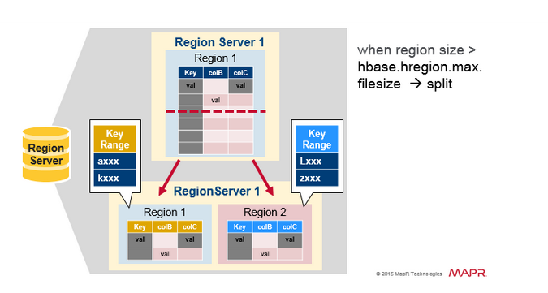
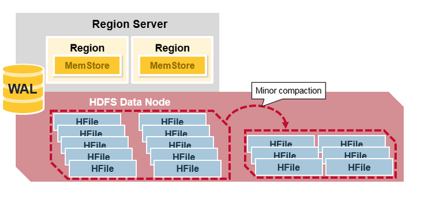
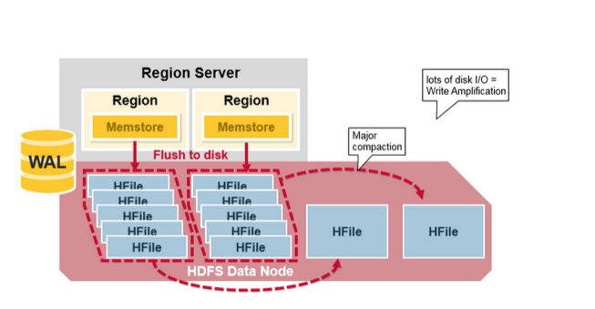

## HBase

HBase是一个开源的非关系型分布式数据库,参考BigTable建模,运行于HDFS文件系统之上,可以容错存储海量稀疏的数据

### 特性与优势

- **高可靠**
- **高并发读写**
- **面向列**
- **可升缩**
- **易构建**
- **海量数据存储**
- **快速随机访问**
- **大量写操作的应用**

### 数据模型

- RowKey: Byte array,是表中每条记录的主键,方便快速查找,RowKey的设计非常重要,设计依赖于业务
- Column Family:列族,拥有一个名称,包含一个或者多个相关列
- Column:属于某一个column family,family name:column name,每条记录可动态添加
- version number:类型为long,默认值是系统时间戳,可由用户自定义
- value:Byte array
- timestamp时间戳用于区分失效时间

### SSTable

**定义**:SSTable是Bigtable内部用于数据的文件格式,文件本身就是一个**排序**的,**不可变**的,**持久**的```Key/Value```对,其中```Key```和```value```都可以是任意的```byte```字符串。

使用Key来查找Value，或通过给定Key范围遍历所有的```Key/Value```对.每个```SSTable```包含一系列的```Block```(一般```Block```大小为64KB,但是它是可配置的),在```SSTable```的末尾是```Block```索引,用于定位```Block```,这些索引在```SSTable```打开时被加载到内存中,在查找时首先从内存中的索引二分查找找到```Block```,然后一次磁盘寻道即可读取到相应的Block.还有一种方案是将这个```SSTable```加载到内存中,从而在查找和扫描中不需要读取磁盘.


在HBase使用过程中,对这个版本的HFile遇到以下一些问题:

1. 解析时内存使用量比较高;
2. BloomFilter和Block索引很大,影响启动性能.具体的,Bloom Filter可以增长到100MB每个HFile,而Block索引可以增长到300MB,如果一个HRegionServer中有20个HRegion,则他们分别能增长到2GB和6GB的大小.
3. HRegion需要在打开时,需要加载所有的Block索引到内存中,因而影响启动性能;而在第一次Request时,需要将整个Bloom Filter加载到内存中,再开始查找,因而Bloom Filter太大会影响第一次请求的延迟.

**存储**:

1. 在新数据写入时,这个操作首先提交到日志中作为redo记录,最近的数据存储在内存的memtable中;旧的数据存储在一系列的SSTable中.在recover中,Tablet server从metadata表中读取metadata,metadata包含了组成Tablet的所有SSTable(记录了这些SSTable的元数据信息,如SSTable的位置,StartKey,EndKey等)以及一系列日志中的redo点.Tablet Server读取SSTable的索引到内存,并replay这些redo点之后的更新来重构memtable;
2. 在读时,完成格式,授权更检查后,读会同时读取SSTable,memtable(HBase还包含BlockCache中的数据),由于SSTable和memtable都是字典序排序,因而合并操作可以很高效的完成;

**Compaction**:

1. memtable大小增加到一个阈值,这个memtable会被冻结然后创建一个新的memtable以供使用,旧的memtable会转换成一个SSTable而写到GFS,这个过程叫做minor compaction,minor compaction的作用是:减少内存使用量,减少日志大小,因为持久化后的数据可以从日志中删除.在minor compaction过程中,可以继续处理写请求
2. 每次minor compaction会生成新的SSTable,如果SSTable文件数量增加,会影响读性能,因而每次读都需要读取所有SSTable文件,然后合并结果,因而对SSTable文件个数需要有上限,并且是不是需要在后台做merging compaction,这个merging compaction读取一些SSTable文件和memtable的内容,并将它们合并写入一个新的SSTable中,当这个过程完成后,这些源SSTable和memtable就可以被删除了
3. 如果一个merging compaction是合并所有SSTable到一个SSTable,则这个过程称做major compaction.一次major compaction会将mark成delete的数据删除,其他compaction则会保留这些信息和数据.Bigtable会时不时扫描所有的Tablet,并对它们做major compaction.这个major compaction可以将需要删除的数据真正的删除从而节省空间,并保持系统一致性.

**压缩**

Bigtable的压缩是以SSTable中的一个Block为单位的,虽然每个Block为压缩单位损失一些空间,但是采用这种方式,我们可以以Block为单位读取,解压,分析,而不是每次以一个大的SSTable为单位读取,解压,分析

**缓存**

1. 缓存从SSTabel读取的Key/Value对.提升重复读取相同数据性能
2. BlockCache,缓存SSTable中的Block,提升读取相近数据的性能

**BloomFilter**

借助BloomFilter,快速找到一个RowKey不在某个SSTable中的事实

**Immutable好处**

1. 在读SSTable是不需要同步的.读写同步只需要在memtable中处理,为了减少memtable的读写竞争,Bigtable将memtable的row设计成copy-on-write,从而读写可以同时进行;
2. 永久的移除数据转变为SSTable的Grabage Collect.每个Tablet中的SSTable在metadata表中有注册,master使用mark-and-sweep算法将SSTable在GC过程中移除
3. 可以让Tablet Split过程变得高效,我们不需要为每个子Tablet创建新的SSTable,而是可以共享父Tablet的SSTable.

### 物理模型

- HBase一张表由一个或多个Hregion组成,HRegion是HBase中分布式存储和负载均衡的最小单元
  - 最小单元就表示不同的HRegion可以分布在不同HRegion Server上,但一个HRegion是不会拆分到多个server上的
  - HRegion虽然分布式存储的最小单元,但并不是存储的最小单元
  
  
  
- 记录之间按照RowKey的字典序排列

- HRegion按大小分割,每个表一开始只有一个Hregion,随着数据不断插入表,Hregion不断增大,当增大到一定阈值(由```hbase.hregion.max.filesize```指定,默认是10GB)的时候,Hregion就会等分成两个新的Hregion,新的HRegion会在同一个HRegionServer中创建,各自包含父HRegion一半的数据,当Split完成后,父HRegion会下线,新的子HRegion会向HMaster注册上线,出于负载均衡考虑,这两个新的HRegion可能会被HMaster分配到其他的HRegionServer中;当table中的行不断增多,就会有越来越多的Hregion


- 为了增加吞吐量,不同的region放在不同的机器上面



- 表->HTable
- 按RowKey范围分的region->HRegion->Region Servers
- HRegion按列族->多个HStore
- HStore->memstore+HFile(均为有序的KV)
  - memstore到一定大小会从内存flush但磁盘上面
- HFile->HDFS


### 系统架构

架构图如下所示:


- Client:访问HBase的接口,并维护Cache加速Region Server的访问
- HLog:WAL预写log
- HMaster:
  1. 负载均衡;
  2. 分配HRegion到HRegion Server,HRegion Server退出时迁移其内部的HRegion到其他HRegionServer上;
  3. 实现DDL操作;
  4. 权限控制(ACL);
  5. 管理namespace和table的元数据
- HRegionServer:
  1. 存放和管理本地HRegion
  2. 读写HDFS,管理Table中的数据
  3. Client直接通过HRegionServer读写数据(从HMaster中获取元数据,找到RowKey所在的HRegion/HRegionServer后)
- Zookeeper:
  1. 保证集群中只有一个master;
  2. 存储所有Region的入口(ROOT)地址;
  3. 实时监控Region Server的上下线信息,并通知Master

### HBase的容错

- Zookeeper协调集群所有节点的共享信息,在HMaster和HRegion Server连接到Zookeeper后创建Ephemeral(临时)节点,并使用Heartbeat机制维持这个节点的存活状态,如果某个Ephemeral节点失效,则HMaster会收到通知,并做相应的处理


- Master容错:Zookeeper会重新选择一个新的Master
  - 无Master过程中,数据读取仍照常进行
  - 无Master过程中,region切分,负载均衡等无法进行
- Region Server容错
  
  - 定时向Zookeeper汇报心跳,如果一段时间内未出现心跳,Master将该RegionServer上的Region重新分配到其他Region Server上,失效服务器上"预写WAL"日志由主服务器进行分割并派送给新的RegionServer,从而这些HRegionServer可以Replay分到的WAL来重建MemStore
  
  
- Zookeeper容错
  
  - Zookeeper是一个可靠的服务,一般配置3或5个Zookeeper实例
- WAL(Write-Ahead-Log)预写日志
  - 是HBase的RegionServer在处理数据插入和删除的过程中用来记录操作内容的一种日志
  - 在每次put或者Delete等一条记录时,首先将数据写入到RegionServer对应的HLog文件的过程
  - 客户端往RegionServer端提交数据的时候,会写WAL日志,只有**当WAL日志写成功**以后,客户端才会被告诉提交数据成功,如果写WAL失败会告知客户端提交失败
  - 数据落地的过程:
    - 在一个RegionServer上的所有的Region都共享一个HLog,一次数据的提交先写WAL,写入成功后,再写memstore,当memstore到达一定阈值,就会形成一个个StoreFile(HFile)

### HBase查询过程

- -ROOT-表:记录.META.表的Region信息,-ROOT-只有一个HRegion
- .META.表:记录用户表的Region信息,.META.可以有多个HRegion


- 原始过程:

  1. 从Zookeeper中获取-ROOT-表所在HRegionServer;
  2. 通过TableName, Rowkey读取.META.表信息知道对应meta信息应该在哪个HRegionServer;
  3. 在对应的HRegionServer获取此次请求需要访问meta信息知道请求需要访问的HRegion的位置;
  4. 访问该HRegionServer获取请求的数据;

  需要三次请求才能找到用户Table所在的位置包含HRegion Server信息,第四次才请求真正数据,考虑一般集群规模没有那么大,因此只保留一个Meta Table,存储了集群中所有用户HRegion的位置信息,zookeep中存储它的位置,过程就变为:

  1. 从Zookeeper中获取hbase:meta的位置(HRegionServer位置),缓存该位置信息;
  2. 查询用户Table对应请求的RowKey所在的HRegionServer,缓存该位置信息;
  3. 从查询到的HRegionServer中读取Row

- HBase的读取流程：
  
  - 扫描顺序：BlockCache(region中blockcache)，Memstore，StoreFile(HFile)
  - 其中StoreFile的扫描会先使用Bloom Filter过滤那些不可能符合条件的HFile,然后使用Block Index快速定位Cell,并将其加载到BlockCache中,然后从BlockCache中读取,我们知道一个HStore可能存在多个StoreFile(HFile),此时需要扫描多个HFile,如果HFile过多又会引起性能问题.
  
  

### HBase寻址

- 上述查询过程中第二步只缓存当前RowKey对应的HRegion的位置，因而如果下一个RowKey不在同一个HRegion中，则需要继续查询meta，随着时间推移client缓存的位置信息会越来越多，从而不需要去meta中寻找信息，除非某个HRegion宕机或者发生split情况
- meta表存储了所有用户HRegion的位置信息
  
  - tableName，regionStartKey，regionId, replicaId  -> region server
  
  

### HBase 写入

写入过程如下所示:


- client发起一个put请求，首先从meta表中查出该Put数据最终需要取得HRegion server，然后client将put请求发给相应的HRegion server，在HRegion server中它首先会将该Put操作写入WAL日志(Flush到磁盘)

​	

- 写完WAL日志文件后,HRegionServer根据put中的TableName和RowKey找到对应的HRegion,并根据Column Family找到对应HStore,并将Put写入到该HStore的MemStore中,此时写成功,返回通知客户端
- Memstore是一个写缓存(In Memory Sorted Buffer)，每一个column family有一个自己的Memstore
- Memstore是一个HRegion的一个Column Family对应的一个实例，排列顺序为：RowKey，Column Family，Column的顺序以及Timestamp的倒序


### HBase merge

- 随着写入不断增多，flush次数不断增多，Hfile文件越来越多，需要进行合并
- Compaction会从一个region的一个store中选择一些Hfile文件进行合并，原理就是从这些待合并的数据文件中读出KeyValues，再按照由小到大排列后写入一个新的文件中，之后，这些新生成的文件就会取代之前待合并的所有文件对外提供服务
- **Minor Compaction**：选取一些小的，相邻的store file将他们合并成一个更大的store file，在这个过程中不会处理已经delete或者expire的cell，一次minor compaction的结果是更小并且更大的store file



- **Major Compaction**：是指将所有的Store file合并成一个store file，这个过程还会清理三类无意义数据：被删除的数据，TTL过期数据，版本号超过设定版本号的数.Major Compaction耗时较长，占用系统资源较多,因此一般安排在周末,凌晨等集群比较闲的时候



- 本质：使用短时间的IO消耗以及带宽消耗换取后续查询的低延迟,compact的速度远远跟不上HFile生成的速度,因此在HFile数量过多的时候会限制写请求的速度.

### HBase 热点问题

- RowKey设计(根据业务场景的where条件组合成RowKey)