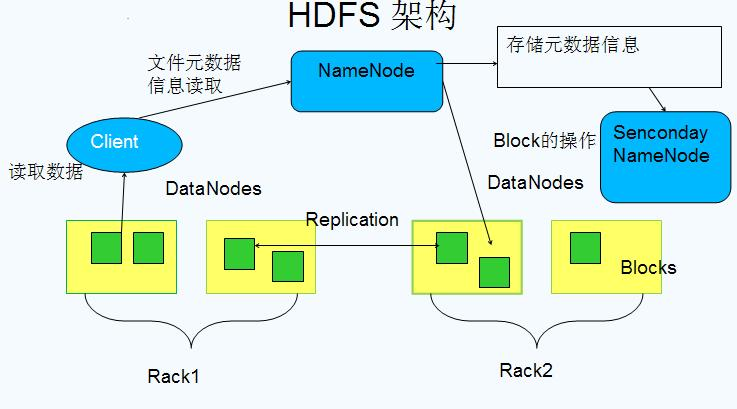
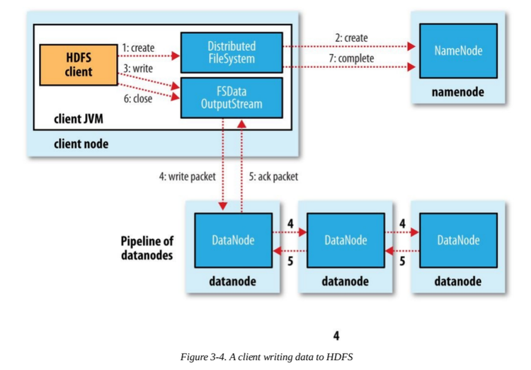
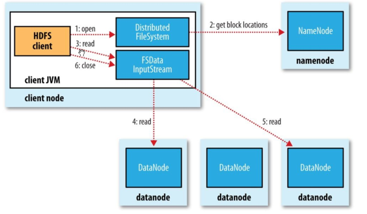

## HDFS

分布式文件存储系统,采用master/slave结构，一个HDFS集群包含一个单独的NameNode和多个DataNode节点，如下图所示：

### NameNode

管理整个分布式系统的元数据

1. 目录树结构
2. 文件到数据库Block的映射关系
3. Block副本及其存储位置等管理数据
4. DataNode的状态监控,两者通过时间间隔的心跳来传递管理信息和数据信息,通过这种方式传递,NameNode可以获知每个DataNode保存的Block信息,DataNode的健康状况,命令DataNode启动停止等(如果发现某个DataNode节点故障,NameNode会将其负责的block在其他DataNode上进行备份)

这些数据保存在内存中,同时在磁盘保存两个元数据管理文件:fsimage和editlog

- fsimage:是内存命名空间元数据在外存的镜像文件
- editlog:各种元数据操作的WAL(write-ahead-log)文件,在体现到内存数据变化前首先会将操作记入editlog,以防止数据丢失

上述两个文件结合可以构造完整的内存数据

### Secondary NameNode

Secondary NameNode并不是NameNode的热备机,而是定期从NameNode拉取fsimage和editlog文件,并对这两个文件进行合并,形成新的fsimage文件并传回NameNode,这样做的目的是减轻NameNode的工作压力,本质上SNN是一个提供检查点功能服务的服务点

### DataNode

负责数据块的实际存储和读写工作,Block默认为64M(2.0变了128M),当客户端上传一个大文件时,HDFS会自动将其切割成固定大小的block,为了保证数据可用性,每个Block会以多备份的形式存储,默认为3.

### 文件写入过程

- block：文件分块，默认64M，2.0变为128M，可修改，不建议改：**block块太小，寻址时间占比过高；block块太大，Map任务数太少，作业执行速度变慢**
- packet：第二大单位，是client向DataNode，或者DataNode的pipeline之间传数据的基本单位，默认为64KB。
- chunk：最小的单位，client向DataNode，或DataNode的pipeline之间进行数据校验的基本单位，默认512Byte，因为用作校验，故每个chunk需要带有4Byte的校验
- client端向DataNode传数据的时候，HDFSOutputStream会有一个chunk buff，写满一个chunk后，会计算校验并写入当前的chunk。之后再把带有检验和的chunk写入packet，当一个packet写满后，packet会进入dataQueue队列，其他的DataNode就是从这个dataQueue获取client端上传的数据并存储的。同时一个DataNode成功存储一个packet后会返回一个ack packet，放入ack Queue中。

1. client发出写请求后，首先检查是否已存在文件，检查权限。如果通过检查，将操作写入editlog
2. Client调用DistributeFileSystem对象的create方法,创建一个文件输出流(FSDataOutputStream)对象;
3. 通过DistributeFileSystem对象与集群的NameNode进行一次RPC远程调用,在HDFS的Namespace中创建一个文件条目(Entry),此时该条目没有任何的Block,NameNode会返回该数据每个块需要拷贝的DataNode地址信息;
4. 通过FSDataOutputStream对象,开始向最近的DataNode写入数据,数据首先被写入FSDataOutputStream对象内部的数据队列中,数据队列由DataStreamer使用,它通过选择合适的DataNode列表来存储副本,从而要求NameNode分配新的block;
5. DataStreamer将数据包以流式传输的方式传输到分配的第一个DataNode中,该数据将数据包存储到第一个DataNode中并将其转发到第二个DataNode中,接着第二个DataNode节点会将数据包转发到第三个DataNode节点（client每向第一个DataNode写入一个packet，这个packet便会直接在pipeline里传给第二个，第三个DataNode）;
6. DataNode确认数据传输完成,最后一个DataNode通知clietn数据写入成功;
7. 完成想文件写入数据,Clietn在文件输出流(FSDataOutputStream)对象上调用close方法,完成文件写入;
8. 调用DistributeFileSystem对象的complete方法,通知NameNode文件写入成功,NameNode会将相关结果记录到editlog.

### 文件读取过程

1. Client通过DistributedFileSystem对象与集群的NameNode进行一次RPC调用,获取文件block信息;
2. NameNode返回存储的每个块的DataNode列表;
3. Client将连接到列表中最近的DataNode;
4. Client开始从DataNode并行读取数据，DataNode向输入流中写数据，以packet为单位来校验;
5. 一旦Client获得了所有必须的block,它就会将这些block组合起来形成一个文件.

在处理client的读取请求时,HDFS会利用机架感知选举最接近Client位置的副本,这将会减少读取延迟和带宽消耗

HDFS 1.0的架构问题:

1. 有单点问题,如果挂掉则不可用 => HA
2. 水平扩展问题 =>NameNode Federation

### HDFS 2.0的HA实现

HA实现组件:

1. Active NameNode和Standby NameNode:两台NameNode形成互备,只有主NameNode才能对外提供读写服务;
2. ZKFailoverController(主备切换控制器,FC):作为独立进程运行,对NameNode的主备切换进行总体控制,它能及时检测到NameNode的健康状况,在主NameNode故障时借助Zookeeper实现自动的主备选举和切换
3. Zookeeper集群:为主备切换控制器提供主备选举支持
4. 共享存储系统:共享存储系统是实现NameNode的高可用最为关键的部分,共享存储系统保存了NameNode在运行过程中所产生的HDFS的元数据.主NameNode和备NameNode通过共享存储系统实现元数据同步.在进行主备切换的时候,新的主NameNode在**确认元数据完全同步之后才能继续对外提供服务**.
5. DataNode节点:因为NameNode和备NameNode需要共享HDFS的数据块与DataNode之间的映射关系,为了使故障切换能够快速进行,DataNode会同时向主NameNode和备NameNode上报数据块的位置信息.

### FailoverController

实现SNN和ANN之间的故障自动切换,FC是独立于NN之外的故障切换控制器,ZKFC作为NameNode机器上一个独立的进程启动,它启动的时候会创建HealthMonitor和ActiveStandbyElector这两个主要的内部组件,其中:

1. HealthMonitor：主要负责检测 NameNode 的健康状态，如果检测到 NameNode 的状态发生变化，会回调 ZKFailoverController 的相应方法进行自动的主备选举；
2. ActiveStandbyElector：主要负责完成自动的主备选举，内部封装了 Zookeeper 的处理逻辑，一旦 Zookeeper 主备选举完成，会回调 ZKFailoverController 的相应方法来进行 NameNode 的主备状态切换。

### 自动触发主备选举

NameNode在选举成功之后,会在zk上创建一个`/hadoop-ha/${dfs.nameservices}/ActiveStandbyElectorLock`临时节点,而没有选举成功的备NameNode会监控这个节点,通过Watcher来监听这个节点的状态变化事件,ZKFC的ActiveStandbyElector主要关注这个节点的NodeDeleted事件

如果Active NameNode对应的HealthMonitor检测到NameNode的状态异常时,ZKFailoverController会主动删除当前在Zookeeper上建立的临时节点`/hadoop-ha/${dfs.nameservices}/ActiveStandbyElectorLock`这样处于standby状态的NameNode的ActiveStandbyElector注册的监听器就会收到这个节点的NodeDeleted事件.收到这个事件之后,会马上再次进入到创建`/hadoop-ha/${dfs.nameservices}/ActiveStandbyElectorLock`节点的流程,如果创建成功,这个本来处于Standby状态的NameNode就选举为主NameNode并随后开始切换为Active状态.

当然,如果是Active状态的NameNode所在的机器整个宕掉的话,那么根据Zookeeper的临时节点特性,`/hadoop-ha/${dfs.nameservices}/ActiveStandbyElectorLock`节点会自动被删除,从而也会自动进行一次主备切换.

### HDFS脑裂问题

在实际中,NameNode可能会出现这种情况,NameNode在垃圾回收时,可能会长时间内整个系统无响应,因此,也就无法向zk写入心跳信息,这样的话可能会导致临时节点掉线,备NameNode会切换到Active状态,这种情况,可能会导致整个集群会有同时有两个NameNode,这就是脑裂问题.

脑裂问题的解决方案是隔离(Fencing),主要是在以下三处采用隔离措施:

1. 第三方共享存储:任一时刻,只有一个NN可以写入;
2. DataNode:需要保证只有一个NN发出与管理数据副本有关的删除命令;
3. Client:需要保证同一时刻只有一个NN能够对Client的请求发出正确的响应;

解决方案实现如下:

1. 在成功创建`/hadoop-ha/${dfs.nameservices}/ActiveStandbyElectorLock`成为Active NameNode之后,创建另外一个路径为`/hadoop-ha/${dfs.nameservices}/ActiveBredCrumb`的持久节点,这个节点里面保存了这个Active NameNode的地址信息
2. Active NameNode的ActiveStandbyElector在正常状态下关闭Zookeeper Session的时候,将一起删除这个持久节点;
3. 但如果ActiveStandbyElector在异常状态下Zookeeper Session关闭,那么`/hadoop-ha/${dfs.nameservices}/ActiveBredCrumb`是持久节点,会一直保留下来,后来当另一个NameNode选主成功之后,会注意到上一个Active NameNode遗留下来的这个节点,从而会回调ZKFailoverController的方法对旧的Active NameNode进行fencing

在进行fencing的时候,会执行以下操作:

1. 首先尝试调用这个旧Active NameNode的HAServiceProtocol RPC接口的transitionToStandby方法,看能不能把它转换为Standby状态;
2. 如果transitionToStandby方法调用失败,那么执行Hadoop配置文件之中预定义的隔离措施.

Hadoop目前提供两种隔离措施,通常选择第一种:

1. sshfence:通过SSH登录到目标机器上,执行命令fuser将对应的进程杀死;
2. shellfence:执行一个用户自定义的shell脚本将对应的进程隔离.

只有在成功执行完成fencing之后,选主成功的ActiveStandbyElector才会回调ZKFailoverController的becomeActive方法讲对应的NameNode转换为Active状态,开始对外提供服务.

### 第三方存储(共享存储)

上述HA方案还有一个明显缺点,那就是第三方存储节点可能失效,采用Clouderea公司实现的基于QJM(Quorum Journal Manager)方案.

QJM本质上利用Paxos协议来实现,QJM在2F+1个JournalNode上存储NN的editlog,每次写入操作都通过Paxos保证写入一致性,最多可以允许有F个JournalNode节点同时故障:

Active NameNode首先把editlog提交到JournalNode集群,然后Standby NameNode再从JournalNode集群定时同步editlog

**HDFS2.0不再有SNN这个角色**,NameNode在启动后,会先加载fsimage文件和共享目录上的editlog Segement文件,之后NameNode会启动EditLogTailer线程和StandbyCheckpointer线程,正式进入Standby模式,其中:

1. EditLogTailer 线程的作用是定时从 JournalNode 集群上同步 editlog；
2. StandbyCheckpointer 线程的作用其实是为了替代 Hadoop 1.x 版本之中的 Secondary NameNode 的功能，StandbyCheckpointer 线程会在 Standby NameNode 节点上定期进行 Checkpoint，将 Checkpoint 之后的 FSImage 文件上传到 Active NameNode 节点。

### HDFS 2.0 Federation实现

在1.0中,HDFS架构设计缺点有:

1. namespace扩展性差:在单一的NN情况下,因为所有的namespace都需要加载到内存,所以物理机内存的大小限制了整个HDFS能够容纳文件的最大个数(namespace 指的是 HDFS 中树形目录和文件结构以及文件对应的 block 信息);
2. 性能的可扩展性差:由于所有的请求都需要经过NN,单一的NN导致所有请求都由一台机器进行处理,很容易达到单台机器的吞吐;
3. 隔离性差:多租户的情况下,单一NN的架构无法在租户间进行隔离,会造成不可避免的相互影响.

Federation的设计就是为了解决这些问题,采用Federation的最主要原因是设计实现简单,而且还能解决问题.

#### Federation的核心设计思想

Federation 的核心思想是将一个大的 namespace 划分多个子 namespace，并且每个 namespace 分别由单独的 NameNode 负责，这些 NameNode 之间互相独立，不会影响，不需要做任何协调工作（其实跟拆集群有一些相似），集群的所有 DataNode 会被多个 NameNode 共享。

其中，每个子 namespace 和 DataNode 之间会由数据块管理层作为中介建立映射关系，数据块管理层由若干数据块池（Pool）构成，每个数据块只会唯一属于某个固定的数据块池，而一个子 namespace 可以对应多个数据块池。每个 DataNode 需要向集群中所有的 NameNode 注册，且周期性地向所有 NameNode 发送心跳和块报告，并执行来自所有 NameNode 的命令。

- 一个 block pool 由属于同一个 namespace 的数据块组成，每个 DataNode 可能会存储集群中所有 block pool 的数据块；
- 每个 block pool 内部自治，也就是说各自管理各自的 block，不会与其他 block pool 交流，如果一个 NameNode 挂掉了，不会影响其他 NameNode;
- 某个 NameNode 上的 namespace 和它对应的 block pool 一起被称为 namespace volume，它是管理的基本单位。当一个 NameNode/namespace 被删除后，其所有 DataNode 上对应的 block pool 也会被删除，当集群升级时，每个 namespace volume 可以作为一个基本单元进行升级。

