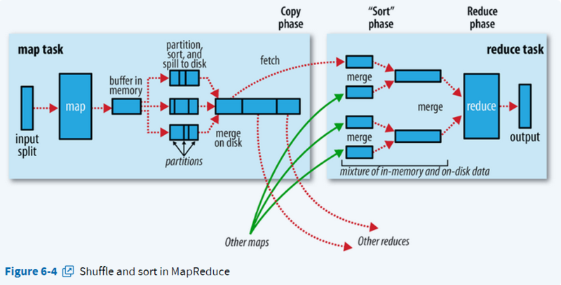
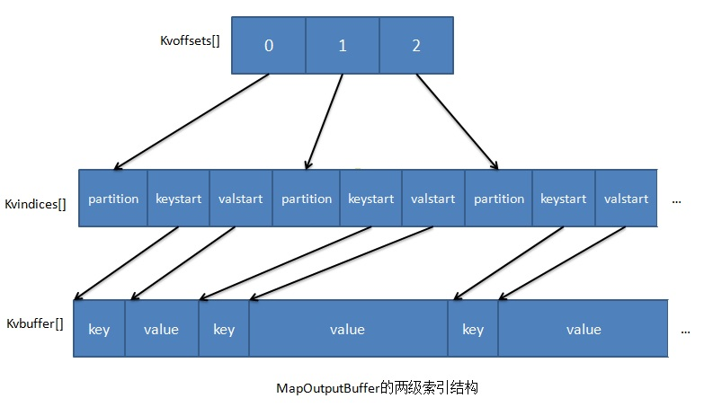
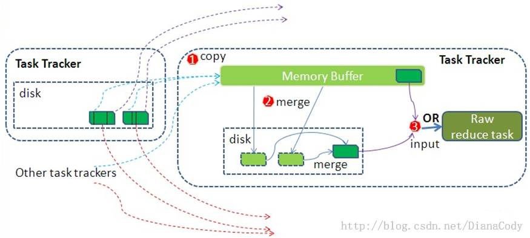

#   Hive

#### 背景

- 对HDFS或者HBase的表进行查询,需要手工写MapReduce代码,耗时耗力
- Hive基于统一的查询分析层,通过SQL语句的方式对HDFS上的数据进行查询,统计和分析
- Hive表是纯逻辑表,只是表的定义(元数据),本身不存储数据,完全依赖于HDFS和MapReduce

### 基础知识

- 内部表和外部表
  - 内部表 create table
  - 外部表 create external table,导入数据到外部表,数据并没有移动到自己的数据仓库目录下,而内部表则不一样,删除内部表的时候,Hive会把表的元数据和数据全部删除,而删除外部表的时候,Hive仅仅删除外部表的元数据,数据不会删除
- partition:辅助查询,缩小查询范围

### Hive SQL编译过程

#### 基本SQL操作原理

1. Join的实现原理(```(select u.name, o.orderid from order o join user u on o.uid = u.uid;   ```)

- 本质上来讲,Join查询就是根据一个共享的键的集合来合并两个或者更多的数据流.
- 在map的输出value中为不同表的数据打上tag标记,在reduce阶段根据tag判断数据来源


2. Group By实现原理(```select rank, isonline, count(*) from city group by rank, isonline;```)

- 将GroupBy的字段组合为map的输出key值,利用MapReduce的排序,在reduce阶段保存LastKey区分不同的key


3. Distinct实现原理(```select dealid, count(distinct uid) num from order group by dealid;```)

- 将Group By字段和Distinct字段组合为map输出key,利用mapreduce的排序,同时将Group By字段作为reduce的key,在reduce阶段保存LastKey即可完成去重


多字段distinct(```select dealid, count (distinct uid), count (distinct date) from order group by dealid;```)

1. 按照单字段distinct方法,但是无法根据uid和date分别排序,也无法通过LastKey去重,仍然需要在reduce阶段在内存中通过Hash去重


2. 对所有distinct字段编号,每行生成n行数据,那么相同字段就会分别排序,这时只需要reduce阶段记录LastKey即可去重


### MapReduce之shuffle过程详述

对于MapReduce作业,完整的作业运行流程如下所示:


1. 作业启动:开发者通过控制台启动作业;
2. 作业初始化:切分数据,创建作业,提交作业;
3. 作业/任务调度;
4. Map任务:数据输入,做初步的处理,输出形式的中间结果;
5. shuffle:按照partition,key对中间结果进行排序合并,输出给reduce线程;
6. Reduce任务:对相同key的输入进行最终处理,并将结果写入到文件中;
7. 作业完成,通知开发者任务完成完成.

而这其中最主要的是MapReduce过程是4,5,6三部分,



shuffle横跨map输出到reduce输入这一过程,大部分情况map task和reduce task的执行是分布在不同的节点上的,因此很多情况下,reduce节点需要跨节点去拉取其他节点的map task的结果,磁盘I/O对性能影响很大,同时网络资源消费非常大,因此希望shuffle过程满足:

1. 完整从Map task端拉取数据到Reduce端;
2. 在跨节点拉取数据时,尽量减少对带宽不必要的消耗;
3. 减少磁盘I/O对task的影响.

#### Map

在进行海量数据处理时,外存文件数据I/O访问会成为制约系统的瓶颈,因此Map过程实现的一个原则就是:**计算靠近数据**,这里主要指两方面:

1. 代码靠近数据:
   - 原则:本地化数据处理,即一个计算节点尽可能处理本地磁盘上所存储的数据
   - 尽量选择数据所在DataNode启动Map任务
   - 这样可以减少数据通信,提高计算效率
2. 数据靠近代码:
   - 当本地没有数据处理时,尽可能从同一机架或最近其他节点传输数据进行处理

Map经典流程:


##### 输入

1. Map task只读取split分片,split与HDFS中block可能一对一也能一对多,但是一个split只会对应一个文件的一个block或多个block,不允许一个split对应多个文件的多个block;
2. 这里切分和输入数据时会涉及到InputFormat文件的切分算法和host选择算法
   - 文件切分算法用于确定InputSplit的个数以及每个InputSplit对应的数据段.FileInputFormat以文件为单位切分生成InputSplit,对于每个文件,由goalSize(期望大小,文件总大小/期望Map task数),minSize(InputSplit最小值),blockSize(HDFS中block大小)共同决定,splitSize = max{minSize, min{goalSize, blockSize}}

##### Partition

- 作用:将Map的结果发送到相应的Reduce端,总的partition的数目等于reducer的数目
- 实现功能:
  1. map输出的是key/value对,决定于当前mapper的part交给哪个reducer的方法是:mapreduce提供的Partitioner接口,对key进行hash,在对reducetask数量取模,然后到指定的job上
  2. 然后将数据写入到内存缓冲区,缓冲区批量收集map结果,减少磁盘I/O的影响,key/value对以及Partition的结果都会被写入缓冲区,在此之前,key与value值都会被序列化成字节数组.

##### Spill溢写:sort & combiner

- 作用:将内存缓冲区的数据写入到本地磁盘,在写入本地磁盘时先按照partition,再按照key进行排序
- 注意:
  1. spill是由另外单独的线程来完成,不影响往缓冲区写Map结果的线程
  2. 内存缓冲区默认大小限制为100MB,有个溢写比例,默认为0.8,达到阈值时,溢写线程会启动,先锁定这80MB内存,执行溢写过程,Map task的输出结果还可以往剩下的20MB内存中写,互相不影响,然后重新利用这块缓冲区,因此Map的内存缓冲区又叫做环形缓冲区
  3. 在将数据写入磁盘之前,先要对要写入磁盘的数据进行一次排序操作,先按<key, value, partition>中的partition分区号排序,然后再按key排序,这个就是sort操作,最后溢出的小文件是分区的,且同一分区内是保证key是有序的.
- combine操作:把形如<aa, 1>, <aa, 2>类似的数据进行计算得到<aa, 3>,必须满足combine操作不会影响计算结果

##### Merge

- merge的过程:当Map很大时,每次溢写会产生一个spill file,这样会有多个spill file,而最终的一个map task输出只有一个文件,因此,最终的结果输出之前会对多个中间过程进行多次溢写的文件进行合并
- 注意:
  1. 如果生成文件太多,可能会进行多次合并
  2. 合并会进行一次多路归并排序
  3. 输出文件还会有一个对应的索引文件

##### 内存缓冲区



这三个缓冲区含义如下:

1. kvoffsets:偏移量索引数组,用以保存key/value信息在位置索引kvindices中的偏移量,当kvoffsets使用率超过阈值,便会触发一次Spill Thread线程的溢写操作;
2. kvindices:位置索引数组,用于保存key/value在数据缓冲区kvbuffer的位置信息;
3. kvbuffer:数据缓冲区:保存实际的key/value值,当容量超过阈值,开始spill操作

写入到本地磁盘时,对数据进行排序,实际上是对kvoffsets这个偏移量索引数组进行排序

#### Reduce

Reduce过程经典流程图如下:



##### copy过程

- 作用:拉取数据
- 过程:Reduce进程启动一些数据copy线程(Fetcher),通过Http方式请求Map task的Task Tracker获取Map Task的输出文件,Map Task已经结束,文件归属于Task Tracker管理在本地磁盘中
- 默认情况,整个MapReduce作业已经完成的Map Task已经执行完总Map Task的5%后,Job Tracker便会开始调度执行Reduce Task任务,然后Reduce Task开始开启线程拉取数据,数据先保存在内存缓冲区,当缓冲区大小达到阈值后,则写到磁盘上. 

##### 内存缓冲区

- copy过来放入缓冲区的数据超过分配Reduce Task的最大heap内存的一定比例(默认0.7)就要开始往磁盘写

##### merge过程

由于reduce端从多个map端进行copy时,并没有进行排序,因此当达到阈值写入磁盘时需要进行merge,直到Map端没有数据才结束

- mrge有三种形式:
  1. 内存到内存;
  2. 内存到磁盘;
  3. 磁盘到磁盘;

##### Reducer的输入文件

- merge最后生成一个文件,大多情况存在于磁盘中,但需要将其放入内存中.当reducer输入文件已定,shuffle才算结束.然后Reducer执行,把结果放到HDFS上.

#### MR为什么要进行排序?

- 发生sort两个地方:
  1. map端发生在spill后partition前
  2. reduce端copy后reduce前
- reduce阶段需要分组,将key相同的放在一起进行规约,有两种算法:hashmap和sort,前者太耗内存,而排序通过外排可对任意数据量分组,只要磁盘足够大就行,map端排序是为了减轻reduce端排序的压力,在Spark中除了sort的方法也提供hashmap,用户可配置,毕竟sort开销太大

### Hive优化

- 从一份基础表中按照不同维度,一次组合出不同的数据,可以使用如下语句:

  - from from_statement

    ​        insert overwrite table tablename1 