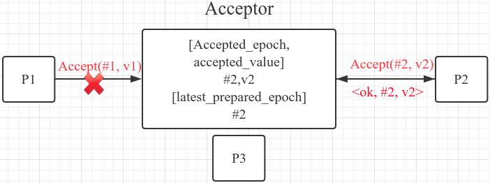

# Paxos-分布式一致性协议

## Paxos的理解困境

1. Paxos究竟在解决什么问题？

   Paxos算法用来确定一个不可变变量的取值，取值可以是任意二进制数据，一旦确定将不再更改，并且可以被获取到（不可变性，可读取性）

2. Paxos如何在分布式存储系统中应用？

   数据本身可变，采用多副本进行存储。需要确保多个副本的更新操作序列【Op1，Op2，…，Opn】是相同的，不变的。用Paxos依次来确定不可变变量Opi的取值（即第i个操作是什么）。没确定完Opi操作之后，让各个数据副本执行Opi，依次类推。

3. Paxos算法的核心思想是什么？

   1. 第一阶段在做什么？
   2. 第二阶段在做什么？

## Paxos希望解决的一致性问题

1. 设计一个系统，来存储名称为var的变量
   1. 系统内部由多个Acceptor组成，负责存储和管理var变量
   2. 外部有多个proposer机器任意并发调用API，向系统提交不同的var取值，var的取值可以是任意二进制数据。
   3. 系统对外的API库接口为：proposer(var, V) => <ok, f> or <error>
2. 系统需要保证var的取值满足一致性
   1. 如果var的取值没有确定，则var的取值为null
   2. 一旦var的取值被确定，则不可被更改。并且可以一直获取到这个值
3. 系统需要满足容错性
   1. 可以容忍任意proposer机器出现故障
   2. 可以容忍少数Acceptor故障（半数以下）
4. 为了讲解简单，暂不考虑
   1. 网络分化
   2. acceptor故障会丢失var的信息

## 确定一个不可变变量-难点

1. 管理多个Proposer的并发执行
2. 保证var变量的不可变性
3. 容忍任意Proposer机器故障
4. 容忍半数以下Acceptor机器故障

## 确定一个不可变变量的取值

1. **方案一**：
   
   1. **核心思想**:通过Acceptor互斥访问权让Proposer序列运行，可以简单的实现var取值的一致性
   2. **原理**：
      1. 先考虑系统由单个Acceptor组成，通过类似互斥锁机制，来管理并发的proposer运行
      2. Proposer首先向Acceptor申请Acceptor的互斥访问权，然后才能Acceptor接受自己的取值
      3. Acceptor给proposer发放互斥访问权，谁申请到互斥访问权，就接收谁提交的取值
      4. 让proposer按照获取互斥访问权的顺序依次访问Acceptor
      5. 一旦Acceptor接收了某个proposer的取值，则认为var取值被确定，其他proposer不再更改
   3. **基于互斥访问权的Acceptor的实现**
      1. Acceptor保存变量var和一个互斥锁lock
      2. Acceptor::prepare():加互斥锁，给予var的互斥访问权，并返回var当前的取值f
      3. Acceptor::release():解互斥锁，收回var的互斥访问权
      4. Acceptor::accept(var, V):如果已经加锁，并且var没有取值，则设置var。并且释放锁。
   4. **proposer（var，V）的两阶段实现**
      1. 第一阶段：通过Acceptor：：prepare获取互斥访问权和当前var的取值，如果不能，返回error，表明锁被别人占用
      2. 第二阶段：根据当前var的取值f，选择执行：
         1. 如果f为null，则通过Acceptor：：accept（var，V）提交数据V
         2. 如果f不为空，则通过Acceptor：：release（）释放访问权，返回<ok, f>。
   5. **缺点**：Proposer在释放互斥访问权之前发生故障，会导致系统陷入死锁，故不能容忍Proposer机器故障。
   
2. **方案二**：引入抢占式访问权，Acceptor可以让某个Proposer获取到的访问权失效，不再接收它的访问，之后，可以讲访问权发放给其他Proposer，让其他Proposer访问Acceptor
   
   1. **核心思想**：让Proposer将按照epoch递增的顺序抢占式的依次运行，后者会认同前者。
      1. 避免Proposer机器故障带来的死锁问题，并且仍可以保证var取值的一致性
      2. 仍需要引入多Acceptor，单机模块Acceptor故障导致整个系统宕机，无法提供服务
   2. **原理**
      1. Proposer向Acceptor申请访问权时指定编号**epoch（越大的epoch越新）**，娶到访问权之后，才能向Acceptor提交取值
      2. Acceptor采用**喜新厌旧**的原则：一旦收到更大的新epoch的申请，马上让旧epoch的访问权失效，不再接收他们提交的取值。然后给新的epoch发放访问权，只接收新epoch提交的取值。新的epoch可以抢占旧的epoch，让旧epoch的访问权失效。旧epoch的Proposer无法运行，新epoch的Proposer将开始运行。
      3. 为了保持一致性，不同epoch的Proposer之间采用**后者认同前者**的原则：在肯定旧epoch无法生成确定性取值时，新的epoch会提交自己的value。不会冲突。一旦旧epoch形成确定性取值，新epoch肯定可以取到此取值，并且会认同此取值，不会破坏
   3. **基于抢占式访问权的Acceptor的实现**
      1. Acceptor保存的状态：当前var的取值<accepted_epoch, accepted_value>，最新发放访问权的epoch（lastest_prepared_epoch）
      2. Acceptor::prepare(epoch)：只接收比latest_prepared_epoch更大的epoch，并给予访问权；记录latest_prepared_epoch=epoch，返回当前var的取值。
      3. Acceptor：：accept（var， prepared_epoch，V）：验证latest_prepared_epoch == prepared_epoch，并设置var的取值<accepted_epoch，accepted_value> = <prepared_epoch, v>。
      4. Propose（var，V）的两阶段实现
         1. 获取epoch轮次的访问权和当前var的取值：简单获取当前时间戳为epoch，通过Acceptor：：prepare（epoch），获取epoch的访问权和当前var的取值；如果不能获取，返回<error>
         2. 采用**后者认同前者**的原则执行：
            1. 如果var的取值为空，则肯定旧epoch无法生成确定性取值，则通过Acceptor：：accept（var，epoch，V）提交数据V，成功后返回<ok, V>；如果accept失败，返回<error>（**被新epoch抢占或者acceptor故障**）
            2. 如果var取值存在，则此取值肯定是确定性取值，此时认同它不再更改，直接返回<ok, accepted_value>
      5. **运行过程**:
   
   
   
   
   
   
   
   
   
3. **Paxos**：在方案二基础上引入多Acceptor：Acceptor的实现保持不变。仍采用**喜新厌旧**的原则运行。采用**少数服从多数**的思路：一旦某epoch的取值f被半数以上Acceptor接受，则认为此var取值被确定为f，不再更改。

   1. **核心思想**：在抢占式访问权的基础上引入多Acceptor，保证一个epoch，只有一个proposer运行，proposer按照epoch递增的顺序依次运行；新epoch的proposer采用“后者认同前者”的思路运行，在肯定旧epoch无法生成确定性取值时，新的epoch会提交自己的取值，不会冲突。一旦旧epoch形成确定性取值，新epoch肯定可以获取到此取值，并且会认同此取值，不会破坏。
   2. **Propose（var，V）的两阶段实现**
      1. 第一阶段和**方案二不同之处**：获取半数以上Acceptor的访问权和对应一组var取值
      2. 第二阶段和**方案二不同之处**：向epoch对应的所有Acceptor提交取值<epoch, V>，如果收到半数以上成功，则返回<ok, V>，否则返回<error>
   3. **容错**：半数以下Acceptor出现故障时，存活的Acceptor仍然可以生成var的确定性取值；一旦var取值被确定，即使出现半数以下Acceptor故障，此取值可以被获取，并且将不再被改变。
   4. **存在的Liveness问题**：新轮次的抢占会让旧轮次停止运行，如果每一轮次在第二阶段执行成功之前都被新一轮抢占，则导致活锁
   5. **运行过程**

   

   

   