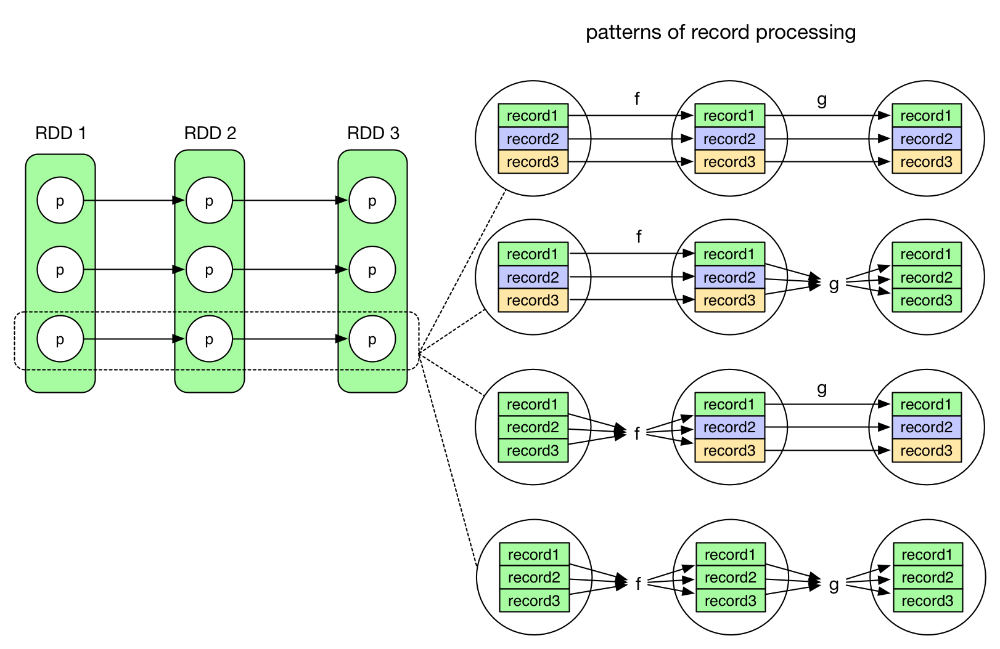
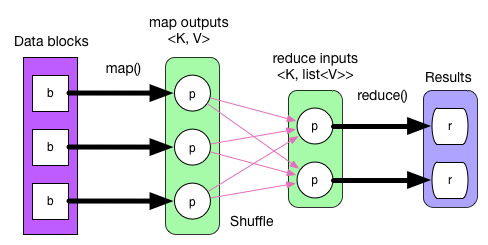

# Job 物理执行图

在 Overview 里我们初步介绍了 DAG 型的物理执行图，里面包含 stages 和 tasks。这一章主要解决的问题是：

**给定 job 的逻辑执行图，如何生成物理执行图（也就是 stages 和 tasks）？**

## 一个复杂 job 的逻辑执行图


代码贴在本章最后。**给定这样一个复杂数据依赖图，如何合理划分 stage，并确定 task 的类型和个数？**

一个直观想法是将前后关联的 RDDs 组成一个 stage，每个箭头生成一个 task。对于两个 RDD 聚合成一个 RDD 的情况，这三个 RDD 组成一个 stage。这样虽然可以解决问题，但显然效率不高。除了效率问题，这个想法还有一个更严重的问题：**大量中间数据需要存储**。对于 task 来说，其执行结果要么要存到磁盘，要么存到内存，或者两者皆有。如果每个箭头都是 task 的话，每个 RDD 里面的数据都需要存起来，占用空间可想而知。

仔细观察一下逻辑执行图会发现：在每个 RDD 中，每个 partition 是独立的，也就是说在 RDD 内部，每个 partition 的数据依赖各自不会相互干扰。因此，一个大胆的想法是将整个流程图看成一个 stage，为最后一个 finalRDD 中的每个 partition 分配一个 task。图示如下：


所有的粗箭头组合成第一个 task，该 task 计算结束后顺便将 CoGroupedRDD 中已经计算得到的第二个和第三个 partition 存起来。之后第二个 task（细实线）只需计算两步，第三个 task（细虚线）也只需要计算两步，最后得到结果。

这个想法有两个不靠谱的地方：

- 第一个 task 太大，碰到 ShuffleDependency 后，不得不计算 shuffle 依赖的 RDDs 的所有 partitions，而且都在这一个 task 里面计算。
- 需要设计巧妙的算法来判断哪个 RDD 中的哪些 partition 需要 cache。而且 cache 会占用存储空间。

虽然这是个不靠谱的想法，但有一个可取之处，即 **pipeline 思想：数据用的时候再算，而且数据是流到要计算的位置的**。比如在第一个 task 中，从  FlatMappedValuesRDD 中的 partition 向前推算，只计算要用的（依赖的） RDDs 及 partitions。在第二个 task 中，从 CoGroupedRDD 到 FlatMappedValuesRDD 计算过程中，不需要存储中间结果（MappedValuesRDD 中 partition 的全部数据）。

更进一步，从 record 粒度来讲，如下图中，第一个 pattern 中先算 g(f(record1))，然后原始的 record1 和 f(record1) 都可以丢掉，然后再算 g(f(record2))，丢掉中间结果，最后算 g(f(record3))。对于第二个 pattern 中的 g，record1 进入 g 后，理论上可以丢掉（除非被手动 cache）。其他 pattern 同理。



回到 stage 和 task 的划分问题，上面不靠谱想法的主要问题是碰到 ShuffleDependency 后无法进行 pipeline。那么只要在 ShuffleDependency 处断开，就只剩 NarrowDependency，而 NarrowDependency chain 是可以进行 pipeline 的。按照此思想，上面 ComplexJob 的划分图如下：


所以划分算法就是：**从后往前推算，遇到 ShuffleDependency 就断开，遇到 NarrowDependency 就将其加入该 stage。每个 stage 里面 task 的数目由该 stage 最后一个 RDD 中的 partition 个数决定。**

粗箭头表示 task。因为是从后往前推算，因此最后一个 stage 的 id 是 0，stage 1 和 stage 2 都是 stage 0 的 parents。**如果 stage 最后要产生 result，那么该 stage 里面的 task 都是 ResultTask，否则都是 ShuffleMapTask。**之所以称为 ShuffleMapTask 是因为其计算结果需要 shuffle 到下一个 stage，本质上相当于 MapReduce 中的 mapper。ResultTask 相当于 MapReduce 中的 reducer（如果需要从 parent stage 那里 shuffle 数据），也相当于普通 mapper（如果该 stage 没有 parent stage）。

还有一个问题：算法中提到 NarrowDependency chain 可以 pipeline，可是这里的 **ComplexJob 只展示了 OneToOneDependency 和 RangeDependency 的 pipeline，普通 NarrowDependency 如何 pipeline？**

回想上一章里面 cartesian(otherRDD) 里面复杂的 NarrowDependency，图示如下：


经过算法划分后结果如下：


图中粗箭头展示了第一个 ResultTask，其他的 task 依此类推。由于该 stage 的 task 直接输出 result，所以这个图包含 6 个 ResultTasks。与 OneToOneDependency 不同的是这里每个 ResultTask 需要计算 3 个 RDD，读取两个 data block，而整个读取和计算这三个 RDD 的过程在一个 task 里面完成。当计算 CartesianRDD 中的 partition 时，需要从两个 RDD 获取 records，由于都在一个 task 里面，不需要 shuffle。这个图说明：**不管是 1:1 还是 N:1 的 NarrowDependency，只要是 NarrowDependency chain，就可以进行 pipeline，生成的 task 个数与该 stage 最后一个 RDD 的 partition 个数相同。**

## 物理图的执行
生成了 stage 和 task 以后，下一个问题就是 **task 如何执行来生成最后的 result？**

回到 ComplexJob 的物理执行图，如果按照 MapReduce 的逻辑，从前到后执行，map() 产生中间数据 map outpus，经过 partition 后放到本地磁盘。再经过 shuffle-sort-aggregate 后生成 reduce inputs，最后 reduce() 执行得到 result。执行流程如下：



整个执行流程没有问题，但不能直接套用在 Spark 的物理执行图上，因为 MapReduce 的流程图简单、固定，而且没有 pipeline。

回想 pipeline 的思想是 **数据用的时候再算，而且数据是流到要计算的位置的**。Result 产生的地方的就是要计算的位置，要确定 “需要计算的数据”，我们可以从后往前推，需要哪个 partition 就计算哪个 partition，如果 partition 里面没有数据，就继续向前推，形成 computing chain。这样推下去，结果就是：需要首先计算出每个 stage 最左边的 RDD 中的某些 partition。

**对于没有 parent stage 的 stage，该 stage 最左边的 RDD 是可以立即计算的，而且每计算出一个 record 后便可以流入 f 或 g（见前面图中的 patterns）。**如果 f 中的 record 关系是 1:1 的，那么 f(record1) 计算结果可以立即顺着 computing chain 流入 g 中。如果 f 的 record 关系是 N:1，record1 进入 f() 后也可以被回收。总结一下，computing chain 从后到前建立，而实际计算出的数据从前到后流动，而且计算出的第一个 record 流动到不能再流动后，再计算下一个 record。这样，虽然是要计算后续 RDD 的 partition 中的 records，但并不是要求当前 RDD 的 partition 中所有 records 计算得到后再整体向后流动。

对于有 parent stage 的 stage，先等着所有 parent stages 中 final RDD 中数据计算好，然后经过 shuffle 后，问题就又回到了计算 “没有 parent stage 的 stage”。

> 代码实现：每个 RDD 包含的 getDependency() 负责确立 RDD 的数据依赖，compute() 方法负责接收 parent RDDs 或者 data block 流入的 records，进行计算，然后输出 record。经常可以在 RDD 中看到这样的代码`firstParent[T].iterator(split, context).map(f)`。firstParent 表示该 RDD 依赖的第一个 parent RDD，iterator() 表示 parentRDD 中的 records 是一个一个流入该 RDD 的，map(f) 表示每流入一个 recod 就对其进行 f(record) 操作，输出 record。为了统一接口，这段 compute() 仍然返回一个 iterator，来迭代 map(f) 输出的 records。

总结一下：**整个 computing chain 根据数据依赖关系自后向前建立，遇到 ShuffleDependency 后形成 stage。在每个 stage 中，每个 RDD 中的 compute() 调用 parentRDD.iter() 来将 parent RDDs 中的 records 一个个 fetch 过来。**

如果要自己设计一个 RDD，那么需要注意的是 compute() 只负责定义 parent RDDs => output records 的计算逻辑，具体依赖哪些 parent RDDs 由 `getDependency()` 定义，具体依赖 parent RDD 中的哪些 partitions 由 `dependency.getParents()` 定义。

 例如，在 CartesianRDD 中，
```scala
 // RDD x = (RDD a).cartesian(RDD b)
 // 定义 RDD x 应该包含多少个 partition，每个 partition 是什么类型
 override def getPartitions: Array[Partition] = {
    // create the cross product split
    val array = new Array[Partition](rdd1.partitions.size * rdd2.partitions.size)
    for (s1 <- rdd1.partitions; s2 <- rdd2.partitions) {
      val idx = s1.index * numPartitionsInRdd2 + s2.index
      array(idx) = new CartesianPartition(idx, rdd1, rdd2, s1.index, s2.index)
    }
    array
  }

  // 定义 RDD x 中的每个 partition 怎么计算得到
  override def compute(split: Partition, context: TaskContext) = {
    val currSplit = split.asInstanceOf[CartesianPartition]
    // s1 表示 RDD x 中的 partition 依赖 RDD a 中的 partitions（这里只依赖一个）
    // s2 表示 RDD x 中的 partition 依赖 RDD b 中的 partitions（这里只依赖一个）
    for (x <- rdd1.iterator(currSplit.s1, context);
         y <- rdd2.iterator(currSplit.s2, context)) yield (x, y)
  }

  // 定义 RDD x 中的 partition i 依赖于哪些 RDD 中的哪些 partitions
  //
  // 这里 RDD x 依赖于 RDD a，同时依赖于 RDD b，都是 NarrowDependency
  // 对于第一个依赖，RDD x 中的 partition i 依赖于 RDD a 中的
  //    第 List(i / numPartitionsInRdd2) 个 partition
  // 对于第二个依赖，RDD x 中的 partition i 依赖于 RDD b 中的
  //    第 List(id % numPartitionsInRdd2) 个 partition
  override def getDependencies: Seq[Dependency[_]] = List(
    new NarrowDependency(rdd1) {
      def getParents(id: Int): Seq[Int] = List(id / numPartitionsInRdd2)
    },
    new NarrowDependency(rdd2) {
      def getParents(id: Int): Seq[Int] = List(id % numPartitionsInRdd2)
    }
  )
```

## 生成 job
前面介绍了逻辑和物理执行图的生成原理，那么，**怎么触发 job 的生成？已经介绍了 task，那么 job 是什么？**

下表列出了可以触发执行图生成的典型 [action()](http://spark.apache.org/docs/latest/programming-guide.html#actions)，其中第二列是 `processPartition()`，定义如何计算 partition 中的 records 得到 result。第三列是 `resultHandler()`，定义如何对从各个 partition 收集来的 results 进行计算来得到最终结果。


| Action | finalRDD(records) => result | compute(results) |
|:---------| :-------|:-------|
| reduce(func) | (record1, record2) => result, (result, record i) => result | (result1, result 2) => result, (result, result i) => result
| collect() |Array[records] => result | Array[result] |
| count() | count(records) => result | sum(result) |
| foreach(f) | f(records) => result | Array[result] |
| take(n) | record (i<=n) => result | Array[result] |
| first() | record 1 => result | Array[result] |
| takeSample() | selected records => result | Array[result] |
| takeOrdered(n, [ordering]) | TopN(records) => result | TopN(results) |
| saveAsHadoopFile(path) | records => write(records) | null |
| countByKey() | (K, V) => Map(K, count(K)) | (Map, Map) => Map(K, count(K)) | 

用户的 driver 程序中一旦出现 action()，就会生成一个 job，比如 `foreach()` 会调用`sc.runJob(this, (iter: Iterator[T]) => iter.foreach(f))`，向 DAGScheduler 提交 job。如果 driver 程序后面还有 action()，那么其他 action() 也会生成 job 提交。所以，driver 有多少个 action()，就会生成多少个 job。这就是 Spark 称 driver 程序为 application（可能包含多个 job）而不是 job 的原因。

每一个 job 包含 n 个 stage，最后一个 stage 产生 result。比如，第一章的 GroupByTest 例子中存在两个 job，一共产生了两组 result。在提交 job 过程中，DAGScheduler 会首先划分 stage，然后先提交**无 parent stage 的 stages**，并在提交过程中确定该 stage 的 task 个数及类型，并提交具体的 task。无 parent stage 的 stage 提交完后，依赖该 stage 的 stage 才能够提交。从 stage 和 task 的执行角度来讲，一个 stage 的 parent stages 执行完后，该 stage 才能执行。

## 提交 job 的实现细节

下面简单分析下 job 的生成和提交代码，提交过程在 Architecture 那一章也会有图文并茂的分析：

1. rdd.action() 会调用 `DAGScheduler.runJob(rdd, processPartition, resultHandler)` 来生成 job。
2. runJob() 会首先通过`rdd.getPartitions()`来得到 finalRDD 中应该存在的 partition 的个数和类型：Array[Partition]。然后根据 partition 个数 new 出来将来要持有 result 的数组 `Array[Result](partitions.size)`。
3. 最后调用 DAGScheduler 的`runJob(rdd, cleanedFunc, partitions, allowLocal, resultHandler)`来提交 job。cleanedFunc 是 processParittion 经过闭包清理后的结果，这样可以被序列化后传递给不同节点的 task。
4. DAGScheduler 的 runJob 继续调用`submitJob(rdd, func, partitions, allowLocal, resultHandler)` 来提交 job。
5. submitJob() 首先得到一个 jobId，然后再次包装 func，向 DAGSchedulerEventProcessActor 发送 JobSubmitted 信息，该 actor 收到信息后进一步调用`dagScheduler.handleJobSubmitted()`来处理提交的 job。之所以这么麻烦，是为了符合事件驱动模型。
6. handleJobSubmmitted() 首先调用 finalStage = newStage() 来划分 stage，然后submitStage(finalStage)。由于 finalStage 可能有 parent stages，实际先提交 parent stages，等到他们执行完，finalStage 需要再次提交执行。再次提交由 handleJobSubmmitted() 最后的 submitWaitingStages() 负责。

分析一下 newStage() 如何划分 stage：

1. 该方法在 new Stage() 的时候会调用 finalRDD 的 getParentStages()。
2. getParentStages() 从 finalRDD 出发，反向 visit 逻辑执行图，遇到 NarrowDependency 就将依赖的 RDD 加入到 stage，遇到 ShuffleDependency 切开 stage，并递归到 ShuffleDepedency 依赖的 stage。
3. 一个 ShuffleMapStage（不是最后形成 result 的 stage）形成后，会将该 stage 最后一个 RDD 注册到`MapOutputTrackerMaster.registerShuffle(shuffleDep.shuffleId, rdd.partitions.size)`，这一步很重要，因为 shuffle 过程需要 MapOutputTrackerMaster 来指示 ShuffleMapTask 输出数据的位置。

分析一下 submitStage(stage) 如何提交 stage 和 task：

1. 先确定该 stage 的 missingParentStages，使用`getMissingParentStages(stage)`。如果 parentStages 都可能已经执行过了，那么就为空了。
2. 如果 missingParentStages 不为空，那么先递归提交 missing 的 parent stages，并将自己加入到 waitingStages 里面，等到 parent stages 执行结束后，会触发提交 waitingStages 里面的 stage。
3. 如果 missingParentStages 为空，说明该 stage 可以立即执行，那么就调用`submitMissingTasks(stage, jobId)`来生成和提交具体的 task。如果 stage 是 ShuffleMapStage，那么 new 出来与该 stage 最后一个 RDD 的 partition 数相同的 ShuffleMapTasks。如果 stage 是 ResultStage，那么 new 出来与 stage 最后一个 RDD 的 partition 个数相同的 ResultTasks。一个 stage 里面的 task 组成一个 TaskSet，最后调用`taskScheduler.submitTasks(taskSet)`来提交一整个 taskSet。
4. 这个 taskScheduler 类型是 TaskSchedulerImpl，在 submitTasks() 里面，每一个 taskSet 被包装成 manager: TaskSetMananger，然后交给`schedulableBuilder.addTaskSetManager(manager)`。schedulableBuilder 可以是 FIFOSchedulableBuilder 或者 FairSchedulableBuilder 调度器。submitTasks() 最后一步是通知`backend.reviveOffers()`去执行 task，backend 的类型是 SchedulerBackend。如果在集群上运行，那么这个 backend 类型是 SparkDeploySchedulerBackend。
5. SparkDeploySchedulerBackend 是 CoarseGrainedSchedulerBackend 的子类，`backend.reviveOffers()`其实是向 DriverActor 发送 ReviveOffers 信息。SparkDeploySchedulerBackend 在 start() 的时候，会启动 DriverActor。DriverActor 收到 ReviveOffers 消息后，会调用`launchTasks(scheduler.resourceOffers(Seq(new WorkerOffer(executorId, executorHost(executorId), freeCores(executorId)))))` 来 launch tasks。scheduler 就是 TaskSchedulerImpl。`scheduler.resourceOffers()`从 FIFO 或者 Fair 调度器那里获得排序后的 TaskSetManager，并经过`TaskSchedulerImpl.resourceOffer()`，考虑 locality 等因素来确定 task 的全部信息 TaskDescription。调度细节这里暂不讨论。
6. DriverActor 中的 launchTasks() 将每个 task 序列化，如果序列化大小不超过 Akka 的 akkaFrameSize，那么直接将 task 送到 executor 那里执行`executorActor(task.executorId) ! LaunchTask(new SerializableBuffer(serializedTask))`。

## Discussion
至此，我们讨论了：
- driver 程序如何触发 job 的生成
- 如何从逻辑执行图得到物理执行图
- pipeline 思想与实现
- 生成与提交 job 的实际代码

还有很多地方没有深入讨论，如：

- 连接 stage 的 shuffle 过程
- task 运行过程及运行位置

下一章重点讨论 shuffle 过程。

从逻辑执行图的建立，到将其转换成物理执行图的过程很经典，过程中的 dependency 划分，pipeline，stage 分割，task 生成 都是有条不紊，有理有据的。

## ComplexJob 的源代码

```scala
package internals

import org.apache.spark.SparkContext
import org.apache.spark.SparkContext._
import org.apache.spark.HashPartitioner


object complexJob {
  def main(args: Array[String]) {

    val sc = new SparkContext("local", "ComplexJob test")
    
    val data1 = Array[(Int, Char)](
      (1, 'a'), (2, 'b'),
      (3, 'c'), (4, 'd'),
      (5, 'e'), (3, 'f'),
      (2, 'g'), (1, 'h'))
    val rangePairs1 = sc.parallelize(data1, 3)
    
    val hashPairs1 = rangePairs1.partitionBy(new HashPartitioner(3))

    
    val data2 = Array[(Int, String)]((1, "A"), (2, "B"),
      (3, "C"), (4, "D"))

    val pairs2 = sc.parallelize(data2, 2)
    val rangePairs2 = pairs2.map(x => (x._1, x._2.charAt(0)))

    
    val data3 = Array[(Int, Char)]((1, 'X'), (2, 'Y'))
    val rangePairs3 = sc.parallelize(data3, 2)

    
    val rangePairs = rangePairs2.union(rangePairs3)

    
    val result = hashPairs1.join(rangePairs)

    result.foreachWith(i => i)((x, i) => println("[result " + i + "] " + x))

    println(result.toDebugString)
  }
}
```