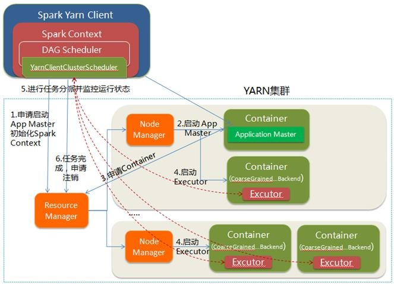
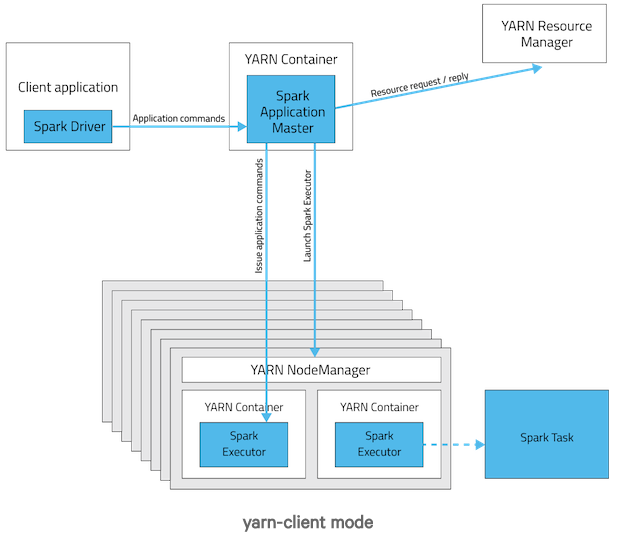
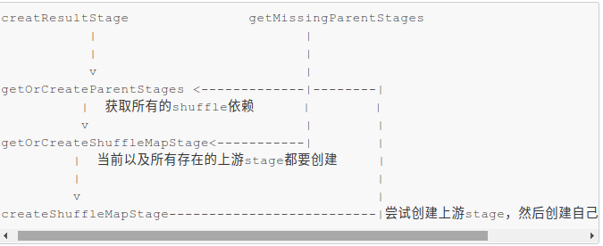

# 高性能Spark

## Spark 运行流程

### 基本运行流程

1. 说明

   1. 构建Spark Application的运行环境(Spark Context), SparkContext向资源管理器(可以是Standalone,Mesos或YARN)注册并申请运行Executor资源
   2. 资源管理器分配Executor资源并启动StandaloneExecutorBackend，Executor运行情况将随着心跳发送到资源管理器上
   3. SparkContext构建成DAG图，将DAG图分解成Stage，并把TaskSet发送给Task Scheduler。Executor向SparkContext申请Task
   4. Task Scheduler将Task发放给Executor运行同时SparkContext将应用程序代码发放给Executor
   5. Task在Executor上运行，运行完毕释放所有资源

2. 图解

   

3. Spark运行架构特点

   1. 每个Application获取专属的executor进程，该进程在Application期间一直驻留，并以多线程方式运行tasks。这种Application隔离机制有其优势的，无论是从调度角度看（每个Driver调度它自己的任务），还是从运行角度看（来自不同Application的Task运行在不同的JVM中）。当然，这也意味着Spark Application不能跨应用程序共享数据，除非将数据写入到外部存储系统
   2. Spark与资源管理器无关，只要能够获取executor进程，并能保持相互通信就可以了
   3. 提交SparkContext的Client应该靠近Worker节点（运行Executor的节点)，最好是在同一个Rack里，因为Spark Application运行过程中SparkContext和Executor之间有大量的信息交换；如果想在远程集群中运行，最好使用RPC将SparkContext提交给集群，不要远离Worker运行SparkContext
   4. Task采用了数据本地性和推测执行的优化机制

4. #### DAGScheduler

   Job=多个stage,Stage=多个同种task,Task分为ShuffleMapTask和ResultTask,Dependency分为ShuffleDependency和NarrowDependecy

   面向stage的切分,切分依据为宽依赖维护waiting jobs和active jobs,维护waiting stage,active stages和failed stages,以及与jobs的映射关系

   1. 接收提交Job的主入口，`submitJob(rdd, ...)`或`runJob(rdd, ...)`。在`SparkContext`里会调用这两个方法
      - 生成一个Stage并提交，接着判断Stage是否有父Stage未完成，若有，提交并等待父Stage，以此类推。结果是：DAGScheduler里增加了一些waiting stage和一个running stage
      - running stage提交后，分析stage里Task的类型，生成一个Task描述，即TaskSet
      - 调用`TaskScheduler.submitTask(taskSet, ...)`方法，把Task描述提交给TaskScheduler。TaskScheduler依据资源量和触发分配条件，会为这个TaskSet分配资源并触发执行
      - `DAGScheduler`提交job后，异步返回`JobWaiter`对象，能够返回job运行状态，能够cancel job，执行成功后会处理并返回结果
   2. 处理`TaskCompletionEvent` 
      - 如果task执行成功，对应的stage里减去这个task，做一些计数工作： 
        - 如果task是ResultTask，计数器`Accumulator`加一，在job里为该task置true，job finish总数加一。加完后如果finish数目与partition数目相等，说明这个stage完成了，标记stage完成，从running stages里减去这个stage，做一些stage移除的清理工作
        - 如果task是ShuffleMapTask，计数器`Accumulator`加一，在stage里加上一个output location，里面是一个`MapStatus`类。`MapStatus`是`ShuffleMapTask`执行完成的返回，包含location信息和block size(可以选择压缩或未压缩)。同时检查该stage完成，向`MapOutputTracker`注册本stage里的shuffleId和location信息。然后检查stage的output location里是否存在空，若存在空，说明一些task失败了，整个stage重新提交；否则，继续从waiting stages里提交下一个需要做的stage
        - 如果task是重提交，对应的stage里增加这个task
        - 如果task是fetch失败，马上标记对应的stage完成，从running stages里减去。如果不允许retry，abort整个stage；否则，重新提交整个stage。另外，把这个fetch相关的location和map任务信息，从stage里剔除，从`MapOutputTracker`注销掉。最后，如果这次fetch的blockManagerId对象不为空，做一次`ExecutorLost`处理，下次shuffle会换在另一个executor上去执行
        - 其他task状态会由`TaskScheduler`处理，如Exception, TaskResultLost, commitDenied等。
   3. 其他与job相关的操作还包括：cancel job， cancel stage, resubmit failed stage等

5. TaskScheduler

   维护task和executor对应关系,executor和物理资源对应关系,在排队的task和正在跑的task

   内部维护一个任务队列,根据FIFO或Fair策略,调度任务

   TaskScheduler本身是个接口,Spark里只实现了一个TaskSchedulerImpl,理论上任务调度可以定制

   主要功能:

   1. `submitTasks(taskSet)`，接收`DAGScheduler`提交来的tasks 
      - 为tasks创建一个`TaskSetManager`，添加到任务队列里。`TaskSetManager`跟踪每个task的执行状况，维护了task的许多具体信息
      - 触发一次资源的索要
        - 首先，`TaskScheduler`对照手头的可用资源和Task队列，进行executor分配(考虑优先级、本地化等策略)，符合条件的executor会被分配给`TaskSetManager`
        - 然后，得到的Task描述交给`SchedulerBackend`，调用`launchTask(tasks)`，触发executor上task的执行。task描述被序列化后发给executor，executor提取task信息，调用task的`run()`方法执行计算
   2. `cancelTasks(stageId)`，取消一个stage的tasks 
      - 调用`SchedulerBackend`的`killTask(taskId, executorId, ...)`方法。taskId和executorId在`TaskScheduler`里一直维护着。
   3. resourceOffer(offers: Seq[Workers])，这是非常重要的一个方法，调用者是SchedulerBackend，用途是底层资源SchedulerBackend把空余的workers资源交给TaskScheduler，让其根据调度策略为排队的任务分配合理的cpu和内存资源，然后把任务描述列表传回给SchedulerBackend 
      - 从worker offers里，搜集executor和host的对应关系、active executors、机架信息等等
      - worker offers资源列表进行随机洗牌，任务队列里的任务列表依据调度策略进行一次排序
      - 遍历每个taskSet，按照进程本地化、worker本地化、机器本地化、机架本地化的优先级顺序，为每个taskSet提供可用的cpu核数，看是否满足 
        - 默认一个task需要一个cpu，设置参数为`"spark.task.cpus=1"`
        - 为taskSet分配资源，校验是否满足的逻辑，最终在`TaskSetManager`的`resourceOffer(execId, host, maxLocality)`方法里
        - 满足的话，会生成最终的任务描述，并且调用`DAGScheduler`的`taskStarted(task, info)`方法，通知`DAGScheduler`，这时候每次会触发`DAGScheduler`做一次`submitMissingStage`的尝试，即stage的tasks都分配到了资源的话，马上会被提交执行
      - `statusUpdate(taskId, taskState, data)`,另一个非常重要的方法，调用者是`SchedulerBacnend`，用途是`SchedulerBacnend`会将task执行的状态汇报给`TaskScheduler`做一些决定 
        - 若`TaskLost`，找到该task对应的executor，从active executor里移除，避免这个executor被分配到其他task继续失败下去
        - task finish包括四种状态：finished, killed, failed, lost。只有finished是成功执行完成了。其他三种是失败
        - task成功执行完，调用`TaskResultGetter.enqueueSuccessfulTask(taskSet, tid, data)`，否则调用`TaskResultGetter.enqueueFailedTask(taskSet, tid, state, data)`。`TaskResultGetter`内部维护了一个线程池，负责异步fetch task执行结果并反序列化。默认开四个线程做这件事，可配参数`"spark.resultGetter.threads"=4`
   4. **TaskResultGetter取task result的逻辑**
      1. 对于success task，如果taskResult里的数据是直接结果数据，直接把data反序列出来得到结果；如果不是，会调用`blockManager.getRemoteBytes(blockId)`从远程获取。如果远程取回的数据是空的，那么会调用`TaskScheduler.handleFailedTask`，告诉它这个任务是完成了的但是数据是丢失的。否则，取到数据之后会通知`BlockManagerMaster`移除这个block信息，调用`TaskScheduler.handleSuccessfulTask`，告诉它这个任务是执行成功的，并且把result data传回去。
      2. 对于failed task，从data里解析出fail的理由，调用`TaskScheduler.handleFailedTask`，告诉它这个任务失败了，理由是什么。

6. SchedulerBackend

   在TaskScheduler层,用于对接不同的资源管理系统,SchedulerBackend是个接口,需要实现的主要方法如下:

   ```scala
   def start(): Unit
   def stop(): Unit
   def reviveOffers(): Unit // 重要方法：SchedulerBackend把自己手头上的可用资源交给TaskScheduler，TaskScheduler根据调度策略分配给排队的任务吗，返回一批可执行的任务描述，SchedulerBackend负责launchTask，即最终把task塞到了executor模型上，executor里的线程池会执行task的run()
   def killTask(taskId: Long, executorId: String, interruptThread: Boolean): Unit =
       throw new UnsupportedOperationException
   ```

   粗粒度:进程常驻的模式,典型代码是standalone模式,mesos粗粒度模式,yarn

   细粒度:mesos细粒度模式

   这里讨论粗粒度模式,更好理解:CoarseGrainedSchedulerBackend

   维护executor相关信息(包括executor的地址、通信端口、host、总核数，剩余核数)，手头上executor有多少被注册使用了，有多少剩余，总共还有多少核是空的等等

   主要职能

   1. Driver端主要通过actor监听和处理下面这些事件:
      1. `RegisterExecutor(executorId, hostPort, cores, logUrls)`。这是executor添加的来源，通常worker拉起、重启会触发executor的注册。`CoarseGrainedSchedulerBackend`把这些executor维护起来，更新内部的资源信息，比如总核数增加。最后调用一次`makeOffer()`，即把手头资源丢给`TaskScheduler`去分配一次，返回任务描述回来，把任务launch起来。这个`makeOffer()`的调用会出现在*任何与资源变化相关的事件*中，下面会看到。
      2. `StatusUpdate(executorId, taskId, state, data)`。task的状态回调。首先，调用`TaskScheduler.statusUpdate`上报上去。然后，判断这个task是否执行结束了，结束了的话把executor上的freeCore加回去，调用一次`makeOffer()`。
      3. `ReviveOffers`。这个事件就是别人直接向`SchedulerBackend`请求资源，直接调用`makeOffer()`。
      4. `KillTask(taskId, executorId, interruptThread)`。这个killTask的事件，会被发送给executor的actor，executor会处理`KillTask`这个事件。
      5. `StopExecutors`。通知每一个executor，处理`StopExecutor`事件。
      6. `RemoveExecutor(executorId, reason)`。从维护信息中，那这堆executor涉及的资源数减掉，然后调用`TaskScheduler.executorLost()`方法，通知上层我这边有一批资源不能用了，你处理下吧。`TaskScheduler`会继续把`executorLost`的事件上报给`DAGScheduler`，原因是`DAGScheduler`关心shuffle任务的output location。`DAGScheduler`会告诉`BlockManager`这个executor不可用了，移走它，然后把所有的stage的shuffleOutput信息都遍历一遍，移走这个executor，并且把更新后的shuffleOutput信息注册到`MapOutputTracker`上，最后清理下本地的`CachedLocations`Map。
   2. `reviveOffers()`方法的实现。直接调用了`makeOffers()`方法，得到一批可执行的任务描述，调用`launchTasks`。
   3. `launchTasks(tasks: Seq[Seq[TaskDescription]])`方法。 
      - 遍历每个task描述，序列化成二进制，然后发送给每个对应的executor这个任务信息 
      - 如果这个二进制信息太大，超过了9.2M(默认的akkaFrameSize 10M 减去 默认 为akka留空的200K)，会出错，abort整个taskSet，并打印提醒增大akka frame size
      - 如果二进制数据大小可接受，发送给executor的actor，处理`LaunchTask(serializedTask)`事件。

7. Executor

   Executor是spark里的进程模型，可以套用到不同的资源管理系统上，与`SchedulerBackend`配合使用。内部有个线程池，running tasks map，以及actor，接收上面提到的由`SchedulerBackend`发来的事件。

   2. **事件处理**
      1. `launchTask`。根据task描述，生成一个`TaskRunner`线程，丢尽running tasks map里，用线程池执行这个`TaskRunner`
      2. `killTask`。从running tasks map里拿出线程对象，调它的kill方法。

### Spark在不同集群中的运行架构

#### Spark on Standalone

1. Spark on Standalone运行过程:主要节点:Client节点,Master节点,Worker节点.其中Driver既可以运行在Master节点上,也可以运行在本地Client端.当用spark-shell交互式工具提交Spark的Job时，Driver在Master节点上运行；当使用spark-submit工具提交Job或者IDEA等开发平台上使用”new SparkConf().setMaster(“spark://master:7077”)”方式运行Spark任务时，Driver是运行在本地Client端上的

2. 运行过程:

   1. 我们提交一个任务，任务就叫Application
   2. 初始化程序的入口SparkContext， 
      1. 初始化DAG Scheduler
      2. 初始化Task Scheduler
   3. Task Scheduler向master去进行注册并申请资源（CPU Core和Memory）
   4. Master根据SparkContext的资源申请要求和Worker心跳周期内报告的信息决定在哪个Worker上分配资源，然后在该Worker上获取资源，然后启动StandaloneExecutorBackend；顺便初始化好了一个线程池
   5. StandaloneExecutorBackend向Driver(SparkContext)注册,这样Driver就知道哪些Executor为他进行服务了。到这个时候其实我们的初始化过程基本完成了，我们开始执行transformation的代码，但是代码并不会真正的运行，直到我们遇到一个action操作。生产一个job任务，进行stage的划分
   6. SparkContext将Application代码发送给StandaloneExecutorBackend；并且SparkContext解析Applicaiton代码，构建DAG图，并提交给DAG Scheduler分解成Stage（当碰到Action操作时，就会催生Job；每个Job中含有1个或多个Stage，Stage一般在获取外部数据和shuffle之前产生）。
   7. 将Stage（或者称为TaskSet）提交给Task Scheduler。Task Scheduler负责将Task分配到相应的Worker，最后提交给StandaloneExecutorBackend执行；
   8. 对task进行序列化，并根据task的分配算法，分配task
   9. 对接收过来的task进行反序列化，把task封装成一个线程
   10. 开始执行Task，并向SparkContext报告，直至Task完成。
   11. 资源注销

3. 图解

   

#### Spark on YARN

YARN是一种统一资源管理机制，在其上面可以运行多套计算框架。目前的大数据技术世界，大多数公司除了使用Spark来进行数据计算，由于历史原因或者单方面业务处理的性能考虑而使用着其他的计算框架，比如MapReduce、Storm等计算框架。Spark基于此种情况开发了Spark on YARN的运行模式，由于借助了YARN良好的弹性资源管理机制，不仅部署Application更加方便，而且用户在YARN集群中运行的服务和Application的资源也完全隔离，更具实践应用价值的是YARN可以通过队列的方式，管理同时运行在集群中的多个服务。

Spark on YARN模式根据Driver在集群中的位置分为两种模式：一种是YARN-Client模式，另一种是YARN-Cluster（或称为YARN-Standalone模式）。

1. YARN-Client

   - Yarn-Client模式中，Driver在客户端本地运行，这种模式可以使得Spark Application和客户端进行交互，因为Driver在客户端，所以可以通过webUI访问Driver的状态，默认是http://xxx:4040访问，而YARN通过http:// xxx:8088访问

   - 运行过程

     - Spark Yarn Client向YARN的ResourceManager申请启动Application Master。同时在SparkContent初始化中将创建DAGScheduler和TaskScheduler等，由于我们选择的是Yarn-Client模式，程序会选择YarnClientClusterScheduler和YarnClientSchedulerBackend
     - ResourceManager收到请求后，在集群中选择一个NodeManager，为该应用程序分配第一个Container，要求它在这个Container中启动应用程序的ApplicationMaster，与YARN-Cluster区别的是在该ApplicationMaster不运行SparkContext，只与SparkContext进行联系进行资源的分派；
     - Client中的SparkContext初始化完毕后，与ApplicationMaster建立通讯，向ResourceManager注册，根据任务信息向ResourceManager申请资源（Container）；
     - 一旦ApplicationMaster申请到资源（也就是Container）后，便与对应的NodeManager通信，要求它在获得的Container中启动CoarseGrainedExecutorBackend，CoarseGrainedExecutorBackend启动后会向Client中的SparkContext注册并申请Task；
     - Client中的SparkContext分配Task给CoarseGrainedExecutorBackend执行，CoarseGrainedExecutorBackend运行Task并向Driver汇报运行的状态和进度，以让Client随时掌握各个任务的运行状态，从而可以在任务失败时重新启动任务；
     - 应用程序运行完成后，Client的SparkContext向ResourceManager申请注销并关闭自己。

   - 图解

     

2. YARN-Cluster

   - 在YARN-Cluster模式中，当用户向YARN中提交一个应用程序后，YARN将分两个阶段运行该应用程序：第一个阶段是把Spark的Driver作为一个ApplicationMaster在YARN集群中先启动；第二个阶段是由ApplicationMaster创建应用程序，然后为它向ResourceManager申请资源，并启动Executor来运行Task，同时监控它的整个运行过程，直到运行完成。

   - 运行过程

     - Spark Yarn Client向YARN中提交应用程序，包括ApplicationMaster程序、启动ApplicationMaster的命令、需要在Executor中运行的程序等；
     - ResourceManager收到请求后，在集群中选择一个NodeManager，为该应用程序分配第一个Container，要求它在这个Container中启动应用程序的ApplicationMaster，其中ApplicationMaster进行SparkContext等的初始化；
     - ApplicationMaster向ResourceManager注册，这样用户可以直接通过ResourceManager查看应用程序的运行状态，然后它将采用轮询的方式通过RPC协议为各个任务申请资源，并监控它们的运行状态直到运行结束；
     - 一旦ApplicationMaster申请到资源（也就是Container）后，便与对应的NodeManager通信，要求它在获得的Container中启动启动CoarseGrainedExecutorBackend，CoarseGrainedExecutorBackend启动后会向ApplicationMaster中的SparkContext注册并申请Task。这一点和Standalone模式一样，只不过SparkContext在Spark Application中初始化时，使用CoarseGrainedSchedulerBackend配合YarnClusterScheduler进行任务的调度，其中YarnClusterScheduler只是对TaskSchedulerImpl的一个简单包装，增加了对Executor的等待逻辑等；
     - ApplicationMaster中的SparkContext分配Task给CoarseGrainedExecutorBackend执行，CoarseGrainedExecutorBackend运行Task并向ApplicationMaster汇报运行的状态和进度，以让ApplicationMaster随时掌握各个任务的运行状态，从而可以在任务失败时重新启动任务；
     - 应用程序运行完成后，ApplicationMaster向ResourceManager申请注销并关闭自己。

   - 图解

     

3. YARN-Client和YARN-Cluster区别

   理解YARN-Client和YARN-Cluster深层次的区别之前先清楚一个概念：Application Master。在YARN中，每个Application实例都有一个ApplicationMaster进程，它是Application启动的第一个容器。它负责和ResourceManager打交道并请求资源，获取资源之后告诉NodeManager为其启动Container。从深层次的含义讲YARN-Cluster和YARN-Client模式的区别其实就是ApplicationMaster进程的区别

   1. YARN-Cluster模式下，Driver运行在AM(Application Master)中，它负责向YARN申请资源，并监督作业的运行状况。当用户提交了作业之后，就可以关掉Client，作业会继续在YARN上运行，因而YARN-Cluster模式不适合运行交互类型的作业；

      

   2. YARN-Client模式下，Application Master仅仅向YARN请求Executor，Client会和请求的Container通信来调度他们工作，也就是说Client不能离开。

      

## Spark 优化实践

### 基本原则

1. 提高资源利用率,不要让cpu空等,内存申请要合适
2. 减小数据量
3. 减少输出碎片,压缩输出数据
4. 减少shuffle
5. 减免数据倾斜

### spark-shell

很多同学在起spark-shell的时候直接用了--num-executor参数,而spark-shell大部分时间都是挂在那儿不动的,这会造成很大的浪费,对于很小的临时任务,建议使用local模式,命令行为:

```shell
spark-shell --cluster c3prc-hadoop-spark2.1
spark-shell --cluster zjyprc-hadoop-spark2.1
```

如果跑的数据量比较大,需要放在集群上才可以跑的,一定要使用动态executor分配,命令行为:

```shell
spark-shell --cluster c3prc-hadoop-spark2.1 --deploy-mode client --master yarn --executor-memory 8G --driver-memory 8G --conf spark.shuffle.service.enabled=true --conf spark.dynamicAllocation.enabled=true --conf spark.dynamicAllocation.maxExecutors=[最多需要的executor数量] --conf spark.yarn.job.owners=[提交同学的大名] --queue [需要使用的队列名]

spark-shell --cluster zjyprc-hadoop-spark2.1 --deploy-mode client --master yarn --executor-memory 8G --driver-memory 8G --conf spark.shuffle.service.enabled=true --conf spark.dynamicAllocation.enabled=true --conf spark.dynamicAllocation.maxExecutors=[最多需要的executor数量] --conf spark.yarn.job.owners=[提交同学的大名] --queue [需要使用的队列名]
```

经常使用spark-shell的同学建议在bashrc里给自己常用的shell命令配一个alias,就不用每次复制命令了

跑海外数据的时候，要在海外的服务器起spark-shell。如果在国内机房启动，会导致大量的跨机房数据传输，容易被SRE请喝茶。

### 合理配置资源

- 计算型,内存小点,--executor-cores 2
- 数据装载型任务,尽量见效executor数量,提高单个executor qps,并且这类任务的内存可以配置得非常小
- 任务的gc情况,确保资源分配合理
- 解决慢节点问题:--conf spark.speculation=true --conf spark.speculation.quantile=0.9 --conf spark.speculation.multiplier=2

### Persisit/Cache

- 序列化是一件很耗时的操作
- 不要针对大数据集做
- 只用一次的数据不要做这个操作
- 记得数据不用以后即时做unpersist释放内存

### HDFS注意事项

- 一定记得压缩数据，不要保存未压缩数据
  - 尽量使用结构化数据存储格式(例如parquet、thrift sequence file)
  - 尽量不要使用JSON/XML
  - 压缩参数参考输出方式的文档
- 控制平均输出文件大小，减少namenode占用
  - 输出的时候通过coalesce/repartition来控制输出文件数量

### Shuffle优化

- Broadcast join,将小数据集广播出去,这样不会有shuffle
- 多次的join理论上都可以通过多rdd union后做一次group by解决
- 尽量减少在shuffle前的数据量,filter越早做越好
- 注意数据倾斜问题
- 尽量使用Spark Sql解决问题,很多人肉优化都不需要操心

## 对 spark 中 DAGScheduler 阶段划分的一次探索

- Narrow Dependency指的是 child RDD只依赖于parent RDD(s)固定数量的partition。
- Wide Dependency指的是child RDD的每一个partition都依赖于parent RDD(s)所有partition。

下文中 窄依赖 就是指 Narrow Dependency， 宽依赖就是指 Wide Dependency，  宽依赖也称为 shuffle Dependency， 下文图中标识 S 打头，例如 S_X。

根据宽依赖和窄依赖， 整个job，会划分为不同的stage, 像是用篱笆隔开了一样， 如果中间有宽依赖，就用刀切一刀， 前后划分为两个 stage。

stage 分为两种， ResultStage 和 ShuffleMapStage， spark job 中产生结果最后一个阶段生成的stage 是ResultStage ， 中间阶段生成的stage 是 ShuffleMapStage

属于 ResultStage 的Task都是 ResultTask ， 属于 ShuffleMapStage 的Task都是 ShuffleMapTask

### 依赖链生成过程

spark 中 DAGScheduler 进行阶段划分主要使用以下几个函数，  在调用过程中使用了递归的思想。函数调用关系如下：



- creatResultStage  创建一个 ResultStage,  整个调用的起始点， 会在 finalRDD 上调用 creatResultStage,  加入我们的依赖链条是:

  A <------------s---------,
                          		   \
  B <--s-- C <--s-- D <--n---`-- E

  这样的，就会在 E 这个 RDD 上调用 creatResultStage， 会先创建所有父亲stage， 调用 getOrCreateParentStages， 返回 List[stage]作为父 stage后创建自己 的 stage 作为 ResultStage。