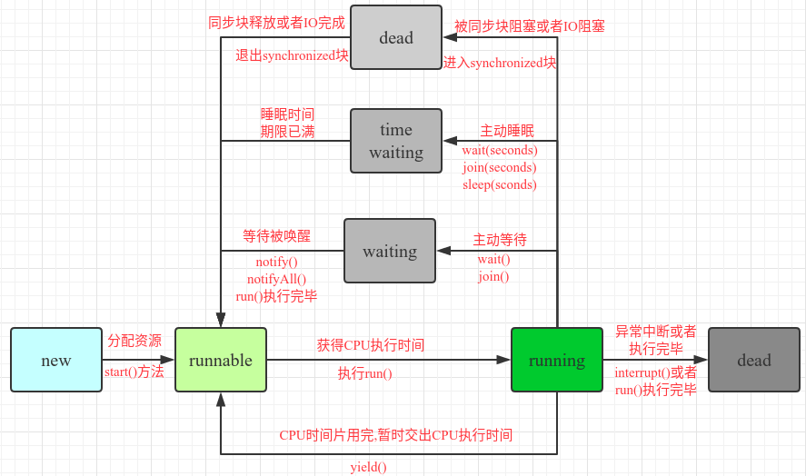
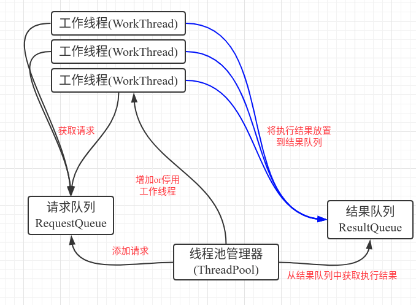

## 知识准备

### SQL on Hadoop

#### 调优策略

- 调优：在资源不变的前提下，让作业的执行性能有所提升．主要关注两大负载：CPU负载和IO负载(内存)

##### 架构层调优

- 分表
  - 场景：行式存储，每分钟２亿条数据，几百列数据，500个作业访问这个大表
  - 解决方法：剥离出业务表中一部分数据进行分表，仅仅关注我们目前关注的数据．
- 分区表
  - 场景：日志表(用户日志)
  - 解决办法：分区表，按时间分区，包括单级分区，多级分区和静态分区，动态分区
- 充分利用中间结果集
  - 多次使用中间结果，建表存储中间结果
    - 优点：IO负载降低
    - 缺点：增加存储
- 压缩
  - 压缩：使用压缩算法，减少数据存储空间的过程，解压缩：使用解压缩算法还原成原始数据的过程．
    - 优点：空间少，减少IO
    - 缺点：示例数据不可见(乱码)，使用前有个解压的过程
  - 使用场景：输入数据，中间数据，输出数据
  - 压缩比与解压速度：

##### 应用层调优

- 排序
  - set hive.mapred.mode 获取是否为严格模式，严格模式order by必须limit，order by只会产生一个reducer，是一个全局排序．
  - sort by 只保证每个mr作业有序，局部排序，仅仅保证分区内有序．
  - cluster by 和distribute by
    - distribute by：按照指定的字段进行数据的分发
    - cluster by = distribute by + sort by
- 控制输出(reduce/partition/task)的数量
  - 为什么要设置reduce的数量？
    - 决定文件输出的个数
    - reduce数量多，文件多，产生小文件可能性大
      - 小文件弊端：
        - 增加map开销，每个分片都要执行一次map任务，map操作会造成额外的开销
        - mr处理的最佳速度就是和集群的传输速度相同，而处理小文件将增加作业的寻址次数
        - 浪费namenode的内存
      - 解决办法：
        - 使用SequenceFile将这些小文件合并成一个大文件或者多个大文件：文件名为键，文件内容为值
        - hdfs已经存在大批小文件，可以使用CombinerFileInputFormat将多个文件打包成一个文件
        - hadoop archive，减少对namenode的负载
    - reduce数量少，运行时间长或者可能出现跑不出来情况，数据倾斜也可能出现．
    - reduce数量：min(hive.exec.reducers.max, 总输入数据量/hive.exec.reducers.bytes.per.reducer)，手动设置为：mapred.reduce.tasks，spark中对应为设置partitions数量
- 执行计划
  - explain extended "query"
  
  - 普通join(shuffle join)实现：
    - 在map的输出value中为不同表的数据打上tag标记,在reduce阶段根据tag判断数据来源
  
    
  
  - map join(broadcast join, 并没有shuffle的过程)实现原理
    - set hive.auto.convert.join = true; 或者手动加上**/\*+mapjoin(表名)\*/**
  
    1. 通过MapReduce Local Task,将小表读入内存，生成HashTableFile上传到Distributed Cache，这里会对HashTableFile进行压缩
    2. MapReduce Job在Map阶段,每个Mapper从Distributed Cache读取HashTableFiles到内存中,顺序扫描,在Map阶段直接进行Join,将数据传递给下一个MapReduce任务
  
    
  
    - 优点：
      - 不消耗集群的reduce资源
      - 减少reduce操作，加快程序执行
      - 降低网络负载
    - 缺点
      - 占用内存
      - 生成小文件

##### 运行层调优

- 推测执行
  - 问题：集群NM/机器的负载是不一样的，集群机器配置不一样，数据倾斜(剩下一个reduce执行时间很长，任务长时间卡在99%)
  - 场景:长尾作业
  - set hive.mapred.reduce.tasks.speculative.execution;
- 并行执行
  - 前提:多个task之间没有依赖
  - set hive.exec.parallel=true, set hive.exec.parallel.thread.number=8(默认为8个)
- JVM重用
  - 背景:map和reduce task是以进程执行的,JVM数量和task数量相同,task结束JVM销毁,但是启动和销毁JVM需要资源,因此可以复用JVM来优化性能
  - set mapred.job.reuse.jvm.num.tasks=1(默认为1)

### Spark总结

#### Spark调优

##### 算子的合理选择

- map VS mapPartition      transformer
  - map是作用于RDD中的每一个元素(RDD = 100 partition partition = n个元素)
  - mapPartitions是作用于partition上,但是如果partition中元素特别多的时候,可能会出现资源不足的情况,可以调整partition数目,改变每个partition中元素的数量
- Foreach VS ForeachPartition   action
  - 类似与map VS mapPartitions,写数据库一定要使用 **Partition算子**
- groupByKey VS reduceByKey
  - groupByKey shuffle传输的数据量大于reduceByKey
  - groupByKey:所有的数据都经过了shuffle
  - reduceByKey:先在本地做了聚合然后再进行shuffle(map side预聚合)
    - pv,uv统计
      - 统计uv:1000w TB的数据,需要去重,如果不做优化将会在一个分区处理,因此需要做的是将数据划分到多个partition中,比如通过uid进行分区,相同uid散列到相同分区中,然后在分区中去重,再进行repartition(1)再求sum
      - 实时计算当天uv,按date进行group by,然后在一个分区中count(distinct ),因此考虑内存中要缓存当天从零点开始到目前的所有去重字段状态,只在一个节点中,性能较差,优化策略是:也是对其进行分区,然后统计最后求sum
- collect() 所有数据输出到driver端内存中,因此需要保证数据输出较少,否则会出现内存溢出
- coalesce和repartition对RDD分区进行重新划分,repartition为coalesce中shuffle参数为true的实现,因此若coalesce中shuffle设置为false,那么是无法将分区数由少变多的.因此coalesce适用于多分区变少,而repartition适用于少分区变多分区
  - coalesce使用于小文件合并场景,repartition适用于数据倾斜场景,也可增加或减少RDD的并行度
- cache VS persist
  - 需要经常用到(训练)的数据可以cache住
  - cacge 调用persist,persist调用默认的持久化到memory
- 窗口操作:
  - reduceByKeyAndWindow(),比如:pairs.reduceByKeyAndWindow(_ + _, Seconds(30), Seconds(10)),其中窗口总长度需要是滑动时间间隔的整数倍
- Streaming全局统计量
  - updateStateByKey算子,必须设置一个checkpoint目录,开始checkpoint机制,这样的话才能把每个key对应的state除了在内存中有,也需要checkpoint一份
  - 因为要长期保存一份key的state的话,那么Spark Streaming是要求必须用checkpoint的,以便于在内存数据丢失的时候,可以从checkpoint中恢复数据.

##### 序列化的合理选择

- 使用org.apache.spark.serializer.KryoSerializer效率更高,但是需要register

##### 流处理数据Sink到目的地的N种错误操作剖析

- foreachRDD操作:

  - 数据库连接错误示例:

  - ```scala
    // 错误示例！
    dstream.foreachRDD { rdd =>
      val connection = createNewConnection()  // executed at the driver
      rdd.foreach { record =>
        connection.send(record) // executed at the worker
      }
    }
    ```

  - 这段代码的错误之处在于不理解spark的内在执行逻辑，`val connection = createNewConnection()`是在driver执行的，但是`connection.send(record)`是在executor执行的；

  - 这样就需要把driver端初始化的connection序列化之后，传到executor端使用；但问题在于connection这种对象一般是不可序列化的，所以程序会运行抛出序列化异常；

  - ```scala
    // 错误示例！
    dstream.foreachRDD { rdd =>
      rdd.foreach { record =>
        val connection = createNewConnection()
        connection.send(record)
        connection.close()
      }
    }
    ```

  - 这段代码确实是在executor端初始化的connection，但是问题在于rdd.foreach会遍历整个rdd中的数据；也就是connection的创建数量和rdd中的record数量一样，这会造成极大的资源浪费和计算延迟；

  - ```scala
    // 错误示例！
    dstream.foreachRDD { rdd =>
      rdd.foreachPartition { partitionOfRecords =>
        val connection = createNewConnection()
        partitionOfRecords.foreach(record => connection.send(record))
        connection.close()
      }
    }
    ```

  - 这段代码用rdd.foreachPartition很好的避开了上面的问题；由于foreachPartition后面传入的计算逻辑只会在每个分片上执行一次，所以connection创建的数量只会和rdd的partition数量一样多；
    但问题是spark streaming在每个mini batch都会生成一个这样的rdd，也就是说每个batch都会重复创建connection，所以资源浪费的问题依旧存在；

  - ```scala
    // 正确示例
    dstream.foreachRDD { rdd =>
      rdd.foreachPartition { partitionOfRecords =>
        // ConnectionPool is a static, lazily initialized pool of connections
        val connection = ConnectionPool.getConnection()
        partitionOfRecords.foreach(record => connection.send(record))
        ConnectionPool.returnConnection(connection)  // return to the pool for future reuse
      }
    }
    ```

  - 这段代码通过线程池实现了connection的复用，需要注意的是ConnectionPool是static的，这样就保证了每个executor只会有一个线程池存在，极大地提高了connection的复用率；

##### 如何保证流处理过程的零数据丢失

- 暂无

##### 如何基于Spark定制外部数据源

- 暂无

##### Spark Streaming

###### Streaming on Kafka Direct

1. Direct的方式直接操作Kafka底层的元数据,Kafka相当于底层的文件系统(对应receiver的executor内存)
2. 直接读取数据,没有所谓的Receiver,直接是周期性(Batch Intervel)的查询Kafka,处理数据的时候,使用基于Kafka原生的Consumer api来获取Kafka中特定范围(offset范围)中的数据
3. 读取多个Kafka partition, Spark也会创建RDD的partition,这个时候RDD的partition和Kafka的partition是一致的.
4. 不需要开启WAL机制,提升效率,节省一倍磁盘空间.从Kafka获取数据,比从HDFS获取数据快,因为是zero copy的方式,速度更快.

###### Direct和Receiver方式对比

1. 容错角度:
   - Receiver:失败情况下,数据可能会被处理不止一次.接收到的数据被可靠的保存到WAL中,但是还没有来得及更新Zookeeper中Kafka的偏移量,导致数据不一致:即Streaming知道数据被接收,但是Kafka认为数据还没被接收,因此戏台恢复正常后,Kafka会再一次发送这些数据,at least once
   - Direct:给出每个batch区间需要读取的偏移量位置,每个batch的job被运行时,对应偏移量的数据从Kafka拉取,偏移量信息也被可靠的存储(checkpoint),从失败中恢复可以直接读取这些偏移量信息.exactly once
2. Direct API消除了需要使用WAL的Receivers的情况,而且确保每个Kafka记录仅被接收一次并被高效的接收,使得Spark Streaming和Kafka很好的整合在一起,总体来说,这些特性使得流处理管道拥有高容错性,高效性,而且易使用.

##### Spark常见面试题

- Spark on YARN 两种方式的区别以及工作流程
- Spark内存管理,解决OOM
- Spark作业资源设置情况 executor个数, memory, core, driver
- Shuffle机制:shuffle,依赖
- Dataframe/Dataset/RDD的区别以及编程
- 数据倾斜
- RDD
- Spark执行流程: count 后续干了什么事情
- Spark中的隐式转换的左右
- Spark和MR的区别
- Spark规模
- ThriftServer如何实现HA
- Kafka整合Spark Offset的管理
- Spark Storm Flink的区别
- 遇到问题,解决,两点
- 合理算子选择
- Catalyst的选择

### 数据倾斜

#### 数据倾斜产生的原因及现象

- 对于大数据来说,数据量大并不可怕,最怕的是数据倾斜,由于数据分布不均匀,造成数据大量集中在某个点上,造成数据热点问题,一般有shuffle,比如join或者group by
- 现象
  - Hive中大部分task快速完成,只有极少数task执行非常慢,执行时间长,或者等待很长时间后提示内存不足,reduce阶段卡在99%不能结束
  - Sprak: 同一个Stage的不同partition可以并行处理,而具有依赖关系的不同Stage之间是串行处理的.假设某个Spark Job分为Stage 0和Stage 1两个Stage,且Stage 1依赖于Stage 0,那Stage 0完全处理结束之前不会处理Stage 1,而Stage 0可能包含N个Task,这N个Task可以并行执行.
  - 例行作业运行正常,突然OOM,遇到数据倾斜需要具备自适应的能力
  - SparkStreaming做实时算法时候,一直会有executor出现OOM的错误,但是其余的executor内存使用率却很低

#### 倾斜度

- 平均记录数超过50w且最大记录数是超过平均记录数的４倍
- 最长时长比平均时长超过４分钟，且最大时长超过平均时长的２倍

#### MapReduce中的shuffle

- 在shuffle的时候,必须将相同的key拉取到同一节点进行task的处理, 比如join, group by,如果某个key数量特别大,那么必然这个key对应的数据处理必然产生数据倾斜

#### Spark中的shuffle

- Spark依赖:
  - 宽依赖父RDD的partition被子RDD的某个partition使用多次,有shuffle,遇到shuffle,stage就会拆分
  - 窄依赖:父RDD的partition至多被子RDD的某个partition使用一次
- hash shuffle
- sort shuffle
- 钨丝 shuffle
- 大数据处理:分区+散列(hash)+分区计算函数

**对比 MapReduce 的 map()-reduce() 和 Spark 中的 reduceByKey()：**

- map 端的区别：map() 没有区别。对于 combine()，MapReduce 先 sort 再 combine()，Spark 直接在 HashMap 上进行 combine()。
- reduce 端区别：MapReduce 的 shuffle 阶段先 fetch 数据，数据量到达一定规模后 combine()，再将剩余数据 merge-sort  后 reduce()，reduce() 非常灵活。Spark 边 fetch 边 reduce()（在 HashMap 上执行 func），因此要求 func 符合 commulative 的特性。

**从内存利用上来对比：**

- map 端区别：MapReduce 需要开一个大型环形缓冲区来暂存和排序 map() 的部分输出结果，但 combine() 不需要额外空间（除非用户自己定义）。 Spark 需要 HashMap 内存数据结构来进行 combine()，同时输出 records 到磁盘上时也需要一个小的 buffer（bucket）。
- reduce 端区别：MapReduce 需要一部分内存空间来存储 shuffle 过来的数据，combine() 和 reduce() 不需要额外空间，因为它们的输入数据分段有序，只需归并一下就可以得到。在 Spark 中，fetch 时需要 softBuffer，处理数据时如果只使用内存，那么需要 HashMap 来持有处理后的结果。如果使用内存＋磁盘，那么在 HashMap 存放一部分处理后的数据。

#### 数据倾斜的场景

- group by
- join
- count (distinct )

#### 解决办法

##### Hive 

- hive.groupby.skewindata=true
  - 生成的查询计划会有两个MR job，第一个MR job中，Map的输出结果会随机分布到Reduce中，每个Reduce做部分聚合操作；第二个MR job再根据预处理的数据按照Group By Key分布到Reduce中，最终完成聚合操作
- Map端聚合：hive.map.aggr=true，map端部分聚合，相当于Combiner
- join:
  - 小表和大表join,可以通过map join(broadcast join)改善
  - 大表和大表join:
    - 比如日志中有一部分user_id是空或者０的情况，导致在用user_id进行hash分桶的时候，会将user_id为０或者空的数据分到一起，导致过大的倾斜度，解决办法：把空值的key变成一个字符串加上随机数，这样把倾斜的数据分到不同的reduce中，由于null值关联不上，处理后也不影响最终结果
    - 在Spark中,只要生成RDD的时候,HashPartitioner相同,且分区数相同,就不会产生shuffle
- key分布不均匀,解决:打散key
  - 比如在双11时数据量特别大，group by date时发生数据倾斜，这时候可以人为的将date这个key人为的加上随机数，然后在后续再还原回来

##### Spark

- 避免数据源的数据倾斜
  - **读Kafka**时:Spark Streaming通过DirectStream方式读取Kafka数据,Kafka每个Partition对应Spark的一个Task,所以Kafka内相关Topic的各Partition之间数据是否平衡直接决定Spark处理该数据时是否会产生数据倾斜,如果使用随机partitioner,概率上讲,各个partition间的数据会达到平衡.
  - **读文件**时数据源侧存在不可切分文件,且文件内包含的数据量相差较大
    - 解决:尽量使用可切分的格式代替不可切分的格式,或者保证各文件实际包含数据量大致相同
- 增加(或减小)并行度
  - 大量不同的key被分配到了相同的Task造成该Task数据量过大.一般增大并行度,但有时也可减小并行度.(只能将分配到同一Task的不同key分散开,但对于同一key倾斜严重情况不适用)
- 自定义partitioner,使数据均匀分配,原本分配到同一个task的不同key分配到不同task
- reduce side join变为map side join
  - Spark的broadcast机制,变为map join,避免shuffle,从而完全消除shuffle带来的倾斜
  - 做法:在Java/Scala代码中将小数据集数据拉取到Driver,然后通过BroadCast方案将小数据集数据广播到各个Executor.或者使用sql前,将BroadCast的阈值调整得足够大,从而使用BroadCast生效.
- 为skew的key增加随机前/后缀
  - 给skew的key增加前/后缀,和另外的数据Join的话,与倾斜Key对应的部分数据,与随机前缀作笛卡尔乘积,从而保证无论数据倾斜侧倾斜Key如何加前缀,都能与之正常Join,最后要将倾斜和不倾斜的两部分数据union起来.
  - 不对全量数据扩容,避免占用过多内存
- 大表随机添加前缀,小表扩大N倍
  - 如果RDD中有大量key导致数据倾斜,那么进行拆分key没有什么意义
- 多种方案组合使用

### Java

#### 并发

1. synchronized关键字的本质, 作用是什么?

   使用方式:

   1. 同步普通方法,锁的是当前对象
   2. 同步静态方法,锁的是当前Class对象
   3. 同步块,锁的是{}中的对象

   实现原理:JVM是通过进入,退出对象监视器(Monitor)来实现对方法,同步块的同步,具体实现是在编译之后在同步方法调用前加入一个monitor.enter指令,在退出方法和异常处插入monitor.exit的指令.

   本质:对一个对象监视器(Monitor)进行获取,而这个获取过程具有排他性从而达到同一时刻只能一个线程访问的目的.

   而对于没有获取到锁的线程将会阻塞到方法入口处,直到获取锁的线程monitor.exit之后才能尝试继续获取锁.

   

2. volatile关键字

   一旦一个共享变量(类的成员变量,类的静态成员变量)被volatile修饰之后,具备两层语义:

   1. 保证了不同线程对这个变量进行读取时的可见性,即一个线程修改了某个变量的值,这新值对其他线程来说是立即可见的
      1. 使用volatile关键字会强制将修改的立即写入住存
      2. 使用volatile关键字的话,当线程2进行修改时,会导致线程1工作内存中的stop的缓存行无效
      3. 由于线程1内存中的换粗变量stop的缓存行无效,所以线程1再次读取变量stop的值时回去主存中读取.
   2. 禁止进行指令重排序,阻止编译器对代码进行优化
      1. 当程序执行到volatile变量哦读操作或者写操作时,在其前面操作的更改肯定全部已经进行,而且结果已经对后面的操作可见;在后面的操作肯定还没有进行
      2. 在进行指令优化时,不能把volatile变量前面的语句放在其后面执行,也不能把volatile变量后面的语句放到其前面执行

   为了实现volatile的内存语义,加入volatile关键字时,编译器在生成字节码时,会在指令序列中插入内存屏障,会多出一个lock前缀指令.内存屏障是一组处理器指令,解决禁止指令重排序和内存可见性的问题.

3. Java线程的状态

   

4. 什么是线程池?线程池的工作原理和使用线程池的好处?

   一个线程池管理了一组工作线程,同时它还包括了一个用于放置等待执行任务的任务队列(阻塞队列).默认情况下,在创建了线程池后,线程池中的线程数为0.当任务提交给线程池之后的处理策略如下:

   1. 如果此时线程池中数量小于corePoolSize(核心池大小),即使线程池中的线程都处于空闲状态,也要创建新的线程来处理被添加的人物(也就是每来一个任务,就要创建一个线程来执行任务).
   2. 如果此时线程池中的数量大于corePoolSize,但是缓冲队列workQueue未满,那么任务被放入缓冲队列,则该任务会等空闲线程将其取出执行
   3. 如果此时线程池中数量大于等于corePoolSize,缓冲队列workQueue满,并且线程池中的数量小于maximumPoolSize(线程池最大线程数),建新的线程来处理被添加的任务
   4. 如果此时线程池中数量大于等于corePoolSize,缓冲队列workQueue满,并且线程池中的数量等于maximumPoolSize(线程池最大线程数),那么通过RejectedExecutionHandler所指定的策略(任务拒绝策略)来处理此任务.
   5. 在corePoolSize和maximumPoolSize之间的线程数会被自动释放.当线程池中线程数量大于corePoolSize时,如果某线程空闲时间超过keepAliveTime,线程将被终止,直至线程池中线程数目不大于corePoolSize.这样,线程池可以动态的调整池中的线程数.

   使用线程池的好处:

   1. 通过重复利用已创建的线程,减少在创建和销毁线程上所花的时间以及系统资源的开销
   2. 提供响应速度.当任务到达时,任务可以不需要等到线程创建就可以立即执行
   3. 提供线程的可管理性.使用线程池可以对线程进行统一的分配和健康
   4. 如果不使用线程池,有可能造成系统创建大量线程而导致消耗完系统内存.

5. 设计一个简单的线程池

   一个典型的线程池,应该包括如下几部分:

   1. 线程池管理器(ThreadPool),用于启动,停用,管理线程池
   2. 工作线程(WorkThread),线程池中的线程
   3. 请求接口(WorkRequest),创建请求对象,以供工作线程调度任务的执行
   4. 请求队列(RequestQueue),用于存放和提取请求
   5. 结果队列(ResultQueue),用于存储请求执行后返回的结果

   线程池管理器,通过添加请求的方法(putRequest)向请求队列(RequestQueue)添加请求,这些请求事先实现请求接口,即传递个哦呢做函数,参数,结果处理函数以及异常处理函数.之后初始化一定数量的工作线程,这些线程通过轮询的方式不断查看请求队列(RequestQueue),只要有请求存在,则会取出请求,进行执行.然后,线程池管理器调用方法(poll)查看结果队列(ResultQueue),如果有值,则取出,调用结果处理函数执行.核心在于:请求队列和结果队列,工作线程通过轮询RequestQueue获得任务,主线程通过查看结果队列,获得执行结果.因此,对这个队列的设计,要实现线程同步,以及一定阻塞和超时机制的设计,以防止因为不断轮询而导致的过多cpu开销.

   