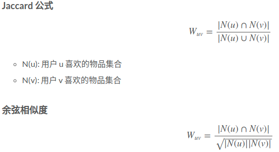
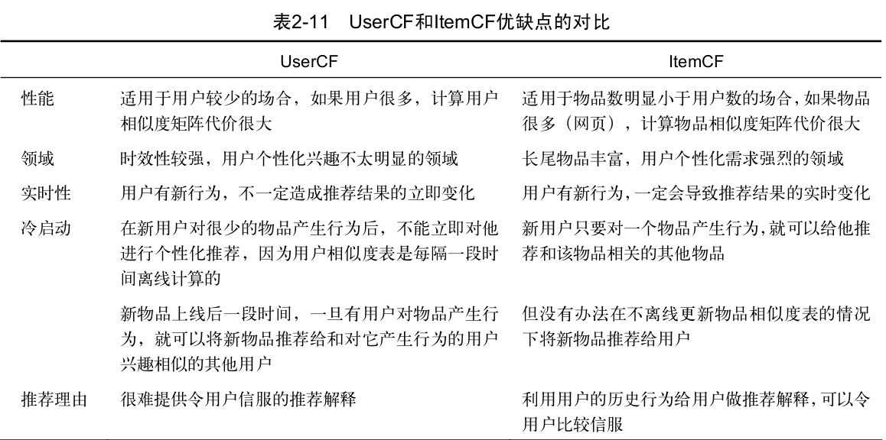

# CF





## user_base

```python
import operator

# 1. 获得用户和用户之间的相似度
# 1.1正常逻辑的用户相似度计算
# 通过Jaccard 公式计算相似度:两个集合A和B交集元素的个数在A B并集中所占的比例,称为这两个集合的Jaccard系数
def user_normal_simmilarity(d):
    w = dict()
    for u in d.keys():
        if u not in w:
            w[u] = dict()
        for v in d.keys():
            if u == v: continue
            w[u][v] = len(set(d[u]) & set(d[v]))
            w[u][v] = 2 * w[u][v] / (len(d[u]) + len(d[v])) * 1.0
    print(w['196'])
    print('all user cnt : ', len(w.keys()))
    print('user_196 sim user cnt: ', len(w['196']))
    return w

# 上述两两用户都计算余弦相似度,时间复杂度是O(N(U)*N(U)),在用户数很大的时候非常耗时.很多用户相互之间并没有对同样的物品产品产生过行为,即交集为0,有计算的浪费,因此建立item-users倒排表,然后对有交集的用户建立用户相似度矩阵
# 1.2 优化计算用户与用户之间的相似度 user->item => item->user
def user_sim(d):
    # 建立item->users的倒排表
    item_users = dict()
    for u, items in d.items():
        for i in items.keys():
            if i not in item_users:
                item_users[i] = set()
            item_users[i].add(u)
    # 物品热度
    # i_pop = 1/math.log(1+len(item_users[i]))
    # print(item_users['257'])
    # print(len(item_users['257']))

    # 计算用户共同items的数量
    C = dict()  # 存放统计用户与用户共同item数量
    N = dict()  # 存放用户对应的item数量
    for i, users in item_users.items():
        for u in users:
            if N.get(u, -1) == -1: N[u] = 0
            N[u] += 1
            if C.get(u, -1) == -1:
                C[u] = dict()
            for v in users:
                if u == v: continue
                if C[u].get(v, -1) == -1: C[u][v] = 0
                C[u][v] += 1
                # C[u][v] += 1/math.log(1+len(item_users[i]))
                # 用户相似度优化:如果绝大多数人都买过<新华字典>,并不能说明他们兴趣相似,所以需要惩罚用户u和v共同兴趣列表中热门物品对他们相似度的影响,解决热度问题
    del item_users
    # max_cuv = 0.0
    # 计算最终的相似度
    for u, sim_users in C.items():
        for v, cuv in sim_users.items():
            C[u][v] = 2 * cuv / ((N[u] + N[v]) * 1.0)
            # C[u][v] = cuv / math.sqrt(N[u] * N[v])
            # if max_cuv<2*cuv / ((N[u]+N[v])*1.0):
            #     max_cuv = 2*cuv / ((N[u]+N[v])*1.0)
    print(C['244'])
    print('all user cnt : ', len(C.keys()))
    print('user sim user cnt: ', len(C['244']))
    # print('max_cuv:',max_cuv)
    return C


def recommend(user, d, C, k):
    rank = dict()
    # 用户评论过的电影
    interacted_items = d[user].keys()
    for v, cuv in sorted(C[user].items(), key=operator.itemgetter(1),
                         reverse=True)[0:k]:
        for i, rating in d[v].items():	
            if i in interacted_items:
                # 过滤掉已经评论过的电影（购买过的商品）
                continue
            elif rank.get(i, -1) == -1:
                rank[i] = 0
            rank[i] += cuv * rating
    return rank

```

