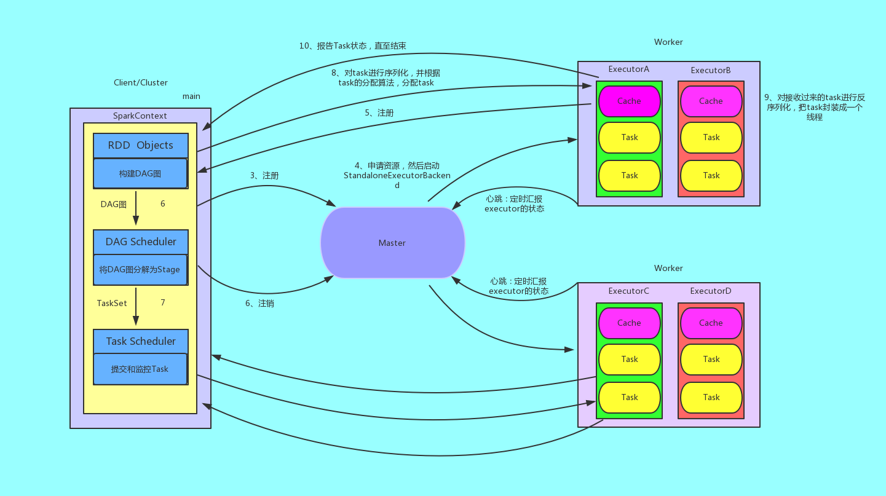
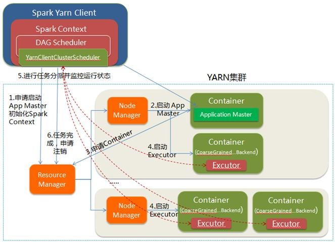
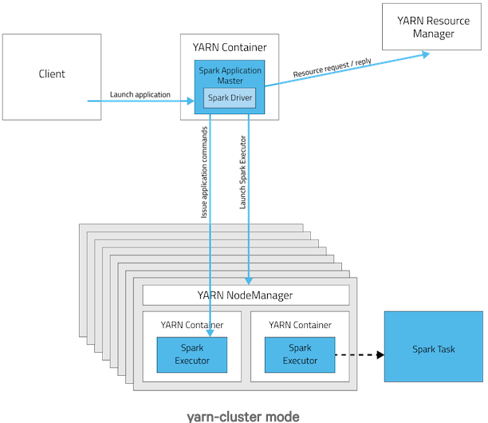
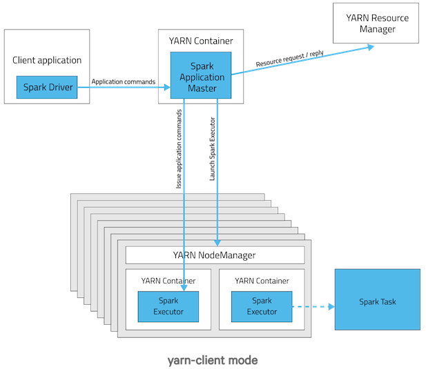

# 高性能Spark

## Spark 运行流程

### 基本运行流程

1. 说明

   1. 构建Spark Application的运行环境(Spark Context), SparkContext向资源管理器(可以是Standalone,Mesos或YARN)注册并申请运行Executor资源
   2. 资源管理器分配Executor资源并启动StandaloneExecutorBackend，Executor运行情况将随着心跳发送到资源管理器上
   3. SparkContext构建成DAG图，将DAG图分解成Stage，并把TaskSet发送给Task Scheduler。Executor向SparkContext申请Task
   4. Task Scheduler将Task发放给Executor运行同时SparkContext将应用程序代码发放给Executor
   5. Task在Executor上运行，运行完毕释放所有资源

2. 图解

   

3. Spark运行架构特点

   1. 每个Application获取专属的executor进程，该进程在Application期间一直驻留，并以多线程方式运行tasks。这种Application隔离机制有其优势的，无论是从调度角度看（每个Driver调度它自己的任务），还是从运行角度看（来自不同Application的Task运行在不同的JVM中）。当然，这也意味着Spark Application不能跨应用程序共享数据，除非将数据写入到外部存储系统
   2. Spark与资源管理器无关，只要能够获取executor进程，并能保持相互通信就可以了
   3. 提交SparkContext的Client应该靠近Worker节点（运行Executor的节点)，最好是在同一个Rack里，因为Spark Application运行过程中SparkContext和Executor之间有大量的信息交换；如果想在远程集群中运行，最好使用RPC将SparkContext提交给集群，不要远离Worker运行SparkContext
   4. Task采用了数据本地性和推测执行的优化机制

4. #### DAGScheduler

   1. 接收提交Job的主入口，`submitJob(rdd, ...)`或`runJob(rdd, ...)`。在`SparkContext`里会调用这两个方法
      - 生成一个Stage并提交，接着判断Stage是否有父Stage未完成，若有，提交并等待父Stage，以此类推。结果是：DAGScheduler里增加了一些waiting stage和一个running stage
      - running stage提交后，分析stage里Task的类型，生成一个Task描述，即TaskSet
      - 调用`TaskScheduler.submitTask(taskSet, ...)`方法，把Task描述提交给TaskScheduler。TaskScheduler依据资源量和触发分配条件，会为这个TaskSet分配资源并触发执行
      - `DAGScheduler`提交job后，异步返回`JobWaiter`对象，能够返回job运行状态，能够cancel job，执行成功后会处理并返回结果
   2. 处理`TaskCompletionEvent` 
      - 如果task执行成功，对应的stage里减去这个task，做一些计数工作： 
        - 如果task是ResultTask，计数器`Accumulator`加一，在job里为该task置true，job finish总数加一。加完后如果finish数目与partition数目相等，说明这个stage完成了，标记stage完成，从running stages里减去这个stage，做一些stage移除的清理工作
        - 如果task是ShuffleMapTask，计数器`Accumulator`加一，在stage里加上一个output location，里面是一个`MapStatus`类。`MapStatus`是`ShuffleMapTask`执行完成的返回，包含location信息和block size(可以选择压缩或未压缩)。同时检查该stage完成，向`MapOutputTracker`注册本stage里的shuffleId和location信息。然后检查stage的output location里是否存在空，若存在空，说明一些task失败了，整个stage重新提交；否则，继续从waiting stages里提交下一个需要做的stage
        - 如果task是重提交，对应的stage里增加这个task
        - 如果task是fetch失败，马上标记对应的stage完成，从running stages里减去。如果不允许retry，abort整个stage；否则，重新提交整个stage。另外，把这个fetch相关的location和map任务信息，从stage里剔除，从`MapOutputTracker`注销掉。最后，如果这次fetch的blockManagerId对象不为空，做一次`ExecutorLost`处理，下次shuffle会换在另一个executor上去执行
        - 其他task状态会由`TaskScheduler`处理，如Exception, TaskResultLost, commitDenied等。
   3. 其他与job相关的操作还包括：cancel job， cancel stage, resubmit failed stage等

5. TaskScheduler

   1. `submitTasks(taskSet)`，接收`DAGScheduler`提交来的tasks 
      - 为tasks创建一个`TaskSetManager`，添加到任务队列里。`TaskSetManager`跟踪每个task的执行状况，维护了task的许多具体信息
      - 触发一次资源的索要
        - 首先，`TaskScheduler`对照手头的可用资源和Task队列，进行executor分配(考虑优先级、本地化等策略)，符合条件的executor会被分配给`TaskSetManager`
        - 然后，得到的Task描述交给`SchedulerBackend`，调用`launchTask(tasks)`，触发executor上task的执行。task描述被序列化后发给executor，executor提取task信息，调用task的`run()`方法执行计算
   2. `cancelTasks(stageId)`，取消一个stage的tasks 
      - 调用`SchedulerBackend`的`killTask(taskId, executorId, ...)`方法。taskId和executorId在`TaskScheduler`里一直维护着。
   3. resourceOffer(offers: Seq[Workers])，这是非常重要的一个方法，调用者是SchedulerBackend，用途是底层资源SchedulerBackend把空余的workers资源交给TaskScheduler，让其根据调度策略为排队的任务分配合理的cpu和内存资源，然后把任务描述列表传回给SchedulerBackend 
      - 从worker offers里，搜集executor和host的对应关系、active executors、机架信息等等
      - worker offers资源列表进行随机洗牌，任务队列里的任务列表依据调度策略进行一次排序
      - 遍历每个taskSet，按照进程本地化、worker本地化、机器本地化、机架本地化的优先级顺序，为每个taskSet提供可用的cpu核数，看是否满足 
        - 默认一个task需要一个cpu，设置参数为`"spark.task.cpus=1"`
        - 为taskSet分配资源，校验是否满足的逻辑，最终在`TaskSetManager`的`resourceOffer(execId, host, maxLocality)`方法里
        - 满足的话，会生成最终的任务描述，并且调用`DAGScheduler`的`taskStarted(task, info)`方法，通知`DAGScheduler`，这时候每次会触发`DAGScheduler`做一次`submitMissingStage`的尝试，即stage的tasks都分配到了资源的话，马上会被提交执行
      - `statusUpdate(taskId, taskState, data)`,另一个非常重要的方法，调用者是`SchedulerBacnend`，用途是`SchedulerBacnend`会将task执行的状态汇报给`TaskScheduler`做一些决定 
        - 若`TaskLost`，找到该task对应的executor，从active executor里移除，避免这个executor被分配到其他task继续失败下去
        - task finish包括四种状态：finished, killed, failed, lost。只有finished是成功执行完成了。其他三种是失败
        - task成功执行完，调用`TaskResultGetter.enqueueSuccessfulTask(taskSet, tid, data)`，否则调用`TaskResultGetter.enqueueFailedTask(taskSet, tid, state, data)`。`TaskResultGetter`内部维护了一个线程池，负责异步fetch task执行结果并反序列化。默认开四个线程做这件事，可配参数`"spark.resultGetter.threads"=4`
   4. **TaskResultGetter取task result的逻辑**
      1. 对于success task，如果taskResult里的数据是直接结果数据，直接把data反序列出来得到结果；如果不是，会调用`blockManager.getRemoteBytes(blockId)`从远程获取。如果远程取回的数据是空的，那么会调用`TaskScheduler.handleFailedTask`，告诉它这个任务是完成了的但是数据是丢失的。否则，取到数据之后会通知`BlockManagerMaster`移除这个block信息，调用`TaskScheduler.handleSuccessfulTask`，告诉它这个任务是执行成功的，并且把result data传回去。
      2. 对于failed task，从data里解析出fail的理由，调用`TaskScheduler.handleFailedTask`，告诉它这个任务失败了，理由是什么。

6. Executor

   1. Executor是spark里的进程模型，可以套用到不同的资源管理系统上，与`SchedulerBackend`配合使用。内部有个线程池，running tasks map，以及actor，接收上面提到的由`SchedulerBackend`发来的事件。
   2. **事件处理**
      1. `launchTask`。根据task描述，生成一个`TaskRunner`线程，丢尽running tasks map里，用线程池执行这个`TaskRunner`
      2. `killTask`。从running tasks map里拿出线程对象，调它的kill方法。

### Spark在不同集群中的运行架构

#### Spark on Standalone

1. Spark on Standalone运行过程:主要节点:Client节点,Master节点,Worker节点.其中Driver既可以运行在Master节点上,也可以运行在本地Client端.当用spark-shell交互式工具提交Spark的Job时，Driver在Master节点上运行；当使用spark-submit工具提交Job或者IDEA等开发平台上使用”new SparkConf().setMaster(“spark://master:7077”)”方式运行Spark任务时，Driver是运行在本地Client端上的

2. 运行过程:

   1. 我们提交一个任务，任务就叫Application
   2. 初始化程序的入口SparkContext， 
      1. 初始化DAG Scheduler
      2. 初始化Task Scheduler
   3. Task Scheduler向master去进行注册并申请资源（CPU Core和Memory）
   4. Master根据SparkContext的资源申请要求和Worker心跳周期内报告的信息决定在哪个Worker上分配资源，然后在该Worker上获取资源，然后启动StandaloneExecutorBackend；顺便初始化好了一个线程池
   5. StandaloneExecutorBackend向Driver(SparkContext)注册,这样Driver就知道哪些Executor为他进行服务了。到这个时候其实我们的初始化过程基本完成了，我们开始执行transformation的代码，但是代码并不会真正的运行，直到我们遇到一个action操作。生产一个job任务，进行stage的划分
   6. SparkContext将Application代码发送给StandaloneExecutorBackend；并且SparkContext解析Applicaiton代码，构建DAG图，并提交给DAG Scheduler分解成Stage（当碰到Action操作时，就会催生Job；每个Job中含有1个或多个Stage，Stage一般在获取外部数据和shuffle之前产生）。
   7. 将Stage（或者称为TaskSet）提交给Task Scheduler。Task Scheduler负责将Task分配到相应的Worker，最后提交给StandaloneExecutorBackend执行；
   8. 对task进行序列化，并根据task的分配算法，分配task
   9. 对接收过来的task进行反序列化，把task封装成一个线程
   10. 开始执行Task，并向SparkContext报告，直至Task完成。
   11. 资源注销

3. 图解

   

#### Spark on YARN

1. YARN-Client

   - Yarn-Client模式中，Driver在客户端本地运行，这种模式可以使得Spark Application和客户端进行交互，因为Driver在客户端，所以可以通过webUI访问Driver的状态，默认是http://xxx:4040访问，而YARN通过http:// xxx:8088访问

   - 运行过程

     - Spark Yarn Client向YARN的ResourceManager申请启动Application Master。同时在SparkContent初始化中将创建DAGScheduler和TASKScheduler等，由于我们选择的是Yarn-Client模式，程序会选择YarnClientClusterScheduler和YarnClientSchedulerBackend
     - ResourceManager收到请求后，在集群中选择一个NodeManager，为该应用程序分配第一个Container，要求它在这个Container中启动应用程序的ApplicationMaster，与YARN-Cluster区别的是在该ApplicationMaster不运行SparkContext，只与SparkContext进行联系进行资源的分派；
     - Client中的SparkContext初始化完毕后，与ApplicationMaster建立通讯，向ResourceManager注册，根据任务信息向ResourceManager申请资源（Container）；
     - 一旦ApplicationMaster申请到资源（也就是Container）后，便与对应的NodeManager通信，要求它在获得的Container中启动启动CoarseGrainedExecutorBackend，CoarseGrainedExecutorBackend启动后会向Client中的SparkContext注册并申请Task；
     - Client中的SparkContext分配Task给CoarseGrainedExecutorBackend执行，CoarseGrainedExecutorBackend运行Task并向Driver汇报运行的状态和进度，以让Client随时掌握各个任务的运行状态，从而可以在任务失败时重新启动任务；
     - 应用程序运行完成后，Client的SparkContext向ResourceManager申请注销并关闭自己。

   - 图解

     

2. YARN-Cluster

   - 在YARN-Cluster模式中，当用户向YARN中提交一个应用程序后，YARN将分两个阶段运行该应用程序：第一个阶段是把Spark的Driver作为一个ApplicationMaster在YARN集群中先启动；第二个阶段是由ApplicationMaster创建应用程序，然后为它向ResourceManager申请资源，并启动Executor来运行Task，同时监控它的整个运行过程，直到运行完成。

   - 运行过程

     - park Yarn Client向YARN中提交应用程序，包括ApplicationMaster程序、启动ApplicationMaster的命令、需要在Executor中运行的程序等；
     - ResourceManager收到请求后，在集群中选择一个NodeManager，为该应用程序分配第一个Container，要求它在这个Container中启动应用程序的ApplicationMaster，其中ApplicationMaster进行SparkContext等的初始化；
     - ApplicationMaster向ResourceManager注册，这样用户可以直接通过ResourceManager查看应用程序的运行状态，然后它将采用轮询的方式通过RPC协议为各个任务申请资源，并监控它们的运行状态直到运行结束；
     - 一旦ApplicationMaster申请到资源（也就是Container）后，便与对应的NodeManager通信，要求它在获得的Container中启动启动CoarseGrainedExecutorBackend，CoarseGrainedExecutorBackend启动后会向ApplicationMaster中的SparkContext注册并申请Task。这一点和Standalone模式一样，只不过SparkContext在Spark Application中初始化时，使用CoarseGrainedSchedulerBackend配合YarnClusterScheduler进行任务的调度，其中YarnClusterScheduler只是对TaskSchedulerImpl的一个简单包装，增加了对Executor的等待逻辑等；
     - ApplicationMaster中的SparkContext分配Task给CoarseGrainedExecutorBackend执行，CoarseGrainedExecutorBackend运行Task并向ApplicationMaster汇报运行的状态和进度，以让ApplicationMaster随时掌握各个任务的运行状态，从而可以在任务失败时重新启动任务；
     - 应用程序运行完成后，ApplicationMaster向ResourceManager申请注销并关闭自己。

   - 图解

     

3. YARN-Client和YARN-Cluster区别

   理解YARN-Client和YARN-Cluster深层次的区别之前先清楚一个概念：Application Master。在YARN中，每个Application实例都有一个ApplicationMaster进程，它是Application启动的第一个容器。它负责和ResourceManager打交道并请求资源，获取资源之后告诉NodeManager为其启动Container。从深层次的含义讲YARN-Cluster和YARN-Client模式的区别其实就是ApplicationMaster进程的区别

   1. YARN-Cluster模式下，Driver运行在AM(Application Master)中，它负责向YARN申请资源，并监督作业的运行状况。当用户提交了作业之后，就可以关掉Client，作业会继续在YARN上运行，因而YARN-Cluster模式不适合运行交互类型的作业；

      

   2. YARN-Client模式下，Application Master仅仅向YARN请求Executor，Client会和请求的Container通信来调度他们工作，也就是说Client不能离开。

      

## Spark 优化实践

### 基本原则

1. 提高资源利用率,不要让cpu空等,内存申请要合适
2. 减小数据量
3. 减少输出碎片,压缩输出数据
4. 减少shuffle
5. 减免数据倾斜

### spark-shell

很多同学在起spark-shell的时候直接用了--num-executor参数,而spark-shell大部分时间都是挂在那儿不动的,这会造成很大的浪费,对于很小的临时任务,建议使用local模式,命令行为:

```shell
spark-shell --cluster c3prc-hadoop-spark2.1
spark-shell --cluster zjyprc-hadoop-spark2.1
```

如果跑的数据量比较大,需要放在集群上才可以跑的,一定要使用动态executor分配,命令行为:

```shell
spark-shell --cluster c3prc-hadoop-spark2.1 --deploy-mode client --master yarn --executor-memory 8G --driver-memory 8G --conf spark.shuffle.service.enabled=true --conf spark.dynamicAllocation.enabled=true --conf spark.dynamicAllocation.maxExecutors=[最多需要的executor数量] --conf spark.yarn.job.owners=[提交同学的大名] --queue [需要使用的队列名]

spark-shell --cluster zjyprc-hadoop-spark2.1 --deploy-mode client --master yarn --executor-memory 8G --driver-memory 8G --conf spark.shuffle.service.enabled=true --conf spark.dynamicAllocation.enabled=true --conf spark.dynamicAllocation.maxExecutors=[最多需要的executor数量] --conf spark.yarn.job.owners=[提交同学的大名] --queue [需要使用的队列名]
```

经常使用spark-shell的同学建议在bashrc里给自己常用的shell命令配一个alias,就不用每次复制命令了

跑海外数据的时候，要在海外的服务器起spark-shell。如果在国内机房启动，会导致大量的跨机房数据传输，容易被SRE请喝茶。

### 合理配置资源

- 计算型,内存小点,--executor-cores 2
- 数据装载型任务,尽量见效executor数量,提高单个executor qps,并且这类任务的内存可以配置得非常小
- 任务的gc情况,确保资源分配合理
- 解决慢节点问题:--conf spark.speculation=true --conf spark.speculation.quantile=0.9 --conf spark.speculation.multiplier=2

### Persisit/Cache

- 序列化是一件很耗时的操作
- 不要针对大数据集做
- 只用一次的数据不要做这个操作
- 记得数据不用以后即时做unpersist释放内存

### HDFS注意事项

- 一定记得压缩数据，不要保存未压缩数据
  - 尽量使用结构化数据存储格式(例如parquet、thrift sequence file)
  - 尽量不要使用JSON/XML
  - 压缩参数参考输出方式的文档
- 控制平均输出文件大小，减少namenode占用
  - 输出的时候通过coalesce/repartition来控制输出文件数量

### Shuffle优化

- Broadcast join,将小数据集广播出去,这样不会有shuffle
- 多次的join理论上都可以通过多rdd union后做一次group by解决
- 尽量减少在shuffle前的数据量,filter越早做越好
- 注意数据倾斜问题
- 尽量使用Spark Sql解决问题,很多人肉优化都不需要操心

## Chapter 1 Introduction to High Performance Spark

### What is Spark and Why performance matters

### What you can expect to get from this book

### Spark Version

### Why Scala

### To be a Spark expert you have to learn a little scala anyway

### The Spark scala API is easier to use than Java API

### Scala is more performant than Python

### Why not Scala

### Learning Scala

## How Spark Works

本章主要介绍Spark并行计算模型，Spark调度器和执行引擎

### How Spark Fits into the Big Data Ecosystem

Apache Spark是一个能够提供一般化并行处理数据方法的开源框架，Spark中同样的高级函数可以在不同结构、大小的数据上完成不同数据处理任务。就其本身而言，Spark并不提供数据存储解决方案，它仅仅在Spark应用处理期间基于Spark JVMs进行计算任务。Spark可以仅仅运行在单机环境下，只有一个JVM（也被称为本地模式）。更多情况下，Spark和分布式存储系统（比如HDFS，Cassandra，S3）进行协作，一同协作的还有cluster manager，存储Spark处理后的数据，cluster manager还负责在整个集群分发Spark分布式应用。目前包含三种cluster manager：Standalone cluster manager，Apache Mesos，Hadoop YARN，其中Standalone cluster manager包含在Spark中，使用该cluster manager需要在集群的每个节点上安装Spark。

### Spark Components

Spark支持高级查询语言处理数据。

1. Spark Core：数据处理框架，API支持Scala，Java，Python，R
2. RDD：Resilient Distributed DataSets（弹性分布式数据集），lazily evaluated（懒惰计算），statically typed，distributed collections，拥有丰富的“粗粒度”transformation方法，同样拥有和分布式好存储系统进行读写操作的方法
3. Spark SQL
4. Spark MLib
5. Spark ML
6. Spark Streaming
7. GraphX

